# SRS - Specifiche dei Requisiti Software
## Hecaton - Sistema P2P di Calcolo Distribuito

**Versione:** 1.0  
**Data:** 22 Gennaio 2026  
**Autore:** Luca Di Leo  
**Università:** UNIMORE  
**Corso:** Algoritmi Distribuiti

---

## 📋 Indice

1. [Introduzione](#1-introduzione)
   - 1.1 [Scopo del Sistema](#11-scopo-del-sistema)
   - 1.2 [Ambito del Progetto](#12-ambito-del-progetto)

2. [Descrizione Generale](#2-descrizione-generale)
   - 2.1 [Architettura del Sistema](#21-architettura-del-sistema)
   - 2.2 [Funzionalità Principali](#22-funzionalità-principali)
   - 2.3 [Vincoli di Sistema](#23-vincoli-di-sistema)
   - 2.4 [Assunzioni](#24-assunzioni)

3. [Requisiti Funzionali](#3-requisiti-funzionali)
   - 3.1 [Gestione Cluster](#31-gestione-cluster)
   - 3.2 [Elezione Leader](#32-elezione-leader)
   - 3.3 [Monitoraggio Nodi](#33-monitoraggio-nodi)
   - 3.4 [Gestione Job](#34-gestione-job)
   - 3.5 [Esecuzione Task](#35-esecuzione-task)

4. [Modelli di Sistema](#4-modelli-di-sistema)
   - 4.1 [Architettura Generale](#41-architettura-generale)
   - 4.2 [Flussi Operativi](#42-flussi-operativi)
   - 4.3 [Diagrammi di Classe](#43-diagrammi-di-classe)

[Appendici](#appendici)
- [Glossario Tecnico](#Definizioni-e-Acronimi)

---

## 1. Introduzione

### 1.1 Scopo del Sistema

**Hecaton** è un sistema di calcolo distribuito peer-to-peer che trasforma un gruppo eterogeneo di computer (PC, laptop, server, persino smartphone) in un **supercomputer virtuale**. Il sistema è progettato per essere completamente modulare: oggi può craccare password, domani può calcolare simulazioni meteorologiche o rendering video, senza modificare l'infrastruttura di rete.

#### Obiettivi Principali

- **Distribuzione del Carico**: Dividere task computazionalmente intensivi tra più nodi
- **Tolleranza ai Guasti**: Continuare l'esecuzione anche in caso di fallimento di singoli nodi
- **Auto-organizzazione**: Elezione automatica del Leader senza intervento manuale
- **Estensibilità**: Architettura modulare per supportare diversi tipi di calcolo
- **Sistema di Calcolo Ausiliario**: Utilizzo di risorse computazionali idle per task batch

### 1.2 Ambito del Progetto

#### Stato di Implementazione Attuale

Il progetto è attualmente in **Fase 2 completata**, con le seguenti funzionalità operative:

| Componente | Stato | Descrizione |
|------------|-------|-------------|
| **Core RMI Cluster** | ✅ **Implementato** | Coordinazione Leader/Worker con gestione automatica del registry |
| **UDP Auto-Discovery** | ✅ **Implementato** | I Worker trovano il Leader senza configurazione manuale (broadcast porta 9876) |
| **Heartbeat Monitoring** | ✅ **Implementato** | Controlli di salute bidirezionali (Worker→Leader, Leader→Worker) |
| **Leader Election** | ✅ **Implementato** | Algoritmo Bully con failover automatico (<10s detection) |
| **Task Framework** | ✅ **Implementato** | Sistema completo di distribuzione job con strategie pluggable |
| **Task Concreti** | ✅ **Implementato** | Password cracking (MD5/SHA-256), calcolo somme |
| **CLI Interface** | ✅ **Implementato** | Comandi Picocli per gestione nodi e submission job |
| **Worker Failure Recovery** | ✅ **Implementato** | Riassegnazione task in caso di morte Worker durante job |

#### Funzionalità Pianificate ma Non Implementate

- ❌ **Containerizzazione Docker**: Stage 2 deployment (nessun Dockerfile creato)
- ❌ **Cluster Multi-Host Fisico**: Stage 3 deployment (non testato su rete reale)
- ❌ **Task Aggiuntivi**: Simulazioni Monte Carlo, fattorizzazione primi, rendering video


---

## 2. Descrizione Generale

### 2.1 Architettura del Sistema

Hecaton è strutturato in **tre livelli logici distinti**, ciascuno con responsabilità specifiche:

#### **Livello 1: Network & Control (Il Cervello)**

Gestisce la vita del cluster senza conoscere i dettagli dei calcoli.

**Tecnologia**: Java RMI (Remote Method Invocation)

**Responsabilità**:
- **Discovery**: Permette ai nuovi nodi di unirsi al cluster tramite broadcast UDP
- **Heartbeat**: Monitoraggio continuo della salute dei nodi (Worker→Leader e Leader→Worker)
- **Leader Election**: Algoritmo Bully per eleggere automaticamente un coordinatore
- **Fault Detection**: Rileva nodi guasti e riassegna il lavoro

**Package**: `com.hecaton.{rmi, discovery, monitor, election}`

#### **Livello 2: Application Logic (Il Motore Estensibile)**

Contiene l'intelligenza del lavoro da svolgere, progettato con **Strategy Pattern**.

**Componenti**:
- **`Job` Interface**: Contratto generico per qualsiasi tipo di calcolo
- **Splitting Strategies**: Come dividere il lavoro (Uniform, Weighted, Dynamic)
- **Assignment Strategies**: Come assegnare task ai worker (RoundRobin, Targeted)
- **Implementazioni Concrete**:
  - `PasswordCrackJob`: Brute-force di password MD5/SHA-256
  - `SumRangeJob`: Calcolo somme distribuite
  - *(Futuro)* `MonteCarloJob`, `VideoRenderJob`, ecc.

**Vantaggi**: Cambiare tipo di calcolo significa solo sostituire la classe Job, non riscrivere il sistema di rete.

**Package**: `com.hecaton.{task, scheduler}`

#### **Livello 3: User Interface (Il Centro di Comando)**

Interfaccia per interazione umana con il sistema.

**CLI (Command Line Interface)** - Comandi basati su Picocli:

```bash
# Avvio nodo Leader
java -jar hecaton.jar node start --mode LEADER --port 5001

# Avvio nodo Worker (auto-discovery)
java -jar hecaton.jar node start --mode WORKER --port 5002

# Submission di un job
java -jar hecaton.jar job submit \
  --task PASSWORD_CRACK \
  --hash 5f4dcc3b5aa765d61d8327deb882cf99 \
  --charset abcdefghijklmnopqrstuvwxyz \
  --max-length 5

# Verifica stato cluster
java -jar hecaton.jar cluster info --host localhost --port 5001
```

**Package**: `com.hecaton.cli`

**Aspetti Trasversali**: Logging (SLF4J), Configurazione (ClusterConfig), Capabilities (NodeCapabilities)

### 2.2 Funzionalità Principali

#### F1: Cluster Auto-organizzante

- **Auto-discovery tramite UDP**: I Worker trovano il Leader tramite broadcast senza configurazione manuale
- **Registrazione automatica**: I nodi si registrano al Leader tramite chiamate RMI
- **Gestione RMI Registry**: Ogni nodo crea il proprio registry sulla propria porta

#### F2: Tolleranza ai Guasti

- **Heartbeat bidirezionale**: 
  - Worker → Leader: ping ogni 5 secondi
  - Leader → Worker: monitoraggio per riassegnazione task
- **Failure detection**: Dichiarazione morte dopo 3 ping falliti consecutivi (~15 secondi)
- **Leader Election automatica**: Algoritmo Bully avviato dai Worker quando il Leader muore
- **Task reassignment**: Il nuovo Leader riassegna i task dei Worker morti

#### F3: Distribuzione Parallela del Lavoro

- **Job Splitting**: Divisione intelligente del carico usando strategie configurabili
  - **Uniform**: Task di dimensione uguale
  - **Weighted**: Distribuzione basata su capacità Worker (CPU cores, RAM)
  - **Dynamic**: Adattamento runtime al carico
  
- **Task Assignment**: Assegnazione ottimale ai Worker
  - **RoundRobin**: Distribuzione circolare equa
  - **Targeted**: Assegnazione basata su capabilities specifiche

- **Early Termination**: I job possono terminare appena un Task trova la soluzione (es. password cracking)

#### F4: Esecuzione Concorrente

- **Thread Pool per Worker**: Ogni Worker esegue task in parallelo usando `ExecutorService`
- **Aggregazione risultati**: Il Leader raccoglie e combina risultati parziali
- **Supporto risultati parziali**: Job possono aggregare progressivamente durante l'esecuzione

#### F5: Estensibilità tramite Strategy Pattern

- **Task pluggable**: Implementare nuovi calcoli senza modificare l'infrastruttura
- **Strategie configurabili**: Splitting e Assignment strategy iniettate via costruttore
- **Election strategy pluggable**: Supporto futuro per Raft, Ring oltre a Bully

### 2.3 Vincoli di Sistema

#### Vincoli Hardware

| Risorsa | Requisito Minimo | Raccomandato |
|---------|------------------|--------------|
| **RAM** | 2GB | 4GB (per testing multi-nodo locale) |
| **CPU** | 2 cores | 4+ cores (per parallelismo efficace) |
| **Disco** | 100MB | 500MB (per log estesi) |
| **Rete** | 100 Mbps | 1 Gbps (per cluster >10 nodi) |

#### Vincoli Software

| Componente | Versione Richiesta | Note |
|------------|-------------------|------|
| **Java JDK** | 17 o superiore | Richiesto per `record` e pattern matching |
| **Maven** | 3.6+ | Build system |
| **Sistema Operativo** | Windows/Linux/macOS | Android via Termux (pianificato) |

#### Vincoli di Rete

- **Porte Disponibili**: Range 5001-5003 per testing locale, configurabili via CLI
- **UDP Broadcast**: Porta 9876 per discovery (configurabile)
- **Latenza RMI**: < 100ms per chiamate ping (assumendo LAN)
- **Firewall**: Porte RMI e UDP devono essere aperte per comunicazione inter-nodo

#### Vincoli di Configurazione

- **Leader Unico**: Durante esecuzione normale, solo un nodo può essere Leader
- **Election ID Univoco**: Basato su timestamp, richiede clock sincronizzati (tolleranza ±1s)
- **Port Conflict**: Nodi sulla stessa macchina devono usare porte diverse
- **Registry RMI**: Ogni nodo crea il proprio registry (`LocateRegistry.createRegistry(port)`)

### 2.4 Assunzioni

#### Assunzioni di Rete

- **Rete Affidabile**: Pacchetti RMI/UDP hanno probabilità di consegna >95%
- **Latenza Ragionevole**: RTT medio < 1 secondo (LAN o WAN con connessione stabile)
- **Broadcast UDP Funzionante**: La rete locale supporta broadcast UDP per discovery
- **No Network Partition**: Assumiamo che split-brain non si verifichi (tutti i nodi vedono tutti)

#### Assunzioni sui Nodi

- **Clock Ragionevolmente Sincronizzati**: Differenze < 1 secondo (sufficienti per election ID)
- **Risorse Sufficienti**: Worker hanno almeno RAM/CPU per eseguire un task alla volta
- **No Malicious Nodes**: Nessun nodo tenta attacchi di security (fuori scope)
- **Graceful Shutdown**: I nodi terminano correttamente quando possibile (SIGTERM, non SIGKILL)

#### Assunzioni sui Task

- **Determinismo**: Task con stesso input producono stesso output (no side-effect casuali)
- **Idempotenza**: Re-eseguire un task fallito produce risultato corretto
- **Serializzabilità**: Input/output dei task sono serializzabili via Java serialization
- **Durata Finita**: Task non sono infiniti (hanno timeout implicito)

---

## 3. Requisiti Funzionali

### 3.1 Gestione Cluster

#### RF-001: Avvio Nodo Leader

**Descrizione**: Il sistema deve permettere l'avvio di un nodo in modalità Leader.

**Precondizioni**:
- Java 17+ installato
- Porta specificata disponibile (default: 5001)
- Nessun altro Leader attivo sulla stessa porta

**Input**:
```bash
java -jar hecaton.jar node start --mode LEADER --port 5001
```

**Comportamento**:
1. Crea RMI registry sulla porta specificata
2. Istanzia `NodeImpl` con `isLeader = true`
3. Bind come `"leader"` e `"node"` nel registry
4. Avvia `UdpDiscoveryService` per rispondere a broadcast Worker
5. Inizializza `ClusterMembershipService` (lista vuota)
6. Avvia `FailureDetector` per monitorare Worker
7. Inizializza `JobManager` per gestione job
8. Log: `[OK] Node node-localhost-5001-xxx started as LEADER`

**Postcondizioni**:
- Leader disponibile per registrazione Worker
- UDP discovery attivo su porta 9876
- Pronto ad accettare submission job

---

#### RF-002: Avvio Nodo Worker con Auto-Discovery

**Descrizione**: Il sistema deve permettere l'avvio di un nodo Worker che trova automaticamente il Leader via UDP.

**Precondizioni**:
- Java 17+ installato
- Porta specificata disponibile (default: 5002)
- Leader già avviato e raggiungibile in rete locale

**Input**:
```bash
java -jar hecaton.jar node start --mode WORKER --port 5002
```

**Comportamento**:
1. Crea RMI registry sulla porta specificata
2. Istanzia `NodeImpl` con `isLeader = false`
3. Bind come `"node"` nel registry
4. Avvia `LeaderDiscoveryStrategy`:
   - Invia broadcast UDP su porta 9876
   - Attende risposta Leader (timeout 10s, max 3 tentativi)
5. Una volta ricevuto `LeaderInfo` (host, port):
   - Ottiene stub `LeaderService` tramite RMI lookup
   - Chiama `leader.registerNode(this)`
6. Avvia `HeartbeatMonitor` per monitorare Leader (ping ogni 5s)
7. Inizializza `TaskExecutor` con thread pool
8. Log: `[OK] Worker joined cluster successfully. Leader: localhost:5001`

**Postcondizioni**:
- Worker registrato nel `ClusterMembershipService` del Leader
- Heartbeat attivo verso Leader
- Pronto a ricevere task

---

#### RF-003: Avvio Worker con Join Esplicito

**Descrizione**: Il sistema deve permettere l'avvio di un Worker specificando esplicitamente l'indirizzo del Leader (senza auto-discovery).

**Precondizioni**:
- Leader raggiungibile all'indirizzo specificato
- Porta Worker disponibile

**Input**:
```bash
java -jar hecaton.jar node start --mode WORKER --port 5002 --join localhost:5001
```

**Comportamento**:
1. Come RF-002, ma salta il broadcast UDP
2. Ottiene direttamente stub RMI da `rmi://localhost:5001/leader`
3. Procede con registrazione

**Postcondizioni**:
- Worker registrato al Leader specificato
- Heartbeat attivo

---

#### RF-004: Gestione Registry RMI Per-Node

**Descrizione**: Ogni nodo deve creare il proprio RMI registry sulla porta specificata.

**Razionale**: Evita conflitti e single point of failure (ogni nodo è autonomo).

**Gestione Errori**:
- Se porta occupata → lancia `RemoteException` con messaggio chiaro
- Se bind fallisce → rollback e cleanup registry

---

### 3.2 Elezione Leader

#### RF-010: Algoritmo Bully per Elezione

**Descrizione**: Quando il Leader corrente fallisce, i Worker superstiti devono eleggere automaticamente un nuovo Leader usando l'algoritmo Bully.

**Precondizioni**:
- Leader precedente non risponde a ping (3 fallimenti consecutivi)
- Almeno 2 Worker vivi nel cluster

**Trigger**: `HeartbeatMonitor` del Worker rileva morte Leader → invoca callback `onLeaderDied()`

**Comportamento** (Algoritmo Bully):

1. **Fase ELECTION**:
   - Worker che rileva morte invia messaggio `ELECTION` a tutti i nodi con ID > suo
   - Se riceve risposta `OK` da qualcuno → aspetta messaggio `COORDINATOR`
   - Se nessuno risponde → si autopromove a Leader

2. **Fase COORDINATOR**:
   - Nodo con ID più alto che ha vinto invia `COORDINATOR` a tutti
   - Invoca `promoteToLeader()` su sé stesso:
     - Setta `isLeader = true`
     - Rebind come `"leader"` nel proprio registry
     - Inizializza `ClusterMembershipService`, `JobManager`, `FailureDetector`
     - Avvia `UdpDiscoveryService`

3. **Sincronizzazione Worker**:
   - Worker ricevono `COORDINATOR` → aggiornano `leaderRef` e `clusterNodesCache`
   - Ferma vecchio `HeartbeatMonitor`, ne avvia uno nuovo verso nuovo Leader
   - Re-registrazione automatica al nuovo Leader

**Election ID**: `System.currentTimeMillis()` al momento creazione nodo

**Timeout**:
- Risposta a messaggio `ELECTION`: 5 secondi
- Arrivo messaggio `COORDINATOR` dopo risposta `OK`: 10 secondi
- Detection morte Leader: ~15 secondi (3 ping × 5s)

**Postcondizioni**:
- Esattamente un Leader nel cluster
- Tutti i Worker conoscono il nuovo Leader
- Heartbeat ripristinato verso nuovo Leader

---

#### RF-011: Rilevamento Fallimento Leader

**Descrizione**: I Worker devono rilevare automaticamente quando il Leader corrente è morto.

**Meccanismo**: `HeartbeatMonitor` invia `ping()` ogni 5 secondi al Leader.

**Condizione Fallimento**:
- 3 ping consecutivi falliti (timeout 2s ciascuno)
- Totale: ~15 secondi per dichiarare Leader morto

---

#### RF-012: Strategy Pattern per Election

**Descrizione**: Il sistema deve supportare algoritmi di elezione pluggable tramite Strategy Pattern.

**Implementazioni Attuali**:
- `BullyElection` (implementato)

**Implementazioni Future** (pianificate):
- `RaftElection` (consenso con log replicato)
- `RingElection` (token ring)

---

### 3.3 Monitoraggio Nodi

#### RF-020: Heartbeat Bidirezionale

**Descrizione**: Il sistema deve implementare monitoraggio di salute tra Worker e Leader.

**Worker → Leader**
- **Scopo**: Rilevare morte Leader per triggare elezione
- **Frequenza**: Ping ogni 5 secondi
- **Fallimento**: 3 ping consecutivi falliti (~15s) → elezione

---

#### RF-021: Failure Detection con Callback

**Descrizione**: Quando un nodo viene dichiarato morto, il sistema deve invocare callback configurabili.

---

#### RF-022: Cache Refresh Periodica (Worker)

**Descrizione**: I Worker devono aggiornare periodicamente la cache dei nodi del cluster per l'elezione.

**Motivazione**: Durante elezione, Worker deve conoscere lista aggiornata nodi per inviare messaggi `ELECTION`.

**Frequenza**: Ogni 50 secondi (configurabile in `HeartbeatMonitor.CACHE_REFRESH_INTERVAL`)

---

#### RF-023: Re-registrazione dopo Elezione

**Descrizione**: Quando un nuovo Leader viene eletto, i Worker devono re-registrarsi automaticamente.

**Trigger**: Ricezione messaggio `COORDINATOR` con ID nuovo Leader

---

### 3.4 Gestione Job

#### RF-030: Submission Job via CLI

**Descrizione**: L'utente deve poter sottomettere un job di calcolo distribuito tramite CLI.

**Precondizioni**:
- Leader attivo e raggiungibile
- Almeno 1 Worker registrato nel cluster

**Input Esempio**:
```bash
java -jar hecaton.jar job submit \
  --task PASSWORD_CRACK \
  --hash 5f4dcc3b5aa765d61d8327deb882cf99 \
  --charset abcdefghijklmnopqrstuvwxyz \
  --max-length 5
```

**Parametri**:
- `--task`: Tipo di job (PASSWORD_CRACK, SUM_RANGE, ...)
- Job-specific params (es. `--hash`, `--charset`, `--max-length` per password cracking)

**Comportamento**:
1. CLI crea oggetto `Job` concreto (es. `PasswordCrackJob`)
2. Ottiene stub RMI del Leader
3. Chiama `leader.submitJob(job)` (blocking con timeout)
4. Leader delega a `JobManager.submitJob(job)`
5. Attende `JobResult` finale
6. Stampa risultato:
   ```
   [SUCCESS] Password found: password
   Execution time: 12.3s
   Tasks completed: 142/200
   ```

**Timeout**: 5 minuti (configurabile per job lunghi)

**Gestione Errori**:
- Leader non raggiungibile → `RemoteException` con messaggio user-friendly
- Job fallito → stampa errori task
- Timeout → possibilità di richiedere status job

---

#### RF-031: Splitting Strategy - Uniform

**Descrizione**: Il sistema deve supportare splitting uniforme del carico in task di dimensione uguale.

**Use Case**: Password brute-force con keyspace lineare.

**Comportamento**:
```java
// Esempio: 100M password, 10 worker → 10M password per task
// Task 1: range [0, 10M)
// Task 2: range [10M, 20M)
// ...
```
---

#### RF-032: Splitting Strategy - Weighted

**Descrizione**: Il sistema deve supportare splitting basato sulle capacità hardware dei Worker.

**Use Case**: Cluster eterogeneo (PC potente + laptop + Android).

**Comportamento**:
```java
// Worker capabilities:
// Worker1: 8 cores, 16GB RAM → peso 1.0
// Worker2: 4 cores, 8GB RAM  → peso 0.5
// Worker3: 2 cores, 4GB RAM  → peso 0.25

// Distribuzione proporzionale:
// Worker1: 57% del carico
// Worker2: 29% del carico
// Worker3: 14% del carico
```
---

#### RF-033: Assignment Strategy - RoundRobin

**Descrizione**: Il sistema deve supportare assegnazione circolare dei task ai Worker.

**Comportamento**:
```java
// 10 task, 3 worker:
// Worker1: task [0, 3, 6, 9]
// Worker2: task [1, 4, 7]
// Worker3: task [2, 5, 8]
```

**Use Case**: Worker omogenei, task uniformi.

---

#### RF-035: Early Termination Support

**Descrizione**: I job devono poter terminare anticipatamente quando un Task trova la soluzione.

**Use Case**: Password cracking - appena un Worker trova la password, il job termina.

**Cancellazione Task**:
- Leader invia RMI `cancelJob(jobId)` a tutti Worker
- Worker interrompono task in corso per quel job
- Task già completati vengono scartati

---

### 3.5 Esecuzione Task

#### RF-040: Thread Pool Execution

**Descrizione**: I Worker devono eseguire task in parallelo usando un thread pool configurabile.

**Shutdown**:
- Graceful: `executor.shutdown()` + `awaitTermination(30s)`
- Forced: `executor.shutdownNow()` se timeout scaduto
---

#### RF-042: Task Reassignment on Worker Failure

**Descrizione**: Se un Worker muore durante esecuzione di un job, il Leader deve riassegnare i suoi task ad altri Worker.

**Trigger**: `FailureDetector` rileva morte Worker → callback `onWorkerFailed(workerId)`

---

#### RF-043: Result Aggregation

**Descrizione**: Il Leader deve aggregare risultati parziali dei task in un `JobResult` finale.

**Metadati JobResult**:
- `duration`: Tempo totale esecuzione
- `tasksCompleted`: Task completati con successo
- `tasksFailed`: Task falliti
- `successRate`: Percentuale successo

---

## 4. Modelli di Sistema

### 4.1 Architettura Generale


#### Diagramma Grafo Dipendenze

Diagramma delle dipende 

### 4.2 Flussi Operativi


#### Flusso 1: Job Submission & Execution


#### Flusso 2: Early Termination


#### FLusso 2: Heartbeat Monitoring


#### Flusso 3: Leader Election (Bully Algorithm)

```mermaid
sequenceDiagram
    participant L as Leader<br/>
    participant A as Worker-A<br/>(ID: 2000)
    participant B as Worker-B<br/>(ID: 3000)
    participant C as Worker-C<br/>(ID: 4000)
    
    Note over L: ❌ Leader CRASHES
    Note over A,C: T=15s - All workers detect failure
    
    rect rgb(95, 92, 86)
        Note over A,C: Phase 1: Election Messages
        par All workers start election
            A->>A: startElection()
            A->>A: Find higher: [B, C]
            A->>B: ELECTION(2000)
            A->>C: ELECTION(2000)
        and
            B->>B: startElection()
            B->>B: Find higher: [C]
            B->>C: ELECTION(3000)
        and
            C->>C: startElection()
            C->>C: Find higher: []
            Note over C: No higher ID → I WIN!
        end
    end
    
    rect rgb(65, 64, 62)
        Note over C: Phase 2: Become Leader
        C->>C: promoteToLeader()
        C->>C: Initialize ClusterMembershipService
        C->>C: Initialize JobManager
        C->>C: Initialize FailureDetector
        C->>C: Bind as "leader" in RMI registry
        C->>C: Start UDP broadcaster
    end
    
    rect rgb(0, 0, 0)
        Note over A,C: Phase 3: Announce & Reconnect
        par Broadcast COORDINATOR
            C->>A: COORDINATOR(4000, host, port)
            C->>B: COORDINATOR(4000, host, port)
        end
        
        par Workers reconnect
            A->>A: receiveCoordinatorMessage()
            A->>C: RMI: registerNode(this)
            A->>A: Restart HeartbeatMonitor → C
        and
            B->>B: receiveCoordinatorMessage()
            B->>C: RMI: registerNode(this)
            B->>B: Restart HeartbeatMonitor → C
        end
    end
    
    Note over A,C: Cluster reformed with C as Leader
```




#### Flusso 4: Worker Failure & Task Reassignment


#### Flusso 5: Cluster Discovery (UDP Broadcast)


#### Manual Join

When the Worker knows the Leader's address (e.g., via CLI `--join localhost:5001`):


#### Automatic Discovery (UDP Broadcast)

When Leader address is unknown, Workers use UDP broadcast discovery:


### 4.3 Diagrammi di Classe

#### Package: com.hecaton.rmi


#### Package: com.hecaton.node


#### Package: com.hecaton.task


#### Package: com.hecaton.election


---

## Appendice

### Definizioni e Acronimi

| Termine | Definizione |
|---------|-------------|
| **P2P** | Peer-to-Peer: architettura di rete dove i nodi sono equivalenti e non c'è un server centralizzato permanente |
| **RMI** | Remote Method Invocation: tecnologia Java per invocare metodi su oggetti remoti in altre JVM |
| **Leader** | Nodo che coordina il cluster, distribuisce task e mantiene lo stato globale |
| **Worker** | Nodo che esegue task assegnati dal Leader e monitora la sua disponibilità |
| **UDP Discovery** | Meccanismo di discovery basato su broadcast UDP per trovare il Leader senza configurazione manuale |
| **Heartbeat** | Ping periodico per verificare che un nodo remoto sia ancora vivo |
| **Bully Algorithm** | Algoritmo di elezione dove vince sempre il nodo con ID più alto |
| **Election ID** | Timestamp di creazione del nodo (`System.currentTimeMillis()`) usato per l'elezione |
| **Task** | Unità di lavoro elementare eseguibile su un singolo Worker |
| **Job** | Insieme di Task coordinati che rappresentano un calcolo distribuito completo |
| **Splitting Strategy** | Strategia per dividere un Job in Task (Uniform, Weighted, Dynamic) |
| **Assignment Strategy** | Strategia per assegnare Task ai Worker (RoundRobin, Targeted) |
| **Early Termination** | Capacità di un Job di terminare appena un Task trova la soluzione (es. password cracking) |
| **SLF4J** | Simple Logging Facade for Java: astrazione per logging |
| **Logback** | Implementazione concreta del logging usata da Hecaton |
| **Picocli** | Framework Java per creare CLI (Command Line Interface) |
| **Maven** | Build tool per progetti Java |
| **Thread Pool** | Pool di thread riutilizzabili per eseguire task in parallelo |
| **RMI Registry** | Servizio di naming che permette di trovare oggetti RMI remoti |
| **RMI Stub** | Proxy locale che rappresenta un oggetto remoto |


---

**Fine Documento SRS**

*Versione 1.0 - 22 Gennaio 2026*
