# Architecture Overview

Hecaton is a P2P distributed computing system that transforms heterogeneous computers into a virtual supercomputer. Built on Java RMI, it implements a **Leader-Worker architecture** with automatic leader election, fault tolerance, and pluggable task distribution strategies.

## Table of Contents

- [Project Description](#project-description)
- [Package & Class Reference](#package--class-reference)
- [System Integration](#system-integration)
- [Key Interactions](#key-interactions)
  - [Job Submission Flow](#1-job-submission-flow)
  - [Early Termination](#2-early-termination)
  - [Heartbeat Monitoring & Election Trigger](#3-heartbeat-monitoring--election-trigger)
  - [Worker Failure & Task Reassignment](#4-worker-failure--task-reassignment)
  - [Bully Election Algorithm](#5-bully-election-algorithm)
- [Testing Strategy](#testing-strategy)
- [Logging Configuration](#logging-configuration)

---

## Project Description

Hecaton enables distributed computation by:
- **Coordinating** multiple compute nodes via Leader-Worker pattern
- **Distributing** workload using pluggable splitting/assignment strategies
- **Executing** tasks in parallel across worker thread pools
- **Monitoring** node health through bidirectional heartbeat mechanisms
- **Recovering** from failures automatically (worker death → task reassignment)
- **Electing** new leaders when current leader fails (Bully algorithm)

### Key Characteristics

| Aspect | Technology/Approach |
|--------|-------------------|
| **Communication** | Java RMI (Remote Method Invocation) |
| **Architecture** | Leader-Worker with dynamic election |
| **Failure Detection** | Bidirectional heartbeat monitoring |
| **Leader Election** | Bully Algorithm (highest ID wins) |
| **Language** | Java 17 |
| **Build System** | Maven 3.x |

### Architectural Layers

The system is organized into **three logical levels**:

```
┌─────────────────────────────────────────────────────────┐
│  1. Network & Control Level (The Brain)                 │
│     RMI, Discovery, Heartbeat, Election                 │
├─────────────────────────────────────────────────────────┤
│  2. Application Logic Level (The Extensible Engine)     │
│     Task Framework (Strategy Pattern for computation)   │
├─────────────────────────────────────────────────────────┤
│  3. User Interface Level (The Command Center)           │
│     CLI (Picocli-based commands)                        │
└─────────────────────────────────────────────────────────┘
```

**Cross-cutting Concerns**: Logging (SLF4J), Configuration (ClusterConfig), Capabilities (NodeCapabilities)

---

## Package & Class Reference

### Package Structure

```
com.hecaton/
├── cli/                    # Command-line interface
├── rmi/                    # Remote interfaces (contracts)
├── node/                   # Node core implementation
├── discovery/              # Cluster discovery & membership
├── monitor/                # Health monitoring
├── election/               # Leader election algorithms
├── scheduler/              # Job orchestration
└── task/                   # Task framework & implementations
```

### Class Reference by Package

| Package | Key Classes | Responsibility |
|---------|-------------|----------------|
| **rmi** | `NodeService`, `LeaderService` | RMI contracts: common node ops vs leader-specific ops |
| **node** | `NodeImpl`, `TaskExecutor`, `ClusterConfig`, `NodeCapabilities` | Dual-mode node (Leader/Worker), task execution thread pool, strategy configuration, hardware detection |
| **discovery** | `ClusterMembershipService`, `UdpDiscoveryService`, `NodeInfo` | Thread-safe node registry, UDP broadcast discovery, serializable node metadata |
| **monitor** | `HeartbeatMonitor`, `FailureDetector` | Worker→Leader active monitoring, Leader→Workers passive monitoring |
| **election** | `ElectionStrategy`, `BullyElection` | Strategy interface, Bully algorithm (highest ID wins) |
| **scheduler** | `JobManager`, `TaskScheduler` | Job lifecycle facade, distributed task state machine |
| **task** | `Job`, `Task`, `JobResult`, `TaskResult`, `SplittingStrategy`, `AssignmentStrategy` | Work interfaces, result containers, job→tasks splitting, tasks→workers assignment |
| **task/impl** | `PasswordCrackJob`, `SumRangeJob` | Example implementations with early termination support |

### Class Diagram


### Core Design Patterns

| Pattern | Usage |
|---------|-------|
| **State Pattern** | `NodeImpl` switches Leader/Worker behavior via `isLeader` flag |
| **Strategy Pattern** | Pluggable `SplittingStrategy`, `AssignmentStrategy`, `ElectionStrategy` |
| **Facade Pattern** | `JobManager` hides `TaskScheduler` complexity |
| **Observer/Callback** | Failure callbacks (`onWorkerFailed`, `onLeaderDied`) |
| **Supplier Pattern** | Lazy cluster cache evaluation in `BullyElection` |

---

## System Integration

### Component Dependency Graph

This diagram shows how components are created and how they interact at runtime:


**Legend**:
- **Solid arrows** (→): Creation/ownership relationships
- **Dashed arrows** (⇢): Usage dependencies  
- **Double arrows** (⇒): Callback invocations
- **Bidirectional** (↔): RMI communication

### Key Relationships

**Creation Hierarchy**:
- `NodeImpl` creates all components (`ClusterMembershipService`, `JobManager`, `FailureDetector`, `TaskExecutor`)
- `JobManager` creates `TaskScheduler` internally (avoids circular dependency)
- `ClusterConfig` creates `ElectionStrategy` via factory method

**Callback Chains**:
- `FailureDetector` → `onWorkerFailed()` → `JobManager` → `TaskScheduler` reassignment
- `HeartbeatMonitor` → `onLeaderDied()` → `BullyElection` → `promoteToLeader()`
- `HeartbeatMonitor` → `updateClusterCache()` → refreshes election data

**RMI Communication**:
- Leader's `TaskScheduler` → Worker's `TaskExecutor` (`executeTasks`, `cancelJob`)
- Worker's `TaskExecutor` → Leader's `JobManager` (`submitResults`)
- Worker → Leader (`ping` for heartbeat via `LeaderService`)

---

## Key Interactions

### 1. Job Submission Flow

When a client submits a job, it flows through multiple components for splitting, assignment, distribution, execution, and result aggregation.


**Key Implementation Details**:
- `JobManager.submitJob()` blocks using `CountDownLatch` until all tasks complete or timeout
- `TaskScheduler` tracks task states: `WORKING` → `SUCCESS`/`FAILED`/`CANCELLED`
- Results are streamed as they complete (not batched at end)

---

### 2. Early Termination

Early termination allows jobs to stop immediately when a result is found (e.g., password cracking). This is a **3-layer mechanism**:

| Layer | Component | Responsibility |
|-------|-----------|----------------|
| **Job Declaration** | `Job.supportsEarlyTermination()` | Opt-in flag (default: false) |
| **Local Cancellation** | `TaskExecutor` | Cancels remaining tasks on this worker |
| **Remote Broadcast** | `TaskScheduler` | Broadcasts `cancelJob()` to ALL workers |


**Trigger Condition**: Only `TaskResult.Status.SUCCESS` triggers termination, not `COMPLETED`. This distinction allows:
- `SUCCESS`: Found the answer (e.g., cracked password) → **STOP**
- `COMPLETED`: Finished searching range, nothing found → continue other tasks

---

### 3. Heartbeat Monitoring & Election Trigger

Hecaton uses **bidirectional health monitoring**:

| Direction | Component | Model | Purpose |
|-----------|-----------|-------|---------|
| Worker → Leader | `HeartbeatMonitor` | ACTIVE (push) | Detect leader failure → trigger election |
| Leader → Workers | `FailureDetector` | PASSIVE (receive) | Detect worker failure → reassign tasks |

**Heartbeat Constants**:
- Interval: 5 seconds
- Failure threshold: 3 missed heartbeats (15s total)
- Cache refresh: every 8 heartbeats (~40s)


**Cache Refresh Importance**:
Workers periodically refresh their `clusterNodesCache` (every 40s) to know about nodes that joined after them. Without this:
```
Worker-A's cache: [Leader, A]     // Doesn't know about B, C
Actual cluster:   [Leader, A, B, C]
→ If A wins election: SPLIT-BRAIN (B, C orphaned)
```

---

### 4. Worker Failure & Task Reassignment

When `FailureDetector` detects a worker timeout (15s no heartbeat), it triggers task reassignment to healthy workers.


---

### 5. Bully Election Algorithm

When a worker detects leader failure, it initiates the Bully election. The node with the **highest election ID** (timestamp-based) wins.

**Message Types** (via RMI):
| Message | Purpose | Implementation |
|---------|---------|----------------|
| ELECTION | "I'm starting election, respond if higher" | `receiveElectionMessage()` |
| OK | "My ID is higher, I'll handle it" | Implicit (no `RemoteException`) |
| COORDINATOR | "I won, I'm the new Leader" | `receiveCoordinatorMessage()` |

```mermaid
sequenceDiagram
    participant L as Leader<br/>
    participant A as Worker-A<br/>(ID: 2000)
    participant B as Worker-B<br/>(ID: 3000)
    participant C as Worker-C<br/>(ID: 4000)
    
    Note over L: ❌ Leader CRASHES
    Note over A,C: T=15s - All workers detect failure
    
    rect rgb(95, 92, 86)
        Note over A,C: Phase 1: Election Messages
        par All workers start election
            A->>A: startElection()
            A->>A: Find higher: [B, C]
            A->>B: ELECTION(2000)
            A->>C: ELECTION(2000)
        and
            B->>B: startElection()
            B->>B: Find higher: [C]
            B->>C: ELECTION(3000)
        and
            C->>C: startElection()
            C->>C: Find higher: []
            Note over C: No higher ID → I WIN!
        end
    end
    
    rect rgb(65, 64, 62)
        Note over C: Phase 2: Become Leader
        C->>C: promoteToLeader()
        C->>C: Initialize ClusterMembershipService
        C->>C: Initialize JobManager
        C->>C: Initialize FailureDetector
        C->>C: Bind as "leader" in RMI registry
        C->>C: Start UDP broadcaster
    end
    
    rect rgb(0, 0, 0)
        Note over A,C: Phase 3: Announce & Reconnect
        par Broadcast COORDINATOR
            C->>A: COORDINATOR(4000, host, port)
            C->>B: COORDINATOR(4000, host, port)
        end
        
        par Workers reconnect
            A->>A: receiveCoordinatorMessage()
            A->>C: RMI: registerNode(this)
            A->>A: Restart HeartbeatMonitor → C
        and
            B->>B: receiveCoordinatorMessage()
            B->>C: RMI: registerNode(this)
            B->>B: Restart HeartbeatMonitor → C
        end
    end
    
    Note over A,C: Cluster reformed with C as Leader
```



---

## Testing Strategy

Hecaton uses **manual integration tests** instead of JUnit for RMI cluster testing.

**Rationale**:
- RMI requires multiple JVM processes
- JUnit cannot simulate true distributed environment
- Manual tests provide realistic cluster behavior

**Test Structure**:
```
src/test/java/com/hecaton/manual/
├── node/          # Node lifecycle tests
├── rmi/           # RMI communication tests
├── monitor/       # Heartbeat & failure detection
├── election/      # Bully election scenarios
└── task/          # Job execution tests
```

**Running Tests**:
```bash
# Terminal 1: Start Leader
mvn test-compile exec:java '-Dexec.mainClass=com.hecaton.manual.node.TestLeaderNode'

# Terminal 2: Start Worker
mvn test-compile exec:java '-Dexec.mainClass=com.hecaton.manual.node.TestWorkerNode'
```

See [testing readme](../testing/README.md) for complete testing guide.

---

## Logging Configuration

Structured logging via SLF4J + Logback:

```xml
<!-- src/main/resources/logback.xml -->
<logger name="com.hecaton.node" level="DEBUG"/>
<logger name="com.hecaton.monitor" level="DEBUG"/>
<logger name="com.hecaton" level="INFO"/>
```

**Log Levels**:
- **DEBUG**: Node lifecycle, heartbeat, detailed RMI operations
- **INFO**: Cluster events (join, registration, status changes)
- **WARN**: Heartbeat failures, retry attempts
- **ERROR**: Node failures, critical errors

**See** [logging configuration guide](../logging/README.md) for advanced setup.