# Architecture Overview

Hecaton is a distributed computing system designed for parallel task execution across a cluster of Java nodes. The system implements a Leader-Worker architecture with automatic failure detection and recovery capabilities.

---

## System Overview

Hecaton enables distributed computation by:
- **Coordinating** multiple compute nodes in a cluster
- **Distributing** workload across available workers
- **Monitoring** node health through heartbeat mechanisms
- **Recovering** from node failures automatically
- **Electing** new leaders when the current leader fails

### Key Characteristics

| Aspect | Technology/Approach |
|--------|-------------------|
| **Communication** | Java RMI (Remote Method Invocation) |
| **Architecture** | Leader-Worker with dynamic election |
| **Failure Detection** | Heartbeat-based monitoring |
| **Consensus** | Algorithm for leader election |
| **Language** | Java 17 |
| **Build System** | Maven 3.x |

---

## High-Level Architecture


### Architectural Layers

The system is organized into logical layers:

```
┌─────────────────────────────────────┐
│   CLI Layer (User Interface)        │  Entry point, job submission
├─────────────────────────────────────┤
│   Coordination Layer                │  Leader election, discovery
├─────────────────────────────────────┤
│   Task Management Layer             │  Scheduling, distribution
├─────────────────────────────────────┤
│   Communication Layer (RMI)         │  Remote interfaces, stubs
├─────────────────────────────────────┤
│   Monitoring Layer                  │  Heartbeat, failure detection
└─────────────────────────────────────┘
```

---

## Core Components

### 1. Node (`com.hecaton.node`)
- **NodeImpl**: Core node implementation, implements both Worker and Leader roles
- **NodeBootstrap**: CLI entry point for starting nodes
- **State Pattern**: Each node can transition between WORKER and LEADER states

### 2. RMI Interfaces (`com.hecaton.rmi`)
- **NodeService**: Basic node operations (ping, getId, getStatus)
- **LeaderService**: Leader-specific coordination (registerNode, task distribution)

### 3. Discovery (`com.hecaton.discovery`)
- **DiscoveryService**: Manages cluster membership, tracks active nodes
- **Bootstrap Protocol**: New nodes connect to known Leader to join cluster

### 4. Monitoring (`com.hecaton.monitor`)
- **HeartbeatMonitor**: Periodic ping checks to detect node failures
- **Timeout-based detection**: 3 consecutive failed pings → node declared dead

### 5. Election (`com.hecaton.election`)
- **BullyElection**: Implements Bully algorithm for leader election
- **Deterministic**: Node with highest ID always wins
- **ElectionMessage**: Message types (ELECTION, OK, COORDINATOR)

### 6. Task Framework (`com.hecaton.task`)
- **Task**: Interface for executable work units
- **Job**: Splittable workload that divides into multiple tasks
- **TaskScheduler**: Distributes tasks to available workers
- **TaskExecutor**: Executes tasks in worker thread pool

---

## Deployment Topology

```mermaid
flowchart TB
    subgraph LocalMachine ["🖥️ Single Computer (localhost)"]
        subgraph JVM1 ["JVM 1 - port 5001"]
            Leader["🟢 Leader Node\nRMI Registry :5001"]
        end
        
        subgraph JVM2 ["JVM 2 - port 5002"]
            Worker1["⚪ Worker Node A"]
        end
        
        subgraph JVM3 ["JVM 3 - port 5003"]
            Worker2["⚪ Worker Node B"]
        end
    end
    
    Worker1 -->|"RMI\nlocalhost:5001"| Leader
    Worker2 -->|"RMI\nlocalhost:5001"| Leader
    Worker1 -.->|"heartbeat"| Leader
    Worker2 -.->|"heartbeat"| Leader
```



### Current Stage: Local Multi-JVM

The system currently supports running multiple nodes on a single machine using different ports:

```
┌─────────────────────────────────────┐
│  Localhost (127.0.0.1)              │
│                                     │
│  ┌──────────────┐  ┌─────────────┐  │
│  │ Leader :5001 │  │ Worker :5002│  │
│  │ RMI Registry │  │             │  │
│  └──────┬───────┘  └──────┬──────┘  │
│         │                 │         │
│         └────────RMI──────┘         │
└─────────────────────────────────────┘
```

Each node:
- Runs in its own JVM process
- Creates its own RMI Registry on a unique port
- Communicates via localhost RMI calls

### Future Stages

- **Stage 2**: Docker Compose (isolated containers, bridge network)
- **Stage 3**: Multi-host cluster (physical machines or VMs)

---

## Communication Flow

### Node Join Protocol


**Steps:**
1. Worker starts and creates RMI Registry on its port
2. Worker connects to Leader's registry (via `--join` parameter)
3. Worker calls `leader.registerNode(this)` passing its own RMI stub
4. Leader adds worker to cluster membership list
5. Leader starts monitoring worker via heartbeat

### Failure Detection Flow

**Heartbeat Mechanism:**
- Worker periodically pings Leader every 5 seconds
- If Leader fails to respond 3 consecutive times (15 seconds total)
- Worker declares Leader dead and initiates election

**Leader Monitoring Workers:**
- Currently not implemented (Phase 1.3 scope)
- Planned for Phase 1.4 with HeartbeatMonitor component

---

## Data Flow

### Job Execution Workflow (Easy)

```
User
  │
  ├─> submitJob(PasswordCrackJob)
  │
  v
Leader
  │
  ├─> TaskScheduler.split(job)
  │   → [Task1, Task2, Task3]
  │
  ├─> Distribute to Workers
  │
  v
Workers (parallel)
  │
  ├─> Worker A executes Task1
  ├─> Worker B executes Task2
  ├─> Worker C executes Task3
  │
  v
Results Aggregation
  │
  └─> Return to User
```

---

## Design Decisions

### 1. RMI Registry Per Node (Approach A)

**Decision**: Each node creates its own RMI Registry on initialization.

**Rationale**:
- ✅ **Fault Tolerance**: If Leader dies, Workers retain their registries
- ✅ **Independence**: Each node is self-sufficient
- ✅ **Simplified Recovery**: New Leader doesn't need to recreate registry
- ❌ **Resource Overhead**: Multiple registry processes

**Alternative Rejected**: Shared RMI Registry on Leader
- Would create single point of failure
- Workers would become unreachable if Leader dies


### 2. State Pattern for Node Roles

**Decision**: Single `NodeImpl` class implements both NodeService and LeaderService.

**Rationale**:
- ✅ **Dynamic Promotion**: Any Worker can become Leader via election
- ✅ **Code Reuse**: Leader logic available to all nodes
- ✅ **Simplified Design**: No separate Leader/Worker classes

**Behavior**:
- Worker mode: LeaderService methods throw UnsupportedOperationException
- Leader mode: All methods active

---

## Technology Stack


### Core Dependencies

| Dependency | Version | Purpose |
|-----------|---------|---------|
| **Java JDK** | 17 | Runtime and RMI support |
| **Maven** | 3.11+ | Build and dependency management |
| **SLF4J API** | 2.0.9 | Logging facade |
| **Logback** | 1.4.11 | Logging implementation |
| **JUnit Jupiter** | 5.10.0 | Testing framework |

### JDK Modules Used

- `java.rmi` - Remote Method Invocation
- `java.security` - MessageDigest for hashing (future task implementations)
- `java.util.concurrent` - Thread pools, schedulers

---

## Current Implementation Status

### ✅ Phase 1.1-1.3 Complete

- [x] RMI Interfaces (NodeService, LeaderService)
- [x] NodeImpl with dual-role capability
- [x] RMI Registry per node (Approach A)
- [x] Discovery mechanism (bootstrap via Leader join)
- [x] Manual integration tests for cluster formation

### 🚧 In Progress / Planned

- [ ] Phase 1.4: HeartbeatMonitor implementation
- [ ] Phase 2: Bully Algorithm for leader election
- [ ] Phase 3: Task Framework and distribution
- [ ] Phase 4+: Advanced features (see ROADMAP.md)

---

## Testing Strategy

Hecaton uses **manual integration tests** instead of JUnit for RMI cluster testing.

**Rationale**:
- RMI requires multiple JVM processes
- JUnit cannot simulate true distributed environment
- Manual tests provide realistic cluster behavior

**Test Structure**:
```
src/test/java/com/hecaton/manual/
├── node/          # Node lifecycle tests
│   ├── TestLeaderNode.java
│   ├── TestWorkerNode.java
│   └── TestThreeNodeCluster.java
└── rmi/           # RMI communication tests
    ├── TestRemotePing.java
    └── TestNodeRegistration.java
```

**Running Tests**:
```bash
# Terminal 1: Start Leader
mvn test-compile exec:java '-Dexec.mainClass=com.hecaton.manual.node.TestLeaderNode'

# Terminal 2: Start Worker
mvn test-compile exec:java '-Dexec.mainClass=com.hecaton.manual.node.TestWorkerNode'
```

See [testing readme](../testing/README.md) for complete testing guide.

---

## Logging Configuration

Structured logging via SLF4J + Logback:

```xml
<!-- src/main/resources/logback.xml -->
<logger name="com.hecaton.node" level="DEBUG"/>
<logger name="com.hecaton.monitor" level="DEBUG"/>
<logger name="com.hecaton" level="INFO"/>
```

**Log Levels**:
- **DEBUG**: Node lifecycle, heartbeat, detailed RMI operations
- **INFO**: Cluster events (join, registration, status changes)
- **WARN**: Heartbeat failures, retry attempts
- **ERROR**: Node failures, critical errors

---

## Performance Characteristics

### Scalability

**Current Design Limits**:
- **Optimal**: 5-20 nodes
- **Maximum Tested**: 3 nodes (local development)
- **Bully Algorithm Complexity**: O(n²) messages during election

**Bottlenecks**:
- Leader is single point for task distribution
- RMI serialization overhead for large task payloads
- Heartbeat network traffic scales linearly with node count

### Latency

**Typical Timings** (localhost):
- RMI ping roundtrip: <1ms
- Node registration: 5-10ms
- Heartbeat interval: 5 seconds
- Failure detection: ~15 seconds (3 missed heartbeats)

---