# Task Framework Architecture

## Overview

The **Task Framework** is the core execution engine of Hecaton, responsible for distributing computational work across the cluster and aggregating results. It transforms large computational problems into parallelizable units of work that can be executed efficiently on heterogeneous worker nodes.

### Design Philosophy

The framework follows a **separation of concerns** approach with three distinct layers:

1. **Application Layer** (Job/Task interfaces) - Defines WHAT to compute
2. **Orchestration Layer** (JobManager/TaskScheduler) - Decides HOW to distribute work
3. **Execution Layer** (TaskExecutor) - Performs the actual computation

This architecture enables:
- **Pluggable algorithms**: Implement new distributed tasks without modifying cluster infrastructure
- **Flexible scheduling**: Different splitting and assignment strategies for different workloads
- **Fault tolerance**: Task reassignment on worker failure
- **Early termination**: Stop computation as soon as a result is found (for search problems)

---

## Architecture Overview


---

## Core Concepts

### Job

A **Job** represents a complete distributed computational task. It encapsulates:
- The problem definition (e.g., "crack this password hash")
- How to split the problem into smaller Tasks
- How to aggregate Task results into a final answer

**Key responsibilities:**
- `split(int numTasks)` - Divide work into parallelizable chunks
- `aggregateResults(List<TaskResult>)` - Combine partial results

### Task

A **Task** is a unit of work assigned to a single worker. It represents:
- A subset of the Job's work (e.g., "check password indices 0-1000")
- Self-contained computation with no dependencies on other Tasks
- Serializable for RMI transfer to workers

**Key responsibilities:**
- `execute()` - Perform the computation
- `execute(ExecutionContext)` - Execute with worker hardware info

### Result Flow


---

## Job Lifecycle

### Complete Execution Flow


### State Transitions

**Task State Machine:**


## Class Hierarchy

### Core Interfaces and Abstract Classes


---

## Strategy Pattern Implementation

The framework uses the **Strategy Pattern** to decouple job splitting and task assignment from the core orchestration logic.

### Splitting Strategies


**Strategy Selection Guide:**

| Strategy | Use Case | Pros | Cons |
|----------|----------|------|------|
| **UniformSplitting** | Homogeneous cluster, predictable tasks | Simple, fair distribution | Underutilizes fast workers |
| **WeightedSplitting** | Heterogeneous hardware | Better resource utilization | Requires accurate capability info |
| **DynamicSplitting** | Unknown task complexity | Handles stragglers, fault tolerance | More overhead, complex |

### Assignment Strategies


---

## Orchestration Components

### JobManager

**Purpose**: Entry point for job submission and high-level orchestration.

**Responsibilities:**
- Accept job submissions from users
- Coordinate splitting and assignment strategies
- Manage job timeout and cancellation
- Aggregate final results
- Track multiple concurrent jobs

**Threading Model:**
- `submitJob()` blocks until job completes or times out
- Uses `CountDownLatch` for synchronization
- Thread-safe for concurrent job submissions

### TaskScheduler

**Purpose**: Manages task lifecycle and worker communication.

**Architecture - "3 Data Structures" Design:**

```mermaid
graph TD
    subgraph JobContext["JobContext (per job)"]
        CASS[📦 Cassaforte<br/>assignments<br/>Map&lt;WorkerId, List&lt;Task&gt;&gt;]
        LAV[📝 Lavagna<br/>taskStatus<br/>Map&lt;TaskId, TaskResult&gt;]
        CONT[🔢 Contatore<br/>pendingTasks<br/>AtomicInteger]
        FLAG[🚩 terminated<br/>boolean]
    end
    
    CASS -.->|Read-only<br/>Used only on<br/>worker failure| Recovery[Task Recovery]
    LAV -.->|Write-heavy<br/>Updated on every<br/>task completion| Update[Status Updates]
    CONT -.->|Atomic decrement<br/>O1 completion<br/>check| Check[Job Complete?]
    FLAG -.->|Prevents<br/>double-trigger| Early[Early Termination]
    
```



**Key Features:**
- **O(1) job completion check** via atomic counter
- **Immutable task backup** for worker failure recovery
- **Early termination support** for search problems
- **Worker failure handling** via FailureDetector integration

### TaskExecutor

**Purpose**: Executes tasks on worker nodes using thread pool.

**Thread Pool Sizing:**
```
Pool Size = CPU Cores × CORE_MULTIPLIER
Default CORE_MULTIPLIER = 1
```

**Execution Flow:**
1. Receive task BATCH via RMI `executeTasks()`
2. Submit each task to local thread pool
3. Execute task with `ExecutionContext` (worker ID, hardware info)
4. Send result back to Leader via RMI `submitResults()`
5. Continue with next task (non-blocking)

---

## Advanced Features

### Early Termination

For search problems (e.g., password cracking), computation can stop as soon as one worker finds a result.

**Mechanism:**
1. Task returns `TaskResult.SUCCESS` (not `PARTIAL`)
2. TaskScheduler sets `JobContext.terminated = true`
3. JobManager checks `job.supportsEarlyTermination()`
4. Remaining tasks are cancelled (workers notified)
5. Partial results aggregated immediately


### Fault Tolerance

**Worker Failure Detection:**
1. `FailureDetector` (heartbeat monitor) detects worker crash
2. Notifies `TaskScheduler` via `onWorkerFailure(workerId)`
3. TaskScheduler looks up affected jobs in `workerIndex`
4. Retrieves orphaned tasks from `JobContext.assignments` (Cassaforte)
5. Reassigns tasks to healthy workers

**Task Timeout** (planned):
- TaskScheduler maintains task dispatch timestamps
- Periodic check for stale WORKING tasks
- Automatic reassignment after threshold

---

## Execution Context

Workers receive hardware information to optimize task execution:

```java
ExecutionContext {
    String workerId;              // "node-localhost-5002-123"
    String workerAddress;         // "192.168.1.10:5002"
    int availableCpuCores;        // 8
    long availableMemoryMB;       // 16384
    int suggestedParallelism;     // 8 (usually == CPU cores)
}
```

**Use Cases:**
- **Memory-bound tasks**: Adjust buffer sizes based on `availableMemoryMB`
- **CPU-intensive tasks**: Use `suggestedParallelism` for internal threading
- **Data locality**: Future feature - prefer workers with cached data

---

## Result Types

### TaskResult


**Semantics:**
- **SUCCESS**: Terminal result, triggers early termination if supported
- **PARTIAL**: Non-terminal, contributes to aggregation (e.g., sum, count)
- **NOT_FOUND**: Completed successfully but found nothing
- **FAILURE**: Exception during execution
- **CANCELLED**: Task was cancelled before/during execution
- **WORKING**: Initial state when task is dispatched

### JobResult

```java
JobResult {
    String jobId;
    Status status;           // SUCCESS | NOT_FOUND | FAILURE | CANCELLED
    Object data;             // Aggregated result (flexible type)
    String errorMessage;     // Error details if FAILURE
    long executionTimeMs;    // Total execution time
    int totalTasks;          // Task statistics
    int completedTasks;
    int failedTasks;
}
```

---