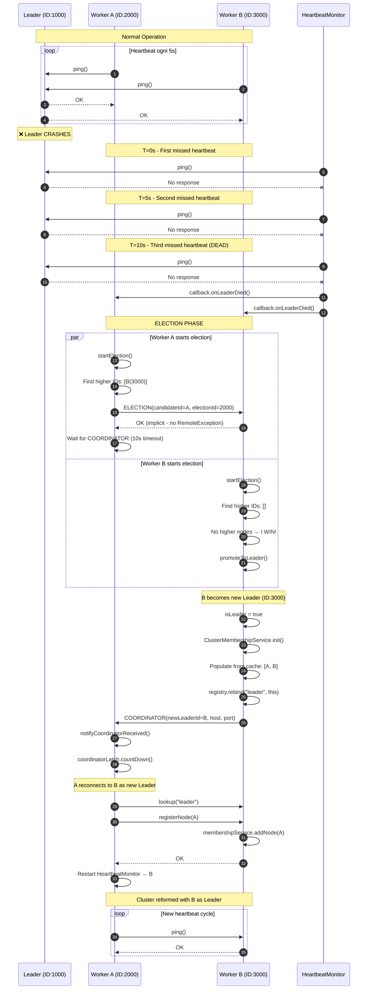

# Leader Election Component Documentation

The **Election** component provides automatic leader election using the Bully Algorithm. When the current Leader fails, Workers automatically elect a new Leader based on node IDs, ensuring cluster availability without manual intervention.

N.B.: The Election component is designed with extensibility in mind, allowing for future addition of other algorithms like Raft and Ring via the Strategy Pattern.
---

## Overview

### Purpose

The Election component (`com.hecaton.election`) provides:
- **Automatic Failover**: Cluster self-heals when Leader dies
- **Strategy Pattern**: Pluggable election algorithms (Bully, Raft, Ring)
- **Deterministic Leadership**: Highest election ID always wins
- **Split-Brain Prevention**: Coordinated cache refresh prevents multiple Leaders

### Key Classes

| Class | Purpose |
|-------|---------|
| `ElectionStrategy` | Interface for election algorithms (Strategy Pattern) |
| `BullyElection` | Bully Algorithm implementation (Phase 2) |
| `ElectionStrategyFactory` | Factory for creating strategy instances |
| `Algorithm` | Enum for algorithm selection (BULLY, RAFT, RING) |

---

## Architecture

### Design Patterns

**Strategy Pattern + Factory Pattern + Supplier Pattern**:

```
┌─────────────────────────────────────────────────────────┐
│                ElectionStrategyFactory                   │
│                                                          │
│  enum Algorithm { BULLY, RAFT, RING }                   │
│                                                          │
│  create(algorithm, selfNode, electionId, supplier)      │
│      → returns ElectionStrategy instance                 │
└─────────────────────────────────────────────────────────┘
                          ↓
            ┌─────────────────────────────┐
            │   <<interface>>             │
            │   ElectionStrategy          │
            ├─────────────────────────────┤
            │ + startElection()           │
            │ + notifyCoordinatorReceived()│
            └─────────────────────────────┘
                          ↑
                          │ implements
                          │
            ┌─────────────────────────────┐
            │   BullyElection             │
            ├─────────────────────────────┤
            │ - selfNode: NodeImpl        │
            │ - selfElectionId: long      │
            │ - clusterNodesSupplier:     │
            │     Supplier<List<NodeInfo>>│
            │ - coordinatorLatch:         │
            │     CountDownLatch          │
            ├─────────────────────────────┤
            │ + startElection()           │
            │ + notifyCoordinatorReceived()│
            │ - sendElectionMessages()    │
            │ - becomeLeader()            │
            │ - announceCoordinator()     │
            │ - waitForCoordinator()      │
            └─────────────────────────────┘
```

### Why Strategy Pattern?

**Future-Proof Design**: Allows swapping election algorithms without modifying `NodeImpl`:

```java
// Easy to switch algorithms via constructor parameter
NodeImpl node1 = new NodeImpl("localhost", 5001, Algorithm.BULLY);
NodeImpl node2 = new NodeImpl("localhost", 5002, Algorithm.RAFT);  // Future
```

**Benefits**:
- ✅ **Open/Closed Principle**: Add new algorithms without changing existing code
- ✅ **Single Responsibility**: `NodeImpl` delegates election logic to strategy
- ✅ **Testability**: Mock election strategies for unit testing
- ✅ **Educational**: Clear separation of concerns for learning

---

## Bully Algorithm

### Overview

**Rule**: The node with the **HIGHEST election ID** always becomes the Leader.

**Election ID**: Timestamp when node was created (`System.currentTimeMillis()`)

**Key Characteristics**:
- ✅ **Deterministic**: Same cluster state → same Leader
- ✅ **Fast**: Election completes in ~10-15 seconds
- ✅ **Simple**: Easy to understand and implement
- ❌ **O(n²) messages**: Not scalable beyond ~20 nodes
- ❌ **Network-intensive**: All higher nodes must be contacted

**Suitability**: Educational projects, small clusters (3-20 nodes)

### Algorithm Flow


---

## Implementation Details

### ElectionStrategy Interface

**Clean API with 2 methods**:

```java
public interface ElectionStrategy {
    /**
     * Initiates the Leader election process.
     * Called when the current Leader is detected as dead by HeartbeatMonitor.
     */
    void startElection();
    
    /**
     * Notifies the election strategy that a COORDINATOR message was received.
     * Unblocks waiting threads (e.g., CountDownLatch in Bully).
     */
    void notifyCoordinatorReceived();
}
```

**Design Decision**: No `setClusterNodes()` method (removed via Supplier Pattern).

**Why 2 methods only?**

- ✅ **Minimal interface**: Easier to implement new algorithms
- ✅ **No setter pollution**: Strategies are immutable after construction
- ✅ **Separation of concerns**: Election logic vs. cache management separate

---

### BullyElection Class

**Key Fields**:

```java
public class BullyElection implements ElectionStrategy {
    private static final int COORDINATOR_TIMEOUT_MS = 10000;  // 10 seconds
    
    private final NodeImpl selfNode;                           // Callback to promote
    private final long selfElectionId;                         // My timestamp
    private final Supplier<List<NodeInfo>> clusterNodesSupplier;  // Lazy cache access
    private final CountDownLatch coordinatorLatch;             // Wait for COORDINATOR
}
```

**Constructor with Supplier**:

```java
public BullyElection(NodeImpl selfNode, 
                    long selfElectionId, 
                    Supplier<List<NodeInfo>> clusterNodesSupplier) {
    this.selfNode = selfNode;
    this.selfElectionId = selfElectionId;
    this.clusterNodesSupplier = clusterNodesSupplier;  // ← Lambda, not snapshot!
}
```

### startElection() Logic

**Step-by-step breakdown**:

```java
@Override
public void startElection() {
    log.info("Starting Bully Election (my ID: {})", selfElectionId);
    
    try {
        // STEP 1: Get FRESH cluster snapshot from supplier
        List<NodeInfo> clusterNodes = clusterNodesSupplier.get();  // ← Lazy evaluation!
        
        // STEP 2: Find nodes with higher election ID
        List<NodeInfo> higherNodes = clusterNodes.stream()
            .filter(node -> node.getElectionId() > selfElectionId)
            .collect(Collectors.toList());
        
        log.info("The cluster nodes are: {}", clusterNodes);
        
        if (higherNodes.isEmpty()) {
            // No node with higher ID → I WIN!
            log.info("No higher nodes found. I am the new Leader!");
            becomeLeader();
            return;
        }
        
        // STEP 3: Send ELECTION messages to higher nodes
        log.info("Sending ELECTION to {} higher node(s)", higherNodes.size());
        boolean receivedOK = sendElectionMessages(higherNodes);
        
        if (!receivedOK) {
            // No one responded → they must all be dead → I WIN!
            log.info("No OK received from higher nodes. I am the new Leader!");
            becomeLeader();
        } else {
            // Someone responded → WAIT for COORDINATOR
            log.info("Waiting for COORDINATOR message from higher node...");
            waitForCoordinator();
        }
        
    } catch (Exception e) {
        log.error("Election failed: {}", e.getMessage(), e);
    }
}
```

**Critical: Lazy Cache Evaluation**

```java
List<NodeInfo> clusterNodes = clusterNodesSupplier.get();  // ← Fresh data!
```

**Why this matters**:

| Scenario | Old Approach (Snapshot) | New Approach (Supplier) |
|----------|------------------------|-------------------------|
| Worker A joins at T=0 | cache = [Leader, A] | supplier → [Leader, A] |
| Worker B joins at T=10 | cache STILL [Leader, A] ❌ | supplier → [Leader, A, B] ✅ |
| Leader dies at T=20 | A thinks only it exists → SPLIT BRAIN! | A sees B → correct election ✅ |

**Solution**: Supplier Pattern + Periodic Refresh (see below).

---

### Periodic Cache Refresh

So we have a method to refresh the cluster nodes cache periodically, but when to call it?
We choose to integrate it into the existing HeartbeatMonitor logic, which already pings the Leader every 5 seconds.


**Integrated with HeartbeatMonitor**:

```java
// HeartbeatMonitor - new callback interface
public interface CacheRefreshCallback {
    void refreshCache();
}

// Refresh trigger every 8 heartbeats (~40 seconds)
private static final int CACHE_REFRESH_INTERVAL = 8;
private int heartbeatCount = 0;

private void sendHeartbeat() {
    boolean alive = targetNode.ping();
    
    if (alive) {
        heartbeatCount++;
        
        // Periodic cache refresh
        if (cacheRefreshCallback != null && heartbeatCount % CACHE_REFRESH_INTERVAL == 0) {
            cacheRefreshCallback.refreshCache();
        }
    }
}
```

**NodeImpl integration**:

```java
// Create HeartbeatMonitor with cache refresh callback
leaderMonitor = new HeartbeatMonitor(
    leaderNode, 
    this::onLeaderDied,          // Failure callback
    this::updateClusterCache,    // Cache refresh callback
    "Leader Monitor"
);

// Implementation of cache refresh
private void updateClusterCache() {
    if (isLeader || leaderNode == null) {
        return;  // Leaders don't need cache
    }
    
    try {
        LeaderService leader = (LeaderService) leaderNode;
        List<NodeInfo> freshNodes = leader.getClusterNodes();
        
        // Update cache (clear + addAll for thread safety)
        this.clusterNodesCache.clear();
        this.clusterNodesCache.addAll(freshNodes);
        
        log.debug("Cluster cache refreshed: {} nodes", clusterNodesCache.size());
    } catch (RemoteException e) {
        log.warn("Failed to refresh cluster cache: {}", e.getMessage());
    }
}
```
---

### Promotion to Leader

**promoteToLeader() in NodeImpl**:

```java
public void promoteToLeader() throws RemoteException {
    log.info("Promoting to Leader...");
    
    synchronized (this) {
        if (isLeader) {
            log.warn("Already Leader, skipping promotion");
            return;
        }
        
        this.isLeader = true;
        
        // Initialize cluster membership service
        this.membershipService = new ClusterMembershipService();
        membershipService.addNode(this);  // Add self
        
        // CRITICAL: Populate membership with cached nodes
        for (NodeInfo nodeInfo : clusterNodesCache) {
            if (nodeInfo.getElectionId() != this.nodeIdValue) {
                try {
                    Registry registry = LocateRegistry.getRegistry(
                        nodeInfo.getHost(), nodeInfo.getPort()
                    );
                    NodeService node = (NodeService) registry.lookup("node");
                    membershipService.addNode(node);
                } catch (Exception e) {
                    log.warn("Failed to add cached node {}", nodeInfo.getNodeId());
                }
            }
        }
        
        // Stop monitoring old Leader (we ARE the Leader now)
        if (leaderMonitor != null) {
            leaderMonitor.stop();
            leaderMonitor = null;
        }
        this.leaderNode = null;
        
        // Bind as "leader" in RMI registry
        myRegistry.rebind("leader", this);
        
        log.info("Successfully promoted to Leader on port {} with {} nodes", 
            port, membershipService.getClusterSize());
    }
}
```

**Key Steps**:
1. **Set isLeader flag**: Changes RMI behavior (accepts registrations)
2. **Initialize ClusterMembershipService**: Leader-only component
3. **Populate from cache**: New Leader knows about other Workers
4. **Stop heartbeat monitoring**: Leaders don't monitor anyone (yet)
5. **Rebind as "leader"**: Workers can now find new Leader

---

### COORDINATOR Announcement

**announceCoordinator() in BullyElection**:

```java
private void announceCoordinator() {
    log.info("Announcing myself as COORDINATOR to all nodes");
    List<NodeInfo> clusterNodes = clusterNodesSupplier.get();
    
    for (NodeInfo node : clusterNodes) {
        if (node.getElectionId() == selfElectionId) {
            continue;  // Skip myself
        }
        
        try {
            Registry registry = LocateRegistry.getRegistry(
                node.getHost(), node.getPort()
            );
            NodeService remoteNode = (NodeService) registry.lookup("node");
            
            // Extract host and port from selfNode ID
            String selfId = selfNode.getId();
            String[] parts = selfId.split("-");
            String host = parts.length > 1 ? parts[1] : "localhost";
            int port = parts.length > 2 ? Integer.parseInt(parts[2]) : 5001;
            
            remoteNode.receiveCoordinatorMessage(selfId, host, port);
            
            log.info("Notified node {}", node.getNodeId());
            
        } catch (Exception e) {
            log.warn("Failed to notify node {}: {}", 
                node.getNodeId(), e.getMessage());
        }
    }
}
```

**Broadcast to ALL nodes** (not just lower IDs):
- Lower IDs: Need to know who won
- Higher IDs: May have crashed, but if alive, should know about new Leader

---

### Worker Reconnection

N.B.: this method is called on the Worker when it receives the COORDINATOR message from the new Leader. And the new leader calls it during announceCoordinator() (see above).
**receiveCoordinatorMessage() in NodeImpl**:

```java
@Override
public void receiveCoordinatorMessage(String newLeaderId, String leaderHost, int leaderPort) 
    throws RemoteException {
    log.info("New Leader elected: {} at {}:{}", newLeaderId, leaderHost, leaderPort);
    
    // Notify election strategy (unblocks CountDownLatch)
    electionStrategy.notifyCoordinatorReceived();
    
    try {
        // Reconnect to new Leader
        Registry leaderRegistry = LocateRegistry.getRegistry(leaderHost, leaderPort);
        LeaderService leader = (LeaderService) leaderRegistry.lookup("leader");
        this.leaderNode = (NodeService) leader;
        
        // Re-register with new Leader
        leader.registerNode(this);
        
        // Restart HeartbeatMonitor for new Leader
        if (leaderMonitor != null) {
            leaderMonitor.stop();
        }
        leaderMonitor = new HeartbeatMonitor(
            leaderNode, 
            this::onLeaderDied, 
            this::updateClusterCache, 
            "Leader Monitor"
        );
        leaderMonitor.start();
        
        log.info("Successfully reconnected to new Leader");
        
    } catch (Exception e) {
        log.error("Failed to reconnect to new Leader: {}", e.getMessage(), e);
    }
}
```

**Steps**:
1. **Unblock waiting thread**: `notifyCoordinatorReceived()` → `coordinatorLatch.countDown()`
2. **Lookup new Leader**: Find "leader" binding in new Leader's registry
3. **Re-register**: Send own RMI stub to new Leader
4. **Restart heartbeat**: Monitor new Leader instead of old one

---

## ElectionStrategyFactory

**Factory with Algorithm Enum**:

```java
public class ElectionStrategyFactory {
    
    public enum Algorithm {
        BULLY,   // Implemented
        RAFT,    // Future
        RING     // Future
    }
    
    public static ElectionStrategy create(
            Algorithm algorithm,
            NodeImpl selfNode, 
            long electionId, 
            Supplier<List<NodeInfo>> clusterNodesSupplier) {
        
        switch (algorithm) {
            case BULLY:
                return new BullyElection(selfNode, electionId, clusterNodesSupplier);
                
            case RAFT:
                throw new UnsupportedOperationException("Raft not yet implemented");
                
            case RING:
                throw new UnsupportedOperationException("Ring not yet implemented");
                
            default:
                throw new IllegalArgumentException("Unknown algorithm: " + algorithm);
        }
    }
}
```

**Why Factory Pattern?**

**Solves chicken-and-egg problem**:
```java
// ❌ BEFORE: Can't create strategy before node exists
BullyElection strategy = new BullyElection(node, ...);  // node doesn't exist yet!
NodeImpl node = new NodeImpl(..., strategy);

// ✅ AFTER: Node creates itself, then creates strategy
NodeImpl node = new NodeImpl(..., Algorithm.BULLY);
// Inside constructor:
this.electionStrategy = ElectionStrategyFactory.create(
    algorithm, 
    this,  // ← 'this' now valid!
    nodeIdValue, 
    () -> this.clusterNodesCache
);
```

**Benefits**:
- ✅ **Type safety**: Enum prevents typos (compile-time check)
- ✅ **Centralized creation**: Single place to add new algorithms
- ✅ **Scalable**: Adding Raft = one new `case` statement

---

## Configuration

### Election Timeout

```java
private static final int COORDINATOR_TIMEOUT_MS = 10000;  // 10 seconds
```

**When COORDINATOR is expected but not received** (higher node crashed during election):

```java
boolean received = coordinatorLatch.await(COORDINATOR_TIMEOUT_MS, TimeUnit.MILLISECONDS);

if (!received) {
    log.warn("COORDINATOR timeout! Higher node may have crashed. Restarting election...");
    startElection();  // Recursive retry
}
```

**Prevents deadlock**: If highest node crashes mid-election, lower node will retry and eventually win.

---

## Testing

### Manual Test Harness

**TestThreeNodeElection.java**:

```java
public static void main(String[] args) throws Exception {
    // Parse CLI args: --port 5001 --leader | --join localhost:5001
    
    if (isLeader) {
        NodeImpl node = new NodeImpl("localhost", port, Algorithm.BULLY);
        node.startAsLeader();
    } else {
        NodeImpl node = new NodeImpl("localhost", port, Algorithm.BULLY);
        node.joinCluster(leaderHost, leaderPort);
    }
    
    Thread.currentThread().join();  // Keep alive
}
```

### Test Scenario

**3-node cluster election**:

1. **Terminal 1**: Start Leader on port 5001
   ```powershell
   mvn test-compile exec:java `
     '-Dexec.mainClass=com.hecaton.manual.election.TestThreeNodeElection' `
     '-Dexec.args=--port 5001 --leader'
   ```

2. **Terminal 2**: Start Worker A on port 5002
   ```powershell
   mvn test-compile exec:java `
     '-Dexec.mainClass=com.hecaton.manual.election.TestThreeNodeElection' `
     '-Dexec.args=--port 5002 --join localhost:5001'
   ```

3. **Terminal 3**: Start Worker B on port 5003
   ```powershell
   mvn test-compile exec:java `
     '-Dexec.mainClass=com.hecaton.manual.election.TestThreeNodeElection' `
     '-Dexec.args=--port 5003 --join localhost:5001'
   ```

4. **Wait** (let Worker A refresh cache at heartbeat #8)

5. **Kill Leader** (Ctrl+C in Terminal 1)

6. **Expected**: Worker B (port 5003, highest ID) becomes Leader

7. **Verify**: Worker A reconnects to Worker B

---

## Related Documentation

- [Node Component](node.md) - Integration with NodeImpl
- [HeartbeatMonitor](heartbeat.md) - Failure detection and cache refresh
- [Troubleshooting](../testing/troubleshooting.md) - Split-brain bug and solutions
- [Testing Guide](../testing/rmi-cluster.md) - Election test procedures

---

## Code Location

**Source**:
- `src/main/java/com/hecaton/election/ElectionStrategy.java`
- `src/main/java/com/hecaton/election/ElectionStrategyFactory.java`
- `src/main/java/com/hecaton/election/bully/BullyElection.java`

**Tests**:
- `src/test/java/com/hecaton/manual/election/TestThreeNodeElection.java`

**Config**: `src/main/resources/logback.xml` (logging levels)
