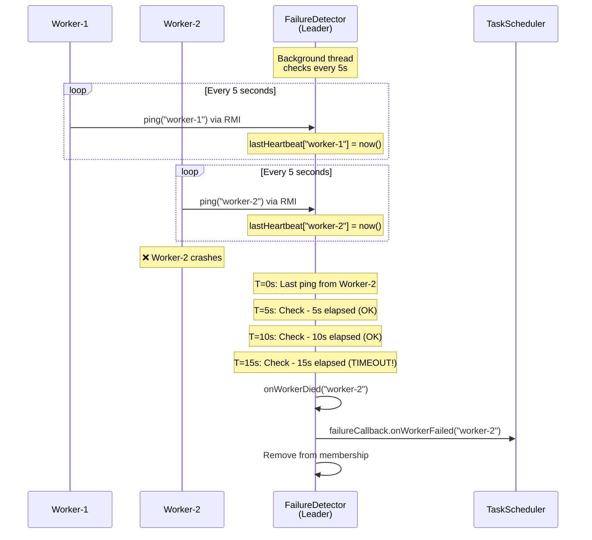
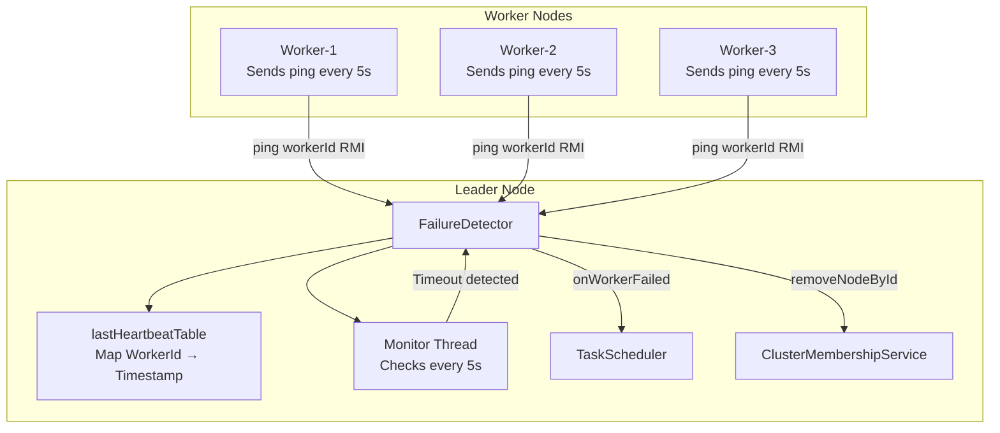
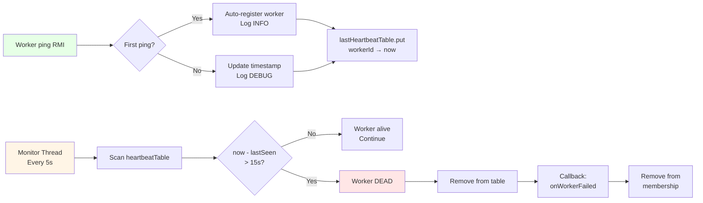
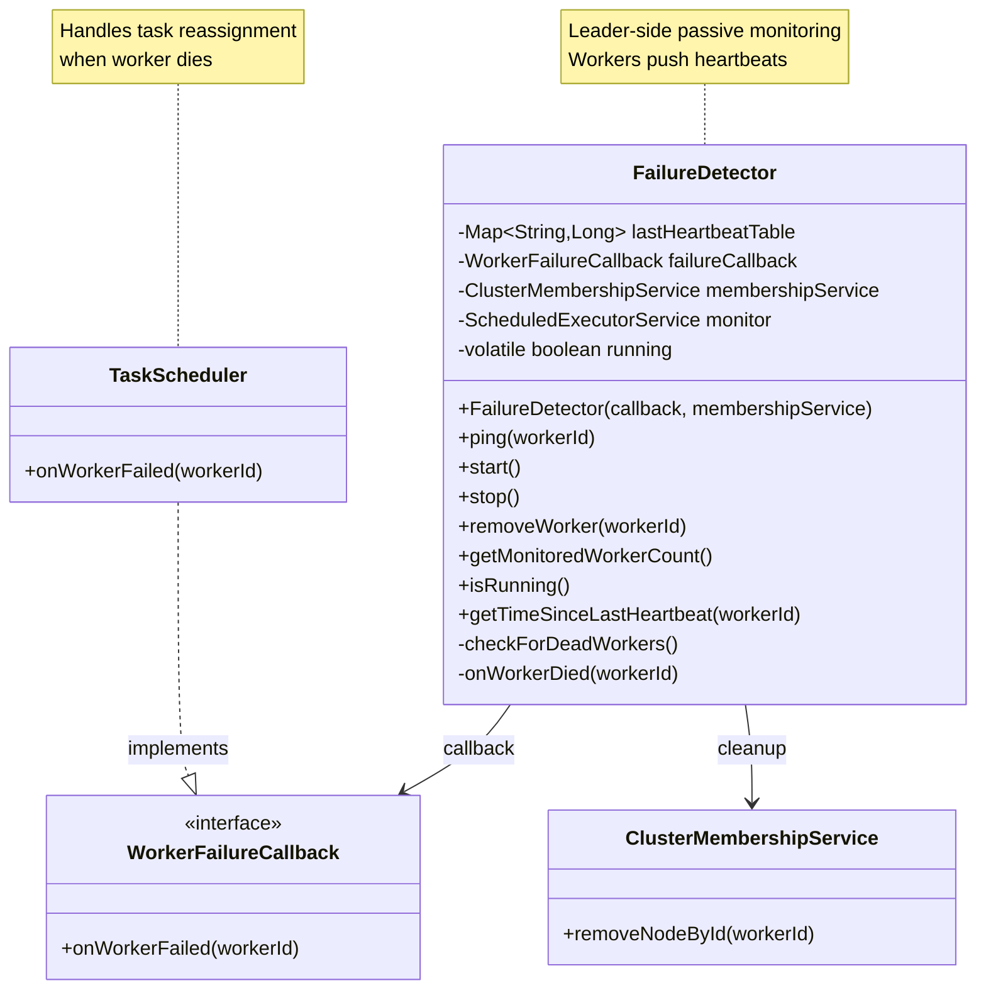
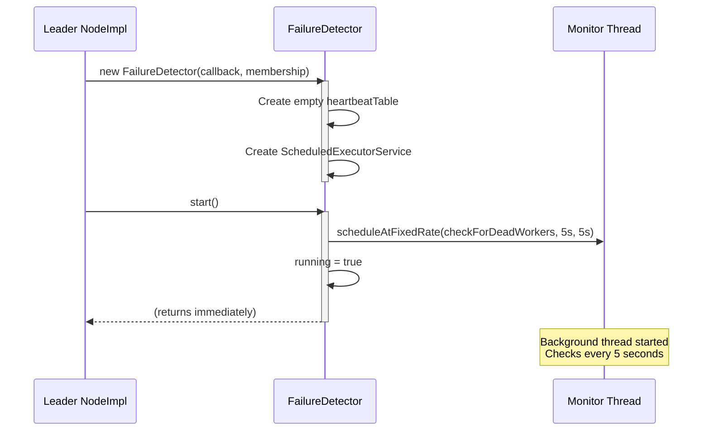
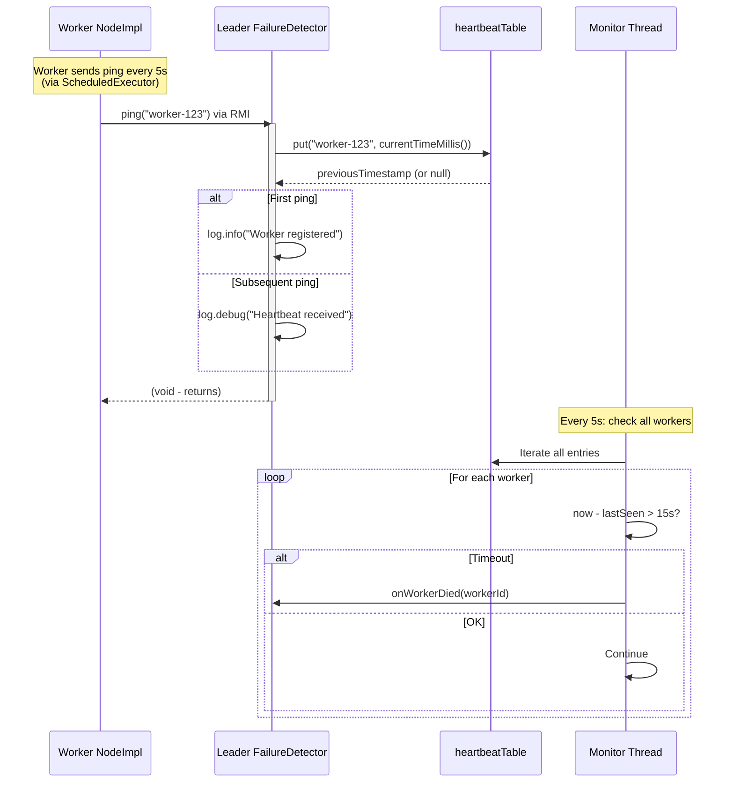

# FailureDetector - Worker Failure Detection

## Table of Contents

- [Overview](#overview)
- [Architecture](#architecture)
- [Comparison with HeartbeatMonitor](#comparison-with-heartbeatmonitor)
- [Class Structure](#class-structure)
- [Heartbeat Table Management](#heartbeat-table-management)
- [Complete Lifecycle](#complete-lifecycle)
- [API Reference](#api-reference)
- [Integration with TaskScheduler](#integration-with-taskscheduler)
- [Configuration](#configuration)
- [Thread Safety](#thread-safety)
- [Best Practices](#best-practices)
- [Advanced Topics](#advanced-topics)

---

## Overview

**FailureDetector** is a Leader-side component that monitors worker health through a passive heartbeat mechanism. Unlike `HeartbeatMonitor` (which actively pings remote nodes), FailureDetector **listens** for incoming heartbeat signals from workers.

### Purpose

- **Passive Monitoring**: Workers call `ping(workerId)` periodically via RMI
- **Timeout Detection**: Declares workers dead after 15 seconds of silence
- **Automatic Registration**: Workers auto-register on first ping (no explicit setup)
- **Callback Mechanism**: Notifies `TaskScheduler` to reassign orphaned tasks
- **Cluster Cleanup**: Removes dead workers from membership list

### Key Characteristics

- ✅ **Leader-Only**: Runs exclusively on Leader node
- ✅ **Scalable**: N workers = O(N) memory, O(N) scan per check
- ✅ **Non-Blocking**: Background thread performs timeout checks
- ✅ **Lazy Registration**: Workers discovered on first heartbeat
- ✅ **Thread-Safe**: `ConcurrentHashMap` for concurrent worker pings

---

## Architecture

### Pull vs Push Model

**FailureDetector uses PUSH model** (workers → Leader):



### Component Diagram



### Data Flow



---

## Comparison with HeartbeatMonitor

| Aspect | **FailureDetector** | **HeartbeatMonitor** |
|--------|-------------------|---------------------|
| **Direction** | Workers → Leader (PUSH) | Monitor → Target (PULL) |
| **Location** | Leader-side only | Any node (Worker/Leader) |
| **Initiator** | Workers send pings | Monitor sends pings |
| **Scalability** | O(N) workers = 1 detector | O(N) workers = N monitors |
| **Use Case** | Leader monitors all workers | Worker monitors Leader |
| **Registration** | Lazy (auto on first ping) | Eager (explicit constructor) |
| **Timeout** | 15s (3 missed 5s intervals) | 15s (3 consecutive failures) |
| **Network Load** | N workers × 1 ping | 1 monitor × 1 ping |

### When to Use Which?

**Use FailureDetector**:
- Leader needs to monitor **many workers**
- Workers can initiate RMI calls to Leader
- Example: Task distribution system

**Use HeartbeatMonitor**:
- Need to monitor **single critical node** (e.g., Leader)
- Want active probing (target may not send pings)
- Monitor has control over detection timing
- Example: Worker detects Leader death for election

---

## Class Structure



### Dependencies

**Required**:
- `ClusterMembershipService` - For removing dead workers from cluster
- `WorkerFailureCallback` - Notification interface (typically `TaskScheduler`)
---

## Heartbeat Table Management

### Data Structure

```java
private final Map<String, Long> lastHeartbeatTable = new ConcurrentHashMap<>();
```

**Key**: `workerId` (String) - Unique worker identifier (e.g., `"node-localhost-5002-1234567890"`)  
**Value**: `timestamp` (Long) - Last ping time in milliseconds (`System.currentTimeMillis()`)

### Lifecycle Operations

### Startup Sequence



---

### Worker Heartbeat Flow


---

## API Reference

### Constructor

```java
public FailureDetector(WorkerFailureCallback failureCallback, 
                       ClusterMembershipService membershipService)
```

**Parameters**:
- `failureCallback` - Invoked when worker dies (e.g., `taskScheduler::onWorkerFailed`)
- `membershipService` - For removing dead workers from cluster list

**Thread Pool Creation**: Single daemon thread for monitoring

---

### ping()

```java
public void ping(String workerId)
```

**Purpose**: Called by workers via RMI to signal they're alive.

**Parameters**:
- `workerId` - Unique worker identifier

**Behavior**:
1. Updates `lastHeartbeatTable` with current timestamp
2. Logs INFO on first ping (registration)
3. Logs DEBUG on subsequent pings

**Thread Safety**: Thread-safe (`ConcurrentHashMap.put()`)

**Called By**: Worker's scheduled task via RMI

**RMI Interface**:

```java
// In LeaderService.java:
public interface LeaderService extends Remote {
    void ping(String workerId) throws RemoteException;
    // ... other methods
}

// In Leader's NodeImpl:
@Override
public void ping(String workerId) throws RemoteException {
    failureDetector.ping(workerId);  // Delegate to FailureDetector
}
```
---

### start()

```java
public void start()
```

**Purpose**: Starts background monitoring thread.

**Behavior**:
- Schedules `checkForDeadWorkers()` every 5 seconds
- Sets `running = true`
- Idempotent (logs warning if already running)

**Initial Delay**: 5 seconds (gives workers time to register)

---

### stop()

```java
public void stop()
```

**Purpose**: Stops monitoring and shuts down executor.

**Shutdown Sequence**:
1. Set `running = false`
2. Call `monitor.shutdown()`
3. Wait 2 seconds for termination
4. Force shutdown if still running

**When to Call**: Leader graceful shutdown or failover

---

### removeWorker()

```java
public void removeWorker(String workerId)
```

**Purpose**: Manually removes worker from monitoring (graceful shutdown).

**Use Case**: Worker sends disconnect signal before shutting down


---

### getMonitoredWorkerCount()

```java
public int getMonitoredWorkerCount()
```

**Returns**: Number of workers currently being monitored

**Use Case**: Metrics, monitoring dashboards

---

### getTimeSinceLastHeartbeat()

```java
public long getTimeSinceLastHeartbeat(String workerId)
```

**Returns**: Milliseconds since last heartbeat, or `-1` if worker not found

**Use Case**: Health checks, debugging

---

## Integration with TaskScheduler

### Callback Interface

```java
public interface WorkerFailureCallback {
    void onWorkerFailed(String workerId);
}
```

---

## Configuration

### Tuning Parameters

```java
private static final long HEARTBEAT_TIMEOUT_MS = 15000;  // 15 seconds
private static final long MONITOR_INTERVAL_MS = 5000;    // 5 seconds
```

**Timeout Calculation**:
```
Workers send ping every 5 seconds
Timeout after 15 seconds
→ Tolerates 3 missed pings (15s / 5s = 3)
```

**Trade-offs**:

| Configuration | Detection Speed | False Positives | Network Load |
|---------------|----------------|-----------------|--------------|
| **Aggressive** (5s timeout, 1s check) | Fast | High (on slow networks) | High |
| **Default** (15s timeout, 5s check) | Moderate | Low | Low |
| **Conservative** (30s timeout, 10s check) | Slow | Very Low | Very Low |

---

### Worker Ping Frequency

**Worker-side configuration**:

```java
// In Worker's NodeImpl:
private static final long PING_INTERVAL_MS = 5000;  // Match detector's expectation

heartbeat.scheduleAtFixedRate(() -> {
    leader.ping(nodeId);
}, 0, PING_INTERVAL_MS, TimeUnit.MILLISECONDS);
```

**Critical**: Worker ping interval MUST be < detector timeout / 3

```
Timeout = 15s
Ping interval < 15s / 3 = 5s
→ Default 5s is optimal
```

---

### Code Location

**Source**: `src/main/java/com/hecaton/monitor/FailureDetector.java`  
**Tests**: `src/test/java/com/hecaton/manual/monitor/TestFailureDetector*.java`  
**Integration**: `src/main/java/com/hecaton/node/NodeImpl.java` (Leader initialization)