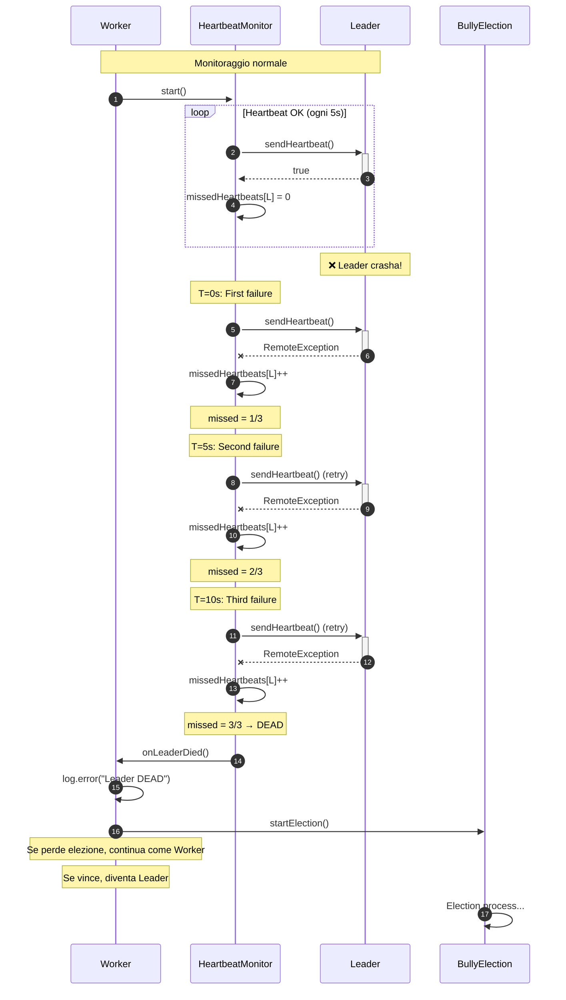
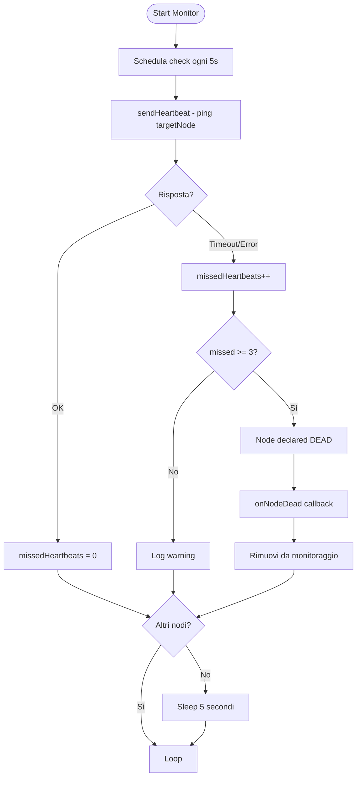

# HeartbeatMonitor Component Documentation

The **HeartbeatMonitor** provides fault detection through periodic health checks of remote nodes. It enables automatic detection of node failures and triggers recovery mechanisms (e.g., leader election).

---

## Overview

### Purpose

HeartbeatMonitor is a **generic watchdog** that can monitor any remote node:
- **Periodic Ping**: Sends RMI `ping()` calls every 5 seconds
- **Failure Detection**: Declares node dead after 3 consecutive failures (~15 seconds)
- **Callback Mechanism**: Executes user-defined action on node death
- **Thread-Safe**: Uses `ScheduledExecutorService` for concurrent operation

### Key Characteristics

- ✅ **Reusable**: Not specific to Leader/Worker - works for any `NodeService`
- ✅ **Non-blocking**: Runs in dedicated daemon thread
- ✅ **Graceful Shutdown**: Properly cleans up resources
- ✅ **Defensive**: Handles RMI failures and callback exceptions
- ✅ **Cache Refresh**: Periodic callback for cluster membership updates (Phase 2)

---

## Architecture

```
┌─────────────────┐                          ┌─────────────────┐
│  Monitoring     │  ping() every 5s         │  Target Node    │
│  Node           │ ─────────────────────>   │  (Leader/Worker)│
│                 │                          │                 │
│ HeartbeatMonitor│ <─────────────────────   │  NodeService    │
│                 │  returns true (alive)    │  impl           │
│                 │                          │                 │
│                 │  Every 10 heartbeats:    │                 │
│                 │  → callback.refreshCache()│                │
│                 │                          │                 │
│                 │  If 3 failures:          │                 │
│                 │  → callback.onNodeDied() │                 │
└─────────────────┘                          └─────────────────┘
```

### Design Decisions

#### Why Worker → Leader (Not Bidirectional by Default)?

**Current Implementation**: Workers monitor Leader only.

**Rationale**:
1. **Scalability**: N workers = N monitors (distributed load)
2. **Fast Election**: Workers detect Leader death immediately → trigger election
3. **Simplicity**: MVP approach for Phase 1

**Trade-off**: Leader doesn't know when Worker dies.

**Solution** (for Leader → Worker monitoring):

```java
// In NodeImpl.registerNode() (Leader-side)
@Override
public void registerNode(NodeService worker) throws RemoteException {
    discoveryService.addNode(worker);
    
    // Create monitor for this worker
    HeartbeatMonitor workerMonitor = new HeartbeatMonitor(
        worker,
        this::onWorkerDied,
        "Worker-" + worker.getId()
    );
    workerMonitor.start();
    
    // Store monitor for later cleanup
    workerMonitors.put(worker.getId(), workerMonitor);
}

private void onWorkerDied(NodeService deadWorker) {
    discoveryService.removeNode(deadWorker);
    // TODO Phase 3: taskScheduler.reassignTasks(deadWorker);
}
```

**When to Implement**: Phase 3 (Task Distribution) when task reassignment is needed.

---

## Class Structure

### Package
`com.hecaton.monitor`

### Dependencies
- `com.hecaton.rmi.NodeService` - Remote interface for ping
- `java.util.concurrent.*` - Scheduling infrastructure
- `org.slf4j.*` - Logging

### Key Fields

```java
private static final int HEARTBEAT_INTERVAL_MS = 5000;    // 5 seconds
private static final int MAX_MISSED_HEARTBEATS = 3;       // 15s total timeout
private static final int CACHE_REFRESH_INTERVAL = 10;     // Refresh every 10 heartbeats

private final ScheduledExecutorService scheduler;         // Thread pool
private final NodeService targetNode;                     // Remote node to monitor
private final NodeFailureCallback callback;               // Death notification
private final CacheRefreshCallback cacheRefreshCallback;  // Periodic cache refresh (Phase 2)
private final String monitorName;                         // For logging ("Leader Monitor")

private int missedHeartbeats = 0;                         // Failure counter
private int heartbeatCount = 0;                           // Total heartbeat count (Phase 2)
private ScheduledFuture<?> heartbeatTask;                 // Task handle for cancellation
```

---

## API Reference

### Constructor
```java
public HeartbeatMonitor(NodeService targetNode, 
                       NodeFailureCallback callback,
                       CacheRefreshCallback cacheRefreshCallback,
                       String monitorName)
```

**Parameters**:
- `targetNode` - Remote node to monitor (RMI stub)
- `callback` - Function called when node dies
- `cacheRefreshCallback` - Optional callback for periodic cache refresh (null = disabled)
**Parameters**:
- `targetNode` - Remote node to monitor (RMI stub)
- `callback` - Function called when node dies
- `monitorName` - Descriptive name for logs (e.g., "Leader Monitor", "Worker-node123")

**Thread Pool Configuration**:
- Single-threaded scheduler (1 thread sufficient for periodic task)
- Custom `ThreadFactory` for named threads (`HeartbeatMonitor-{monitorName}`)
- **Daemon threads**: Don't prevent JVM shutdown

---

### Lifecycle Methods

#### `start()`

```java
public void start()
```

Begins periodic heartbeat monitoring.

**Behavior**:
- First ping sent immediately (delay = 0)
- Subsequent pings every 5 seconds
- Uses `scheduleAtFixedRate` for fixed intervals (not affected by ping duration)

**Idempotent**: Safe to call multiple times (logs warning if already running)

#### `stop()`

```java
public void stop()
```

Stops monitoring and cleans up resources.

**Shutdown Sequence**:
1. Cancel scheduled task (`heartbeatTask.cancel(false)`)
2. Shutdown thread pool (`scheduler.shutdown()`)
3. Wait up to 2 seconds for completion (`awaitTermination`)
4. Force shutdown if still running (`shutdownNow()`)

**Thread Safety**: Safe to call from any thread.

---

### Callback Interface

```java
public interface NodeFailureCallback {
    void onNodeDied(NodeService deadNode);
}
```

**Invocation Context**:
- Called from HeartbeatMonitor's thread (not caller's thread)
- Wrapped in try-catch to prevent callback errors from crashing monitor
- Only invoked once per node death (monitor stops after detection)

**Implementation Example**:

```java
// Worker monitoring Leader
HeartbeatMonitor monitor = new HeartbeatMonitor(
    leaderNode,
    deadLeader -> {
        log.error("LEADER DIED! Starting election...");
        // Start Bully Election (Phase 2)
    },
    "Leader Monitor"
);
```
---

### Cache Refresh Callback (Phase 2)

**Purpose**: Keep cluster membership cache fresh for leader election.

```java
public interface CacheRefreshCallback {
    void refreshCache();
}
```

**Invocation Schedule**:
- Called every **8 successful heartbeats** (~40 seconds)
- Only when `cacheRefreshCallback != null`
- Only on **successful** pings (not during failures)


**Implementation in NodeImpl**:

```java
private void updateClusterCache() {
    if (isLeader || leaderNode == null) {
        return;  // Leaders don't need cache
    }
    
    try {
        LeaderService leader = (LeaderService) leaderNode;
        List<NodeInfo> freshNodes = leader.getClusterNodes();
        
        this.clusterNodesCache.clear();
        this.clusterNodesCache.addAll(freshNodes);
        
        log.debug("Cluster cache refreshed: {} nodes", clusterNodesCache.size());
    } catch (RemoteException e) {
        log.warn("Failed to refresh cluster cache: {}", e.getMessage());
    }
}
```

**Integration with Election**:

The refreshed cache is consumed by `BullyElection` via Supplier Pattern:

```java
// BullyElection.startElection()
List<NodeInfo> clusterNodes = clusterNodesSupplier.get();  // ← Fresh data!
List<NodeInfo> higherNodes = clusterNodes.stream()
    .filter(node -> node.getElectionId() > selfElectionId)
    .collect(Collectors.toList());
```

**See**: [Election Component Documentation](election.md) for complete election 

---

## Heartbeat Algorithm
N.B.: The following diagrams illustrate the heartbeat process and failure detection logic, BUT do not represent the message flow of the Bully Election, neither the cluster cache refresh process, because they are out of scope for this component.
### Sequence Diagram



### Activity Diagram



### Ping Logic

```java
private void sendHeartbeat() {
    try {
        boolean alive = targetNode.ping();  // RMI call (may timeout)
        
        if (alive) {
            if (missedHeartbeats > 0) {
                log.info("Node recovered after {} missed heartbeats", missedHeartbeats);
            }
            missedHeartbeats = 0;  // Reset on success
        } else {
            // ping() returned false (rare - node in bad state)
            handleMissedHeartbeat();
        }
    } catch (RemoteException e) {
        // Network error, timeout, or node dead
        handleMissedHeartbeat();
    }
}
```

**Key Points**:
- **Success = Response Received**: Doesn't matter what ping() returns, just that it responded
- **RMI Timeout**: Default ~5 seconds (configurable via JVM properties)
- **Recovery Detection**: Logs when node comes back after failures

---

## Configuration

### Tuning Parameters

**Heartbeat Interval**:
```java
private static final int HEARTBEAT_INTERVAL_MS = 5000;  // Default: 5 seconds
```

**Trade-offs**:
- **Lower (1-2s)**: Faster detection, higher network load
- **Higher (10s+)**: Slower detection, lower overhead

**Failure Threshold**:
```java
private static final int MAX_MISSED_HEARTBEATS = 3;  // Default: 3 failures
```

**Total Detection Time** = `HEARTBEAT_INTERVAL_MS × MAX_MISSED_HEARTBEATS`  
Default: 5s × 3 = **15 seconds**

### RMI Timeout

Configure via JVM properties:
```bash
java -Dsun.rmi.transport.tcp.responseTimeout=3000 ...
```

**Impact**: Lower timeout = faster single-ping failure detection, but more false positives on slow networks.

---

## Thread Model

### Daemon Threads

```java
ThreadFactory factory = runnable -> {
    Thread thread = new Thread(runnable);
    thread.setName("HeartbeatMonitor-" + monitorName);
    thread.setDaemon(true);  // ← Key for clean JVM shutdown
    return thread;
};
```

**Why Daemon?**
- Allows JVM to exit even if HeartbeatMonitor is running
- Prevents "hanging" processes after Ctrl+C
- Appropriate for background monitoring tasks

**Alternative**: Non-daemon thread requires explicit `stop()` before JVM exit.

### scheduleAtFixedRate vs scheduleWithFixedDelay

**Current Choice**: `scheduleAtFixedRate`

```java
scheduler.scheduleAtFixedRate(
    this::sendHeartbeat,
    0,                      // Initial delay
    HEARTBEAT_INTERVAL_MS,  // Period
    TimeUnit.MILLISECONDS
);
```

**Behavior**:
- T=0s: Execute
- T=5s: Execute (even if previous ping still running)
- T=10s: Execute

**Alternative** (`scheduleWithFixedDelay`):
- T=0s: Start execution (takes 2s)
- T=2s: Finish execution
- T=7s: Start next execution (2s finish + 5s delay)

**Why Fixed Rate?**: Ensures consistent 5-second intervals regardless of ping duration.

---

## Error Handling

### RMI Failures

```java
try {
    targetNode.ping();
} catch (RemoteException e) {
    log.warn("Heartbeat failed: {}", e.getClass().getSimpleName());
    handleMissedHeartbeat();
}
```

**RemoteException Types**:
- `ConnectException` - Node unreachable (most common for dead nodes)
- `NoSuchObjectException` - RMI stub unexported
- `MarshalException` - Serialization failure
- `UnmarshalException` - Deserialization failure

**All treated equally**: Any RMI error counts as missed heartbeat.

### Callback Exceptions

```java
try {
    callback.onNodeDied(targetNode);
} catch (Exception e) {
    log.error("Callback onNodeDied() failed: {}", e.getMessage(), e);
}
```

**Isolation**: Callback errors don't crash the monitor or prevent shutdown.

**Rationale**: Callback is user code (external to HeartbeatMonitor), so must be defensive.

---

## Testing

See [Heartbeat Testing Guide](../testing/heartbeat.md) for:
- Manual test procedures
- Expected log output
- Troubleshooting common issues
- Performance validation

## Related Documentation

- [Node Component](node.md) - Integration with NodeImpl
- [DiscoveryService](discovery.md) - Cluster membership management
- [Heartbeat Testing](../testing/heartbeat.md) - Test procedures and validation
- [RMI Architecture](../architecture/rmi-design.md) - RMI communication patterns
- [Election Component](election.md) - Leader election and cache refresh integration
- [Troubleshooting](../testing/troubleshooting.md) - Cache staleness and split-brain prevention

---

## Code Location

**Source**: `src/main/java/com/hecaton/monitor/HeartbeatMonitor.java`  
**Tests**: `src/test/java/com/hecaton/manual/monitor/TestHeartbeat*.java`  
**Config**: `src/main/resources/logback.xml` (logging levels)
