# Node Component Documentation

The **Node** is the fundamental building block of the Hecaton distributed system. Each node is a self-contained Java process that can operate as either a **Worker** (task executor) or **Leader** (coordinator).

## Table of Contents

- [Overview](#overview)
- [Architecture](#architecture)
  - [NodeImpl Fields](#nodeimpl-fields)
  - [Field-to-Component Mapping](#field-to-component-mapping)
  - [RMI Registry Bindings](#rmi-registry-bindings)
- [Node State Machine](#node-state-machine)
- [ClusterConfig - Strategy Configuration](#clusterconfig---strategy-configuration)
- [Component Integration](#component-integration)
- [API Reference](#api-reference)
- [Testing](#testing)

---

## Overview

### Purpose

The Node component (``com.hecaton.node``) provides:
- **Dual-role capability**: Can function as Worker or Leader
- **RMI endpoint**: Exposes remote interfaces for inter-node communication
- **State management**: Tracks cluster membership and node status
- **Lifecycle management**: Initialization, join, promotion, shutdown

### Interfaces Implemented

``NodeImpl`` implements two RMI interfaces:

| Interface | Purpose | Available On |
|-----------|---------|--------------|
| ``NodeService`` | Basic node operations (ping, getId, executeTasks, cancelJob, election messages) | All nodes |
| ``LeaderService`` | Leader operations (registerNode, submitJob, submitResults, getClusterNodes) | Leader only |

---

## Architecture

### NodeImpl Fields

```java
public class NodeImpl implements NodeService, LeaderService {
    // 
    // IDENTITY & CONFIGURATION
    // 
    private String nodeId;                      // "node-localhost-5001-1737500000000"
    private long nodeIdValue;                   // Timestamp (election ID)
    private String host;                        // Hostname for RMI
    private int port;                           // RMI registry port
    private boolean isLeader;                   // Current role flag
    private Registry myRegistry;                // Own RMI registry instance
    
    private final ClusterConfig config;         // Strategy configuration (immutable)
    public final NodeCapabilities capabilities; // CPU cores, RAM (immutable)
    
    // 
    // LEADER-ONLY COMPONENTS (null when Worker)
    // 
    private ClusterMembershipService membershipService;  // Active nodes registry
    private JobManager jobManager;                       // Job orchestration facade
    private FailureDetector failureDetector;             // Worker health monitoring
    private UdpDiscoveryService discoveryStrategy;       // UDP broadcaster
    
    // 
    // WORKER-ONLY COMPONENTS (null when Leader)
    // 
    private HeartbeatMonitor leaderMonitor;     // Leader health monitoring
    private NodeService leaderNode;             // Leader RMI stub
    
    // 
    // SHARED COMPONENTS (always initialized)
    // 
    private ElectionStrategy electionStrategy;  // Pluggable election algorithm
    private TaskExecutor taskExecutor;          // Thread pool for task execution
    private List<NodeInfo> clusterNodesCache;   // Membership cache (for election)
}
```

### Field-to-Component Mapping

This diagram shows how each NodeImpl field connects to its dedicated component class:

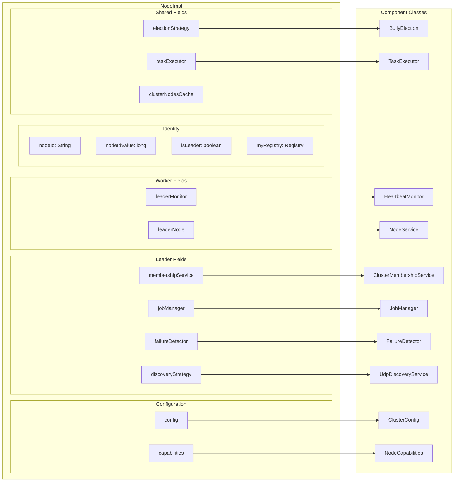

### Field Initialization Timeline

Fields are initialized at different phases of the node lifecycle:

| Phase | Trigger | Fields Initialized |
|-------|---------|-------------------|
| **1. Construction** | ``new NodeImpl(host, port)`` | ``nodeId``, ``nodeIdValue``, ``host``, ``port``, ``myRegistry``, ``config``, ``capabilities``, ``clusterNodesCache``, ``electionStrategy`` |
| **2a. Worker Join** | ``joinCluster(host, port)`` | ``leaderNode``, ``leaderMonitor``, ``taskExecutor`` |
| **2b. Leader Start** | ``startAsLeader()`` | ``isLeader=true``, ``membershipService``, ``jobManager``, ``failureDetector``, ``discoveryStrategy``, ``taskExecutor`` |
| **3. Promotion** | ``promoteToLeader()`` | Converts WorkerLeader: stops ``leaderMonitor``, initializes Leader-only components |

### RMI Registry Bindings

Each node creates its own RMI registry. What is bound depends on the role:

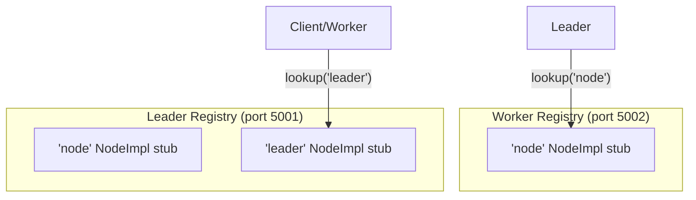

**Key Points**:
- Workers bind only as ``"node"`` (for receiving tasks, election messages)
- Leaders bind as **both** ``"node"`` AND ``"leader"`` (dual binding)
- Workers connect to Leader''s registry to lookup ``"leader"`` service

---

## Node State Machine

A node transitions through states based on startup method and election results:

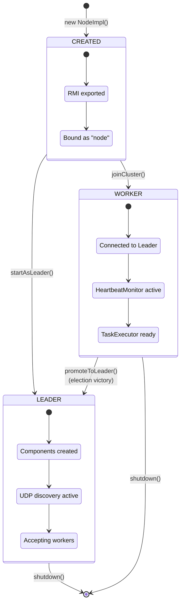

**State Transitions**:

| From | To | Trigger | Actions |
|------|-----|---------|---------|
| ``CREATED`` | ``WORKER`` | ``joinCluster(host, port)`` | Connect to Leader, register, start HeartbeatMonitor |
| ``CREATED`` | ``LEADER`` | ``startAsLeader()`` | Initialize all Leader components, bind as "leader" |
| ``WORKER`` | ``LEADER`` | ``promoteToLeader()`` | Stop HeartbeatMonitor, initialize Leader components, rebind as "leader" |

---

## ClusterConfig - Strategy Configuration

### Overview

``ClusterConfig`` centralizes all strategic choices using the **Builder pattern**. It is **immutable after creation**, ensuring thread-safety.

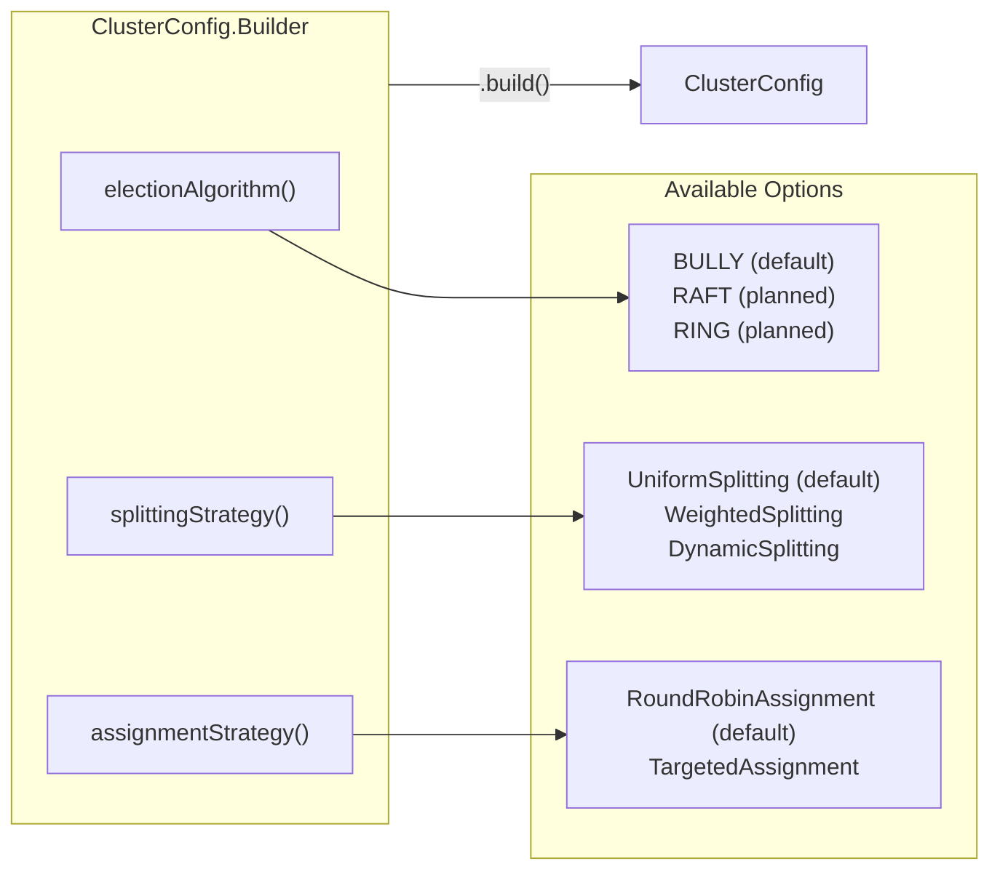

### Default Configuration

```java
// Using defaults (recommended for most cases)
NodeImpl node = new NodeImpl("localhost", 5001);

// Equivalent to:
ClusterConfig defaultConfig = new ClusterConfig.Builder().build();
NodeImpl node = new NodeImpl("localhost", 5001, defaultConfig);
```

### Custom Configuration

```java
ClusterConfig config = new ClusterConfig.Builder()
    .electionAlgorithm(ClusterConfig.Algorithm.BULLY)
    .splittingStrategy(new WeightedSplitting())     
    .assignmentStrategy(new TargetedAssignment())   
    .build();

NodeImpl node = new NodeImpl("localhost", 5001, config);
```

---

## Component Integration

Each component has a dedicated documentation page. This section provides a **quick reference** of how NodeImpl integrates with each.

### Integration Overview

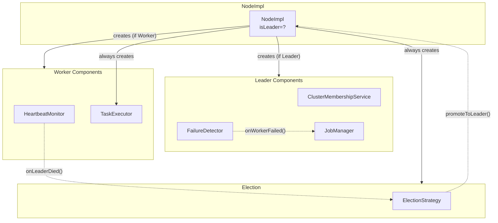

### Quick Reference

| Component | Created By | When | Callback to NodeImpl | See Also |
|-----------|------------|------|---------------------|----------|
| ``ClusterMembershipService`` | ``startAsLeader()`` / ``promoteToLeader()`` | Leader init |  | [cluster-membership.md](cluster-membership.md) |
| ``JobManager`` | ``startAsLeader()`` / ``promoteToLeader()`` | Leader init | ``onWorkerFailed()`` (forwarded) | [job-manager.md](task-framework/job-manager.md) |
| ``FailureDetector`` | ``startAsLeader()`` / ``promoteToLeader()`` | Leader init | ``onWorkerFailed()`` | [failure-detector.md](failure-detector.md) |
| ``HeartbeatMonitor`` | ``joinCluster()`` | Worker join | ``onLeaderDied()``, ``updateClusterCache()`` | [heartbeat.md](heartbeat.md) |
| ``TaskExecutor`` | ``joinCluster()`` / ``startAsLeader()`` | Both |  | [task-executor.md](task-framework/task-executor.md) |
| ``ElectionStrategy`` | Constructor | Always | ``promoteToLeader()`` | [election.md](election.md) |

### Callback Chains

**Worker detects Leader death**:
```
HeartbeatMonitor.onNodeDied() 
   NodeImpl.onLeaderDied() 
     ElectionStrategy.startElection()
       (if wins) NodeImpl.promoteToLeader()
```

**Leader detects Worker death**:
```
FailureDetector.checkForDeadWorkers()
   NodeImpl.onWorkerFailed(workerId)
     JobManager.onWorkerFailed(workerId)
       TaskScheduler.onWorkerFailed(workerId)
         reassign orphaned tasks
```

For detailed interaction flows (job submission, early termination, election, discovery), see [Architecture Overview](../architecture/overview.md#key-interactions).

---

## API Reference

NodeImpl exposes methods through two RMI interfaces plus internal lifecycle methods. This section explains **what each method does**, **who calls it**, and **what happens internally**.

---

### NodeService Methods (All Nodes)

These methods are available on **every node** (Worker or Leader) and are called via RMI.

#### Identity

| Method | Signature | Description |
|--------|-----------|-------------|
| ``getId()`` | ``String getId()`` | Returns unique node identifier (e.g., ``"node-localhost-5001-1737500000000"``). |
| ``getCapabilities()`` | ``NodeCapabilities getCapabilities()`` | Returns CPU cores and available RAM. Used by Leader for intelligent task assignment. |

#### Task Execution

| Method | Signature | Description |
|--------|-----------|-------------|
| ``executeTasks(tasks)`` | ``void executeTasks(List<Task>)`` | Receives tasks from Leader and delegates to ``TaskExecutor`` for parallel execution. |
| ``cancelJob(jobId)`` | ``void cancelJob(String jobId)`` | Interrupts all running tasks for the given job. Called when job completes early (e.g., password found). |

**Task Execution Flow**:

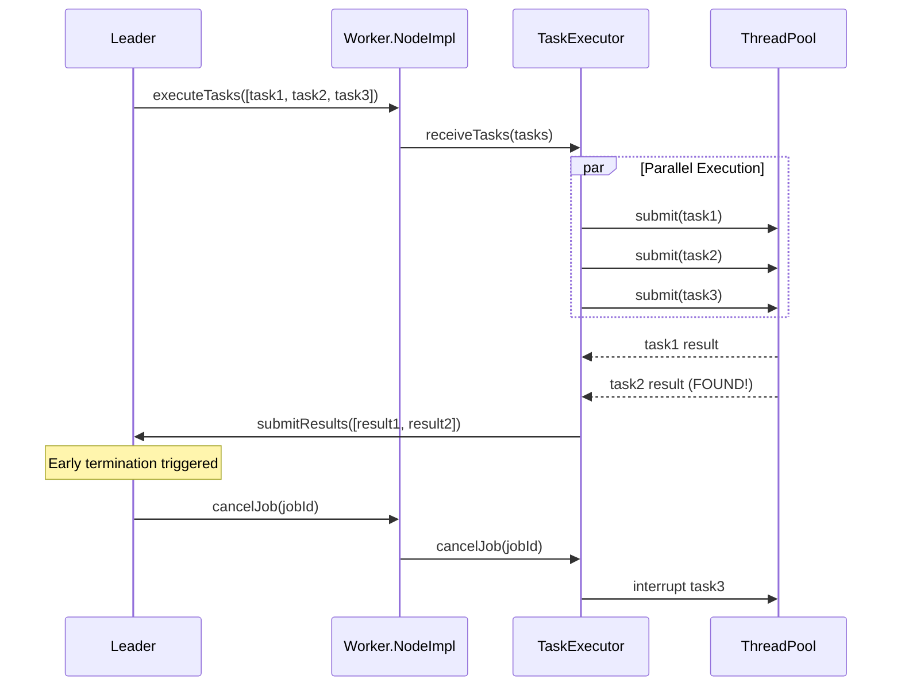

#### Election Messages

| Method | Signature | Description |
|--------|-----------|-------------|
| ``receiveElectionMessage(candidateId, electionId)`` | ``void receiveElectionMessage(String, long)`` | Handles incoming ELECTION message. If local ID is higher, starts own election. |
| ``receiveCoordinatorMessage(leaderId, host, port)`` | ``void receiveCoordinatorMessage(String, String, int)`` | Handles COORDINATOR announcement. Reconnects to new Leader and restarts HeartbeatMonitor. |

**Election Message Flow** (Bully Algorithm):

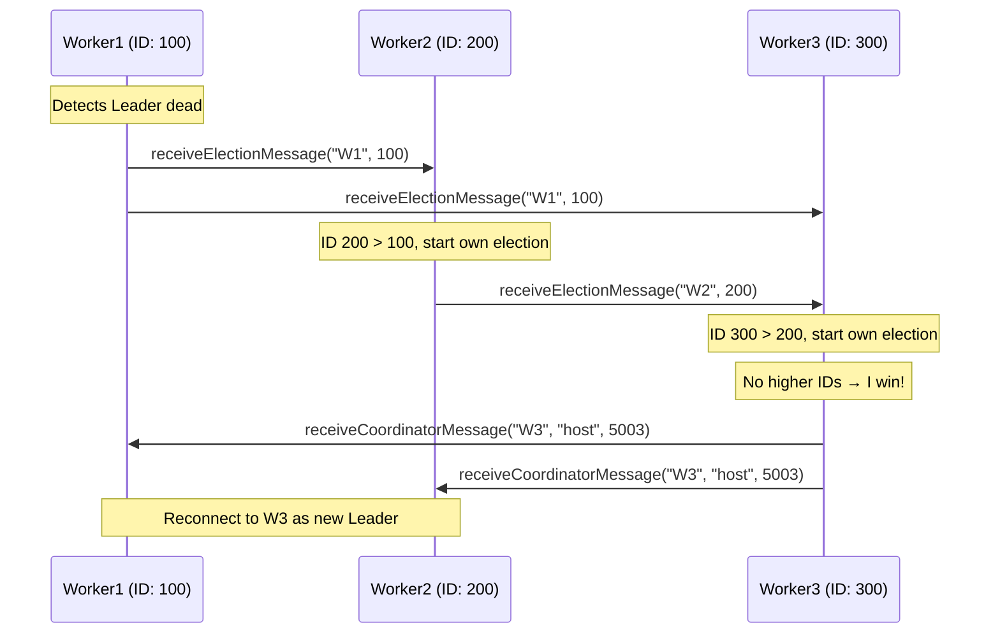

---

### LeaderService Methods (Leader Only)

These methods are **only functional when ``isLeader=true``**. Workers throw ``RemoteException`` if called.

#### Cluster Membership

| Method | Signature | Description |
|--------|-----------|-------------|
| ``registerNode(node)`` | ``void registerNode(NodeService)`` | Adds new Worker to cluster. Stores RMI stub in ``ClusterMembershipService``. |
| ``getClusterNodes()`` | ``List<NodeInfo> getClusterNodes()`` | Returns list of all registered nodes (as DTOs). Used by Workers to cache membership for elections. |

**Worker Registration Flow**:

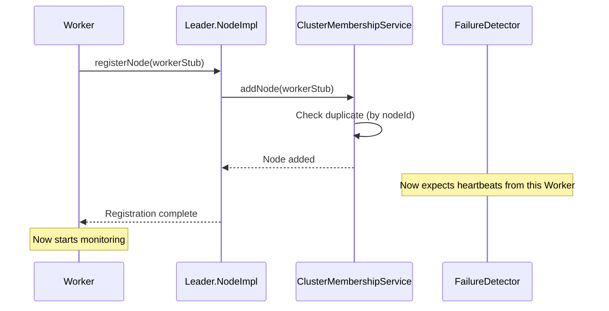

#### Job Management

| Method | Signature | Description |
|--------|-----------|-------------|
| ``submitJob(job)`` | ``JobResult submitJob(Job)`` | **Blocking call**. Splits job into tasks, assigns to Workers, waits for completion. Returns aggregated result. |
| ``submitResults(results)`` | ``void submitResults(List<TaskResult>)`` | Receives completed task results from Workers. Delegates to ``JobManager`` for aggregation. |

**Job Submission Flow**:

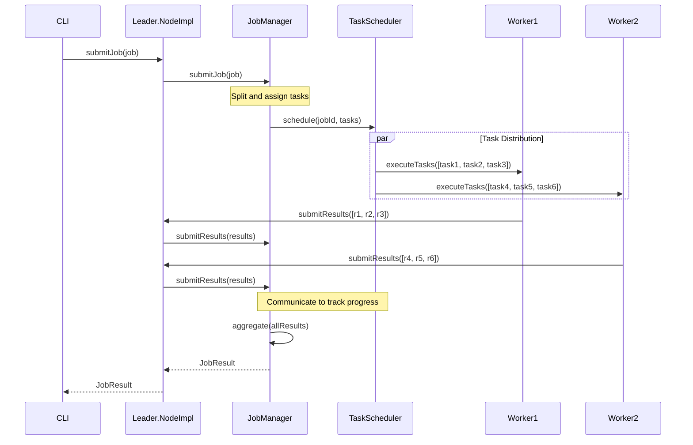

#### Health Monitoring

| Method | Signature | Description |
|--------|-----------|-------------|
| ``ping(workerId)`` | ``void ping(String workerId)`` | Receives heartbeat from Worker. Updates ``lastSeen`` timestamp in ``FailureDetector``. |

**Heartbeat Flow**:

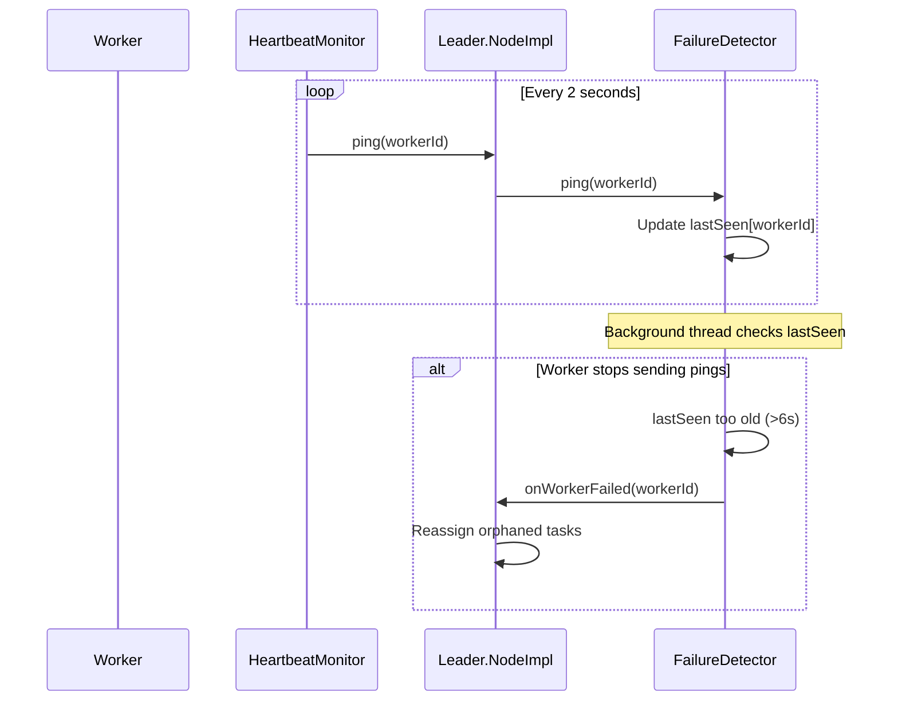

---

### Internal Methods (Not RMI)

These are called **locally** by CLI, callbacks, or internal components.

#### Lifecycle Methods

| Method | Called By | What It Does |
|--------|-----------|--------------|
| ``startAsLeader()`` | CLI (``--leader``) | Sets ``isLeader=true``, creates ``JobManager``, ``FailureDetector``, ``ClusterMembershipService``, starts UDP broadcaster, binds as ``"leader"`` in RMI registry. |
| ``joinCluster(host, port)`` | CLI (``--join``) | Connects to Leader's registry, calls ``registerNode(this)``, starts ``HeartbeatMonitor`` to monitor Leader health. |
| ``autoJoinCluster()`` | CLI (``--auto-discover``) | Listens for UDP broadcasts to discover Leader, then calls ``joinCluster()`` with discovered address. |
| ``promoteToLeader()`` | ``ElectionStrategy`` | Converts Worker→Leader after winning election. Stops ``HeartbeatMonitor``, initializes Leader components, rebinds as ``"leader"``. |
| ``shutdown()`` | CLI or signal | Stops all monitors, unbinds from RMI registry, unexports remote object. |

**Lifecycle State Machine** (simplified):

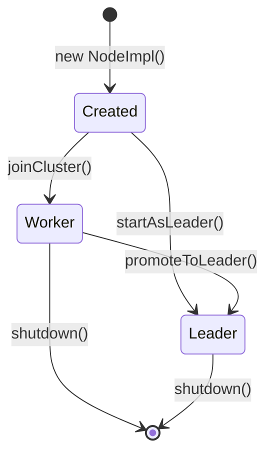

#### Callback Methods

| Method | Called By | What It Does |
|--------|-----------|--------------|
| ``onLeaderDied(deadLeader)`` | ``HeartbeatMonitor`` | Leader unreachable for >6s. Launches ``ElectionStrategy.startElection()`` asynchronously. |
| ``onWorkerFailed(workerId)`` | ``FailureDetector`` | Worker unreachable for >6s. Delegates to ``JobManager.onWorkerFailed()`` for task reassignment. |
| ``updateClusterCache()`` | ``HeartbeatMonitor`` (periodic) | Refreshes ``clusterNodesCache`` by calling ``Leader.getClusterNodes()``. Keeps membership up-to-date for elections. |

**Failure Handling Flows**:

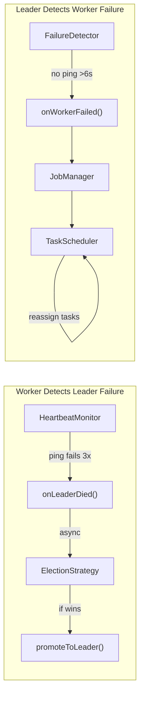

---

## Testing

See [Testing Readme](../testing/README.md) for detailed instructions on manual integration tests.

### Manual Integration Tests

All tests are runnable standalone with `main()` methods. They require **separate terminals** and **test-compile** to access both src/ and test/ classpath.

**Node-specific tests** in ``src/test/java/com/hecaton/manual/node/``:

| Test | Purpose | Prerequisites | Terminals |
|------|---------|---------------|-----------|
| ``TestLeaderNode`` | Leader initialization and RMI binding | None | 1 (standalone) |
| ``TestWorkerNode`` | Worker join and registration | Leader running on ``localhost:5001`` | 2 (Leader + Worker) |
| ``TestWorkerAutoJoin`` | Worker discovers Leader via UDP broadcast | Leader running (UDP enabled) | 2 (Leader + Worker) |
| ``TestNodeCapabilities`` | Detect and display CPU/RAM capabilities | None | 1 (standalone) |
| ``TestThreeNodeCluster`` | Multi-node cluster formation and coordination | Sequential startup | 3 (Leader + 2 Workers) |

### Running Tests

**Test 1: Single Leader (standalone)**
```bash
mvn test-compile exec:java '-Dexec.mainClass=com.hecaton.manual.node.TestLeaderNode'
```

**Test 2: Leader + Worker (manual join)**
```powershell
# Terminal 1: Start Leader (waits for workers)
mvn test-compile exec:java '-Dexec.mainClass=com.hecaton.manual.node.TestLeaderNode'

# Terminal 2: Start Worker (joins to Leader)
mvn test-compile exec:java '-Dexec.mainClass=com.hecaton.manual.node.TestWorkerNode'
```

**Test 3: Leader + Worker (auto-discovery via UDP)**
```powershell
# Terminal 1: Start Leader (broadcasts UDP beacons)
mvn test-compile exec:java '-Dexec.mainClass=com.hecaton.manual.node.TestLeaderNode'

# Terminal 2: Start Worker (discovers Leader automatically)
mvn test-compile exec:java '-Dexec.mainClass=com.hecaton.manual.node.TestWorkerAutoJoin'
```

**Test 4: Node Capabilities (standalone)**
```bash
mvn test-compile exec:java '-Dexec.mainClass=com.hecaton.manual.node.TestNodeCapabilities'
```

**Test 5: Three-Node Cluster**
```powershell
# Terminal 1: Start Leader
mvn test-compile exec:java '-Dexec.mainClass=com.hecaton.manual.node.TestLeaderNode'

# Terminal 2: Start Worker 1 (port 5002)
mvn test-compile exec:java '-Dexec.mainClass=com.hecaton.manual.node.TestWorkerNode'

# Terminal 3: Start Worker 2 (port 5003)
mvn test-compile exec:java '-Dexec.mainClass=com.hecaton.manual.node.TestThreeNodeCluster'
```

### Key Testing Patterns

1. **Always compile with test-compile**: Tests need both src/ and src/test/ classes
2. **Leader first**: Workers require Leader already running (for manual join)
3. **Wait for initialization**: After starting Leader, wait 2-3 seconds before starting Workers
4. **Check both terminals**: Log output shows distributed coordination (cross-terminal verification)
5. **Port assignments**:
   - Leader: ``5001``
   - Worker 1: ``5002``
   - Worker 2: ``5003`` (if third node test)

---
