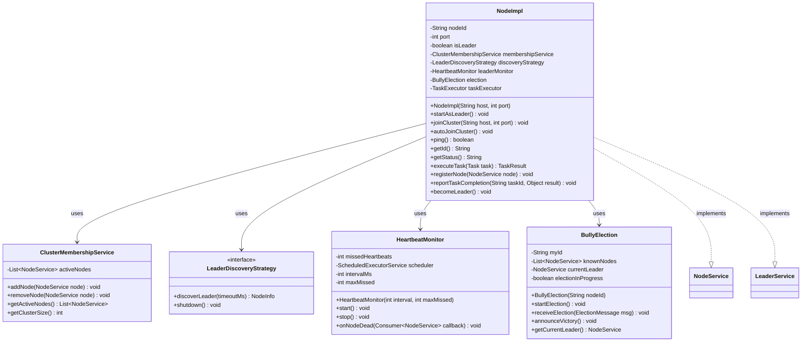

# Node Component Documentation

The **Node** is the fundamental building block of the Hecaton distributed system. Each node is a self-contained Java process that can operate as either a Worker (task executor) or Leader (coordinator).

---

## Overview

### Purpose

The Node component (`com.hecaton.node`) provides:
- **Dual-role capability**: Can function as Worker or Leader
- **RMI endpoint**: Exposes remote interfaces for inter-node communication
- **State management**: Tracks cluster membership and node status
- **Lifecycle management**: Initialization, join, promotion, shutdown

### Key Classes

| Class | Purpose |
|-------|---------|
| `NodeImpl` | Core node implementation, implements NodeService + LeaderService |
| `NodeBootstrap` | CLI entry point for starting nodes with command-line arguments |

---

## Architecture



### NodeImpl Structure

**Implements:**
- `NodeService` - Basic node operations (ping, getId, getStatus)
- `LeaderService` - Leader-specific operations (registerNode, task distribution)

**Key Fields:**

```java
public class NodeImpl implements NodeService, LeaderService {
    private String nodeId;                      // Unique identifier (e.g., "node-localhost-5001-1735315815123")
    private int port;                           // RMI registry port
    private boolean isLeader;                   // Current role (true = Leader, false = Worker)
    private DiscoveryService discoveryService;  // Cluster membership management (Leader only)
    private Registry myRegistry;                // Own RMI registry instance
    private long nodeIdValue;                   // Timestamp-based unique value
    
    // Heartbeat monitoring (Worker only)
    private HeartbeatMonitor leaderMonitor;     // Monitors Leader health
    private NodeService leaderNode;             // Reference to Leader for callbacks
}
```

---

## Node Lifecycle


### Initialization Phase

**Constructor Responsibilities:**

```java
public NodeImpl(String host, int port) throws RemoteException {
    // 1. Fix RMI hostname resolution
    if (System.getProperty("java.rmi.server.hostname") == null) {
        System.setProperty("java.rmi.server.hostname", "localhost");
    }
    
    // 2. Generate unique ID
    this.nodeIdValue = System.currentTimeMillis();
    this.nodeId = "node-" + host + "-" + port + "-" + nodeIdValue;
    
    // 3. Export for RMI
    UnicastRemoteObject.exportObject(this, 0);
    
    // 4. Create own RMI Registry (Approach A)
    this.myRegistry = LocateRegistry.createRegistry(port);
    this.myRegistry.rebind("node", this);
}
```

**Why Approach A (Registry Per Node)?**

Each node creates its own RMI Registry instead of sharing one. This provides:

✅ **Fault Tolerance**: If Leader crashes, Workers keep their registries  
✅ **Independence**: Nodes can receive RMI calls even after Leader dies  
✅ **Simplified Recovery**: New Leader doesn't need to recreate infrastructure  

❌ **Trade-off**: Slightly higher resource usage (multiple registry processes)

---

## Node Roles

### Worker Mode

**Default State**: All nodes start as Workers.

**Responsibilities**:
- Execute tasks assigned by Leader
- Send periodic heartbeat to Leader (every 5 seconds)
- Participate in leader election when Leader fails
- Respond to RMI calls from Leader

**Join Protocol**:

```mermaid
sequenceDiagram
    autonumber
    participant W as Worker (nuovo)
    participant L as Leader
    participant C as ClusterMembershipService
    participant H as HeartbeatMonitor
    
    Note over W: Avvio con --join localhost:5001
    
    W->>W: new NodeImpl(host, port)
    W->>W: UnicastRemoteObject.exportObject(this)
    
    W->>L: LocateRegistry.getRegistry("localhost", 5001)
    W->>L: registry.lookup("leader")
    
    W->>+L: registerNode(this)
    L->>C: addNode(worker)
    C->>C: activeNodes.add(worker)
    C-->>L: ✓ Node added
    L->>H: startMonitoring(worker)
    H->>H: schedule heartbeat task
    L-->>-W: ✓ Registered
    
    Note over W: Worker ora nel cluster
    
    W->>W: startHeartbeatToLeader()
    
    loop Ogni 5 secondi
        W->>L: ping()
        L-->>W: true
    end
```


**N.B.:** Here we are considering only the join process, and not how the worker know the leader address (manual or automatic discovery). 
```java
public void joinCluster(String leaderHost, int leaderPort) throws RemoteException {
    // 1. Connect to Leader's RMI registry
    Registry leaderRegistry = LocateRegistry.getRegistry(leaderHost, leaderPort);
    
    // 2. Lookup Leader service
    LeaderService leader = (LeaderService) leaderRegistry.lookup("leader");
    this.leaderNode = (NodeService) leader;  // Store reference for heartbeat
    
    // 3. Register with Leader (pass own RMI stub)
    leader.registerNode(this);
    
    log.info("[OK] Node {} joined cluster via {}:{}", nodeId, leaderHost, leaderPort);
    
    // 4. Start monitoring Leader health
    leaderMonitor = new HeartbeatMonitor(leaderNode, this::onLeaderDied, "Leader Monitor");
    leaderMonitor.start();
    log.info("[OK] Heartbeat monitoring started for Leader");
}
```

**Critical Detail**: When calling `leader.registerNode(this)`, the Worker passes its **RMI stub** (not a reference). The Leader receives a remote proxy that allows it to call methods on the Worker across the network.

---

#### Automatic Discovery

**Purpose**: Workers can join cluster without knowing Leader's IP:port via automatic discovery.

**Join Protocol with Auto-Discovery**:

```mermaid
sequenceDiagram
    participant Leader as Leader (5001)
    participant BG as Background Thread
    participant Network as UDP Network
    participant Worker as Worker (5002)
    participant C as ClusterMembershipService

    
    Note over Leader: T=0s - Leader Startup
    Leader->>Leader: NodeImpl("localhost", 5001)
    Leader->>Leader: startAsLeader()
    Leader->>Leader: new ClusterMembershipService()
    Leader->>Leader: new UdpDiscoveryService(5001, nodeId)
    Leader->>BG: startBroadcaster()
    activate BG
    Note over BG: Background thread starts
    Note over Leader: [OK] Leader started
    
    Note over Network: T=0s - First Broadcast
    BG->>Network: Broadcast LEADER_ANNOUNCEMENT
    Note over Network: UDP → 255.255.255.255:6789
    
    Note over Worker: T=3s - Worker Startup
    Note over Worker: Avvio con --auto-discover
    
    Worker->>Worker: new NodeImpl(host, port)
    Worker->>Worker: autoJoinCluster()
    Worker->>Worker: new UdpDiscoveryService()
    
    Worker->>Network: discoverLeader(5000ms)
    Note over Worker,Network: Opens socket on port 6789, BLOCKS
    activate Network
    Note over Worker,Network: Socket open on 6789, BLOCKING...
    
    Note over Network: T=5s - Second Broadcast
    BG->>Network: Broadcast LEADER_ANNOUNCEMENT
    Network->>Worker: Packet received!
    deactivate Network
    Note over Worker: Deserialize → NodeInfo
    Note over Worker: [OK] Discovered Leader
    
    Worker->>Leader: joinCluster("localhost", 5001)
    Note over Worker,Leader: RMI connection
    Leader->>C: addNode(worker)
    Leader-->>Worker: Registration confirmed
    Note over Worker: [OK] Joined cluster
    
    Note over Network: T=10s - Third Broadcast
    BG->>Network: Broadcast (no listeners)
    
    Note over Network: T=15s - Fourth Broadcast
    BG->>Network: Broadcast (continues every 5s)
    
    Note over Leader: T=60s - Leader Shutdown
    Leader->>Leader: shutdown()
    Leader->>BG: isBroadcasting = false
    Leader->>BG: executorService.shutdownNow()
    deactivate BG
    Leader->>Leader: socket.close()
    Note over Leader: [OK] Shut down cleanly
```




```java
public void autoJoinCluster() throws Exception {
    log.info("Starting automatic Leader discovery...");
    
    // Use UDP discovery strategy by default
    this.discoveryStrategy = new UdpDiscoveryService();
    
    // Discover Leader (blocks until found or timeout)
    NodeInfo leader = discoveryStrategy.discoverLeader(5000);
    
    if (leader == null) {
        throw new Exception("No Leader found via UDP discovery (timeout 5000ms). " +
                          "Possible causes: No Leader running, firewall blocking UDP, " +
                          "not on same network. Try manual join: --join host:port");
    }
    
    log.info("[OK] Discovered Leader: {} at {}:{}", 
             leader.getNodeId(), leader.getHost(), leader.getPort());
    
    // Use existing join method to complete connection
    joinCluster(leader.getHost(), leader.getPort());
}
```

**Strategy Pattern**: Uses `LeaderDiscoveryStrategy` interface allowing multiple discovery mechanisms (UDP, multicast, static config, cloud-native). See [Discovery Overview](../discovery/overview.md) for details.

**Fallback**: If automatic discovery fails (timeout, firewall), users can still use manual join with `--join host:port`.

---

### Leader Mode

**Activation**: Node becomes Leader via `startAsLeader()` or election victory.

**Responsibilities**:
- Accept Worker registrations
- Maintain cluster membership list
- Distribute tasks to Workers
- Monitor Worker health (future: Phase 1.4)
- Coordinate leader election (future: Phase 2)

**Leader Initialization**:

```java
public void startAsLeader() throws RemoteException {
    this.isLeader = true;
    
    // Initialize cluster membership service
    this.membershipService = new ClusterMembershipService();
    
    // Register self as first cluster member
    membershipService.addNode(this);
    
    // Bind as "leader" in RMI registry (in addition to "node")
    myRegistry.rebind("leader", this);
    
    // Start UDP broadcaster for automatic discovery (NEW - Phase 1.3)
    try {
        this.discoveryStrategy = new UdpDiscoveryService(this.port, this.nodeId);
        ((UdpDiscoveryService) discoveryStrategy).startBroadcaster();
        log.info("[OK] UDP broadcaster started on port 6789");
    } catch (Exception e) {
        log.warn("UDP broadcaster disabled (port conflict): {}", e.getMessage());
        log.warn("  Workers must use manual --join host:port");
        // Continue without UDP - manual join still works
    }
    
    log.info("[OK] Node {} started as LEADER on port {}", nodeId, port);
    log.info("[OK] Cluster size: {} node(s)", membershipService.getClusterSize());
}
```

**UDP Broadcaster**: Leader now automatically broadcasts its presence every 5 seconds via UDP to `255.255.255.255:6789`. This allows Workers to discover the Leader without manual configuration. See [UDP Discovery Implementation](../discovery/udp-discovery-architecture.md).

**Why Rebind Instead of New Registry?**

The Leader uses the **same registry** created in the constructor and simply adds a second binding (`"leader"`). This allows:
- Other nodes to find it via `lookup("leader")`
- The node to still be accessible via `lookup("node")`
- Seamless transition if this node was previously a Worker

---

## RMI Interface Implementation

### NodeService Methods

#### `ping()`

**Purpose**: Heartbeat check to verify node is alive.

```java
@Override
public boolean ping() throws RemoteException {
    return true;  // Simply responding proves we're alive
}
```

**Why So Simple?**

The "liveness check" is not in the method logic, but in **RMI's ability to deliver the response**. If the node is dead, RMI will throw `RemoteException` after timeout—no need for complex logic.

#### `getId()`

**Purpose**: Retrieve unique node identifier.

```java
@Override
public String getId() throws RemoteException {
    return this.nodeId;
}
```

**ID Format**: `node-{host}-{port}-{timestamp}`  
**Example**: `node-localhost-5001-1735315815123`

**Why Timestamp?**

Ensures uniqueness even if the same host:port is reused after restart. Critical for distinguishing between dead node and new node on same port.

#### `getStatus()`

**Purpose**: Query current node role.

```java
@Override
public String getStatus() throws RemoteException {
    return isLeader ? "LEADER" : "WORKER";
}
```

---

### LeaderService Methods

#### `registerNode(NodeService node)`

**Purpose**: Add new Worker to cluster.

```java
@Override
public void registerNode(NodeService node) throws RemoteException {
    if (!isLeader) {
        throw new RemoteException("This node is not the leader");
    }
    
    // Delegate to discovery service (handles duplicate check internally)
    discoveryService.addNode(node);
    
    String newNodeId = node.getId();
    log.info("[OK] New node registered: {} (Total: {} nodes)", 
             newNodeId, discoveryService.getClusterSize());
}
```

**Delegation Pattern**: NodeImpl delegates cluster membership management to DiscoveryService, which uses `CopyOnWriteArrayList` for thread-safe concurrent access.

**Important**: The `node` parameter is an **RMI stub**, not a local object. Calling `node.getId()` triggers a remote method invocation.

#### `reportTaskCompletion()` (Stub)

**Purpose**: Worker reports completed task to Leader.

```java
@Override
public void reportTaskCompletion(String taskId, Object result) throws RemoteException {
    // TODO: Phase 3 - Task Framework
    throw new UnsupportedOperationException("Task framework not yet implemented");
}
```

**Status**: Placeholder for future task distribution functionality.

#### `requestElection()` (Stub)

**Purpose**: Trigger leader election process.

```java
@Override
public boolean requestElection(String candidateId) throws RemoteException {
    // TODO: Phase 2 - Leader Election
    throw new UnsupportedOperationException("Election not yet implemented");
}
```

**Status**: Placeholder for Bully Algorithm implementation.

---

## Cluster Membership Management

### Leader's Responsibility

The Leader delegates cluster membership management to DiscoveryService:

```java
private DiscoveryService discoveryService;  // Initialized in startAsLeader()
```

**Operations**:

| Method | Purpose |
|--------|---------||
| `registerNode(NodeService)` | Delegates to `discoveryService.addNode()` |
| `getClusterSize()` | Returns `discoveryService.getClusterSize()` |
| `getRegisteredNodes()` | Returns `discoveryService.getActiveNodes()` (copy) |
| `removeNode(NodeService)` | Delegates to `discoveryService.removeNode()` (used by heartbeat) |

> **📖 Per approfondimenti**: Vedi [DiscoveryService Component](discovery.md) per architettura dettagliata, thread safety scenarios, performance characteristics e API reference completa.

### Worker's Perspective

Workers **do not** maintain cluster membership—they only know the Leader.

**Rationale**:
- Simplifies Worker logic
- Leader is single source of truth
- Prevents inconsistencies during concurrent joins

**Future Enhancement** (Phase 7):
Leader broadcasts node list to all Workers for peer-to-peer communication.

---

## Heartbeat Monitoring

Workers automatically monitor Leader health using **HeartbeatMonitor** component.

**Quick Summary**:
- Workers ping Leader every **5 seconds**
- **3 consecutive failures** = Leader declared dead (~15 seconds total)
- Triggers `onLeaderDied()` callback → leader election (Phase 2)

**Integration Points**:

```java
// Initialized in joinCluster()
private HeartbeatMonitor leaderMonitor;
private NodeService leaderNode;

// Callback when Leader dies
private void onLeaderDied(NodeService deadLeader) {
    log.error("[ALERT] LEADER IS DEAD!");
    // TODO Phase 2: Start Bully Election
}

// Cleanup on shutdown
public void shutdown() {
    if (leaderMonitor != null) {
        leaderMonitor.stop();
    }
    // ... RMI cleanup ...
}
```

**For complete documentation**, see:
- **Architecture & Design**: [HeartbeatMonitor Component](heartbeat.md)
- **Testing Procedures**: [Heartbeat Testing Guide](../testing/heartbeat.md)

---

## Testing

See [Testing Readme](../testing/README.md) for detailed instructions on unit and integration tests for the Node component.
For the part related to Node, refer to [Node Tests](../testing/rmi-cluster).

There are tests covering:
- Leader Initialization
- Single Worker Initialization and Join
- Multi-node cluster formation (3 nodes)
- RMI method invocations (ping, getId, getStatus)
- Node registration flow (a little useless, considering it's already covered in cluster tests)

---

## API Reference

### Constructor

```java
public NodeImpl(String host, int port) throws RemoteException
```

**Parameters**:
- `host` - Hostname for node identification (typically "localhost")
- `port` - RMI registry port (must be unique per node)

**Throws**: `RemoteException` if RMI export or registry creation fails

---

### Public Methods

#### Role Management

```java
public void startAsLeader() throws RemoteException
```
Promotes node to Leader role, binds as "leader" in RMI registry.

```java
public void joinCluster(String leaderHost, int leaderPort) throws RemoteException
```
Joins existing cluster by registering with Leader.

**Parameters**:
- `leaderHost` - Leader's hostname
- `leaderPort` - Leader's RMI port

#### Cluster Information

```java
public int getClusterSize()
```
Returns count of registered nodes (Leader only).

```java
public List<NodeService> getRegisteredNodes()
```
Returns copy of cluster membership list (Leader only).

---

## Code Example: Starting a 2-Node Cluster

### Step 1: Start Leader

```java
// Create Leader node
NodeImpl leader = new NodeImpl("localhost", 5001);
leader.startAsLeader();

// Keep process alive
Thread.currentThread().join();
```

### Step 2: Start Worker

```java
// Create Worker node
NodeImpl worker = new NodeImpl("localhost", 5002);
worker.joinCluster("localhost", 5001);

// Keep process alive
Thread.currentThread().join();
```

### Step 3: Verify Cluster

Leader log output:
```
[OK] Node node-localhost-5001-1735315815123 started as LEADER on port 5001
[OK] Cluster size: 1 node(s)
[OK] New node registered: node-localhost-5002-1735315820456 (Total: 2 nodes)
```

Worker log output:
```
[OK] Node node-localhost-5002-1735315820456 initialized on port 5002
[OK] Node node-localhost-5002-1735315820456 joined cluster via localhost:5001
```

---