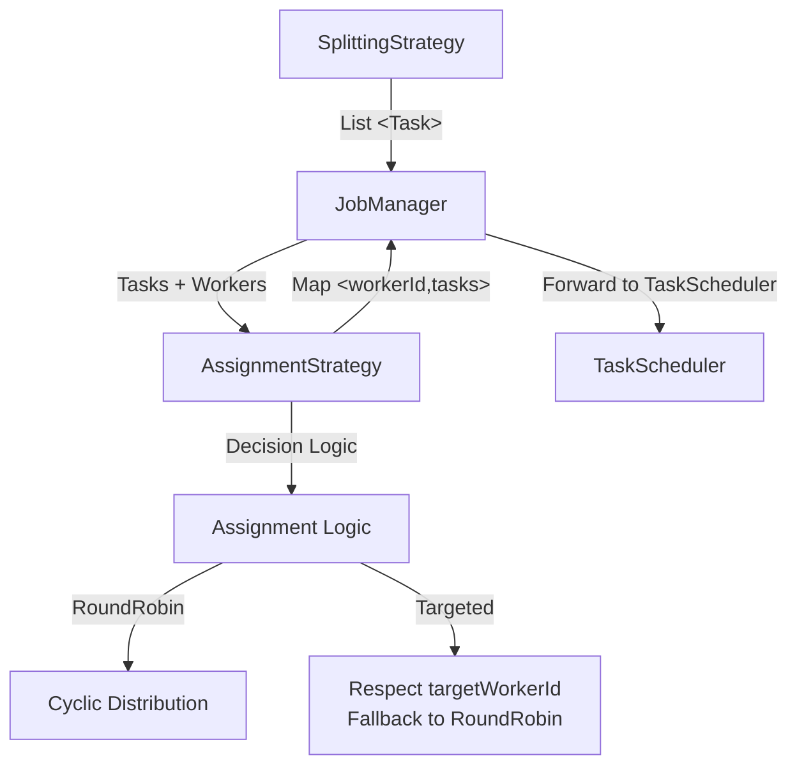
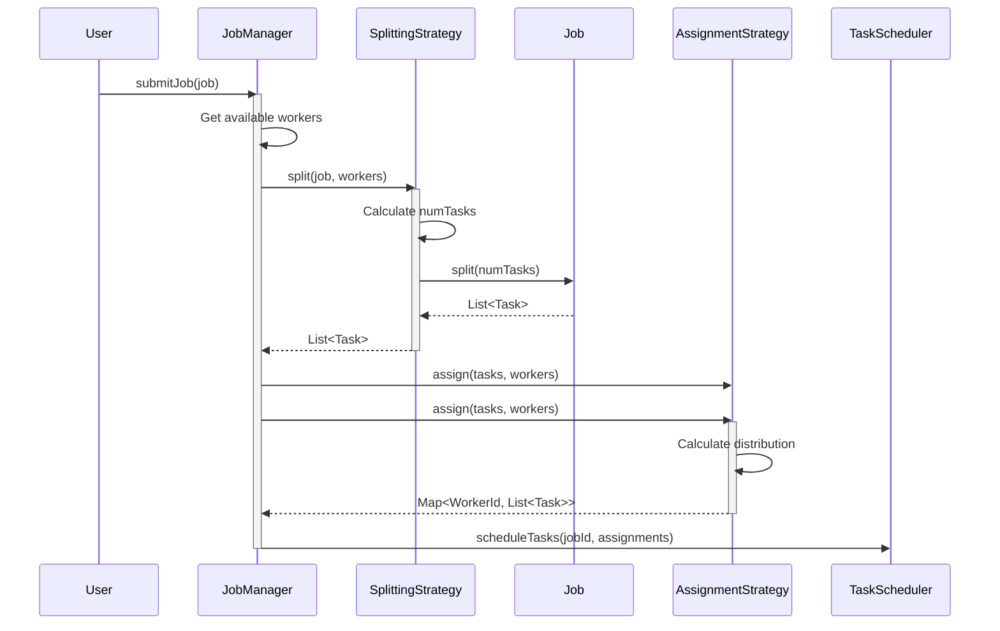
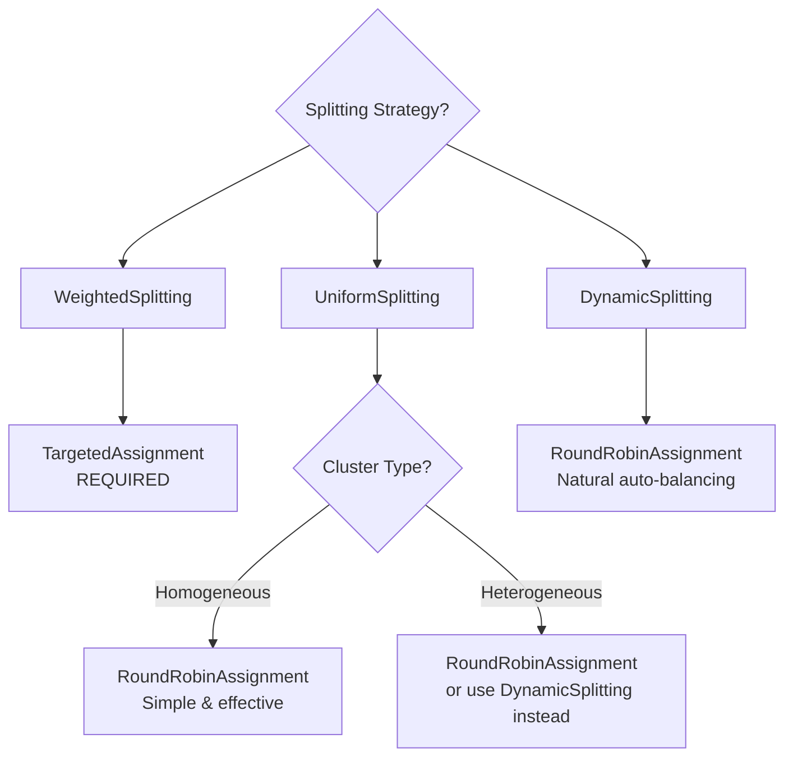

# Assignment Strategies

Assignment strategies determine **which worker executes which task**. They receive a list of tasks (already created by a SplittingStrategy) and a map of available workers, then decide the optimal distribution.

---

## Table of Contents

- [Overview](#overview)
- [Strategy Interface](#strategy-interface)
- [RoundRobinAssignment](#roundrobinassignment)
- [TargetedAssignment](#targetedassignment)
- [Comparison & Selection Guide](#comparison--selection-guide)
- [Creating Custom Strategies](#creating-custom-strategies)
- [Best Practices](#best-practices)

---

## Overview

### Purpose

An **AssignmentStrategy** answers the question:
> "Given N tasks and M workers, which worker should execute which task?"

The strategy receives:
- `List<Task>` - Tasks to assign (from SplittingStrategy)
- `Map<String, NodeCapabilities>` - Available workers with hardware specs

The strategy returns:
- `Map<String, List<Task>>` - Worker ID → tasks assigned to that worker

---

### Architecture



---

### When Strategies Are Called



---

## Strategy Interface

```java
package com.hecaton.task.assignment;

@FunctionalInterface
public interface AssignmentStrategy {
    
    /**
     * Assigns tasks to workers based on their capabilities.
     * 
     * @param tasks list of tasks to assign
     * @param workerCapabilities map of workerId → node capabilities (CPU, RAM, OS)
     * @return map workerId → list of assigned tasks
     * @throws IllegalArgumentException if tasks or workerCapabilities are null/empty
     */
    Map<String, List<Task>> assign(
        List<Task> tasks, 
        Map<String, NodeCapabilities> workerCapabilities
    );
    
    /**
     * @return descriptive name of the strategy (for logging)
     */
    default String getName() {
        return getClass().getSimpleName();
    }
}
```

### Key Points

- **Functional interface** - Single method to implement
- **Pure function** - No side effects, deterministic
- **Defensive** - Must validate inputs (null/empty checks)
- **Serializable** - Should implement `Serializable` if stored in JobManager

---

## RoundRobinAssignment

### Overview

The classic **round-robin** algorithm: distributes tasks cyclically among workers in a circular fashion.

**Algorithm**:
```
Task 0 → Worker 0
Task 1 → Worker 1
Task 2 → Worker 2
...
Task N → Worker (N % workerCount)
```

```java
public class RoundRobinAssignment implements AssignmentStrategy {
    @Override
    public Map<String, List<Task>> assign(
            List<Task> tasks, 
            Map<String, NodeCapabilities> workerCapabilities) {
        
        List<String> workerIds = new ArrayList<>(workerCapabilities.keySet());
        Map<String, List<Task>> assignments = new LinkedHashMap<>();
        
        // Initialize empty lists
        for (String workerId : workerIds) {
            assignments.put(workerId, new ArrayList<>());
        }
        
        // Distribute round-robin
        int workerCount = workerIds.size();
        for (int i = 0; i < tasks.size(); i++) {
            String workerId = workerIds.get(i % workerCount);
            assignments.get(workerId).add(tasks.get(i));
        }
        
        return assignments;
    }
}
```

---

### Characteristics

| Aspect | Value |
|--------|-------|
| **Distribution** | Uniform (each worker gets ≈ same count) |
| **Complexity** | O(T) - where T = task count |
| **Hardware Awareness** | None |
| **Predictability** | ✅ High (deterministic) |
| **Target Respect** | ❌ No (ignores task.getTargetWorkerId()) |

---

### Advantages ✅

1. **Simple** - Easy to understand and debug
2. **Fair distribution** - Each worker gets roughly equal task count
3. **No overhead** - O(T) complexity, minimal computation
4. **Predictable** - Same input = same output
5. **No configuration** - Parameter-less, works out of the box

---

### Disadvantages ❌

1. **Ignores hardware differences** - Fast and slow workers get equal tasks
2. **Ignores task complexity** - All tasks treated equally
3. **No data locality** - Doesn't consider task.getTargetWorkerId()
4. **Static** - Can't adapt to runtime conditions

---

### Distribution Pattern

**Example**: 10 tasks, 3 workers

```
Tasks:    0  1  2  3  4  5  6  7  8  9
Workers:  A  B  C  A  B  C  A  B  C  A

Result:
  Worker A: [0, 3, 6, 9]     (4 tasks)
  Worker B: [1, 4, 7]        (3 tasks)
  Worker C: [2, 5, 8]        (3 tasks)
```

---

### Use Cases

**Best For**:
- ✅ **Homogeneous clusters** (identical hardware)
- ✅ **UniformSplitting or DynamicSplitting** (no target annotations)
- ✅ **Simple jobs** (don't need optimization)
- ✅ **Testing and development** (predictable behavior)

**Avoid For**:
- ❌ WeightedSplitting (wastes target annotations)
- ❌ Highly heterogeneous clusters (use dynamic work stealing instead)
- ❌ Tasks with data locality requirements

---

### Configuration

This strategy requires no configuration.

---

## TargetedAssignment

### Overview

Respects `task.getTargetWorkerId()` when specified, falling back to round-robin for tasks without a target or with invalid targets.

**Algorithm**:
```
For each task:
  if task.getTargetWorkerId() != null AND target exists:
    assign to target worker
  else:
    assign via fallback strategy (default: round-robin)
```

```java
public class TargetedAssignment implements AssignmentStrategy {
    private final AssignmentStrategy fallback;
    
    public TargetedAssignment() {
        this(new RoundRobinAssignment());
    }
    
    public TargetedAssignment(AssignmentStrategy fallback) {
        this.fallback = fallback;
    }
    
    @Override
    public Map<String, List<Task>> assign(
            List<Task> tasks, 
            Map<String, NodeCapabilities> workerCapabilities) {
        
        Set<String> availableWorkers = workerCapabilities.keySet();
        Map<String, List<Task>> assignments = new LinkedHashMap<>();
        List<Task> unassigned = new ArrayList<>();
        
        // Initialize
        for (String workerId : availableWorkers) {
            assignments.put(workerId, new ArrayList<>());
        }
        
        // First pass: assign targeted tasks
        for (Task task : tasks) {
            String target = task.getTargetWorkerId();
            
            if (target != null && availableWorkers.contains(target)) {
                assignments.get(target).add(task);
            } else {
                unassigned.add(task);
            }
        }
        
        // Second pass: fallback for unassigned
        if (!unassigned.isEmpty()) {
            Map<String, List<Task>> fallbackAssignments = 
                fallback.assign(unassigned, workerCapabilities);
            
            // Merge
            for (Map.Entry<String, List<Task>> entry : fallbackAssignments.entrySet()) {
                assignments.get(entry.getKey()).addAll(entry.getValue());
            }
        }
        
        return assignments;
    }
}
```

---

### Characteristics

| Aspect | Value |
|--------|-------|
| **Distribution** | Variable (depends on targets) |
| **Complexity** | O(T) + fallback complexity |
| **Hardware Awareness** | ✅ Yes (via task targets) |
| **Predictability** | Medium (depends on targets) |
| **Target Respect** | ✅ Yes (primary feature) |

---

### Advantages ✅

1. **Respects task preferences** - Uses targetWorkerId when available
2. **Enables WeightedSplitting** - Required for weight-based distribution
3. **Fault-tolerant** - Falls back gracefully if target unavailable
4. **Flexible fallback** - Can use any strategy for non-targeted tasks
5. **Data locality** - Can assign tasks to workers with cached data

---

### Disadvantages ❌

1. **More complex** - Two-pass algorithm
2. **Requires target annotation** - Only useful if tasks have targets
3. **Uneven distribution** - Some workers may get many tasks, others few
4. **Debugging harder** - Distribution less predictable

---

### Target Sources

**Where does `task.getTargetWorkerId()` come from?**

1. **WeightedSplitting** - Annotates tasks based on CPU/RAM weights
2. **Custom Job logic** - Job.split() can set targets based on data locality
3. **Manual annotation** - Developer sets target in Task constructor

---

### Use Cases

**Best For**:
- ✅ **WeightedSplitting** (tasks already annotated)
- ✅ **Data locality** (tasks prefer workers with cached data)
- ✅ **Heterogeneous clusters** (combined with weight-based splitting)
- ✅ **Resource affinity** (tasks need specific worker capabilities)

**Avoid For**:
- ❌ UniformSplitting or DynamicSplitting (tasks have no targets)
- ❌ Homogeneous clusters (RoundRobin simpler and equivalent)
- ❌ When simplicity is priority

---

### Configuration
This class could be initialized with a custom fallback strategy, or with none, in which case it defaults to RoundRobinAssignment.

---

## Comparison & Selection Guide

### Quick Comparison Table

| Strategy | Distribution | Complexity | Hardware-Aware | Target-Aware | Best For |
|----------|-------------|------------|----------------|--------------|----------|
| **RoundRobinAssignment** | Uniform | O(T) | ❌ No | ❌ No | Homogeneous clusters |
| **TargetedAssignment** | Variable | O(T) | ✅ Yes (via targets) | ✅ Yes | WeightedSplitting |

---

### Decision Tree



---

### Strategy Combinations

| Splitting Strategy | Assignment Strategy | Result |
|--------------------|---------------------|--------|
| **UniformSplitting** | RoundRobinAssignment | ✅ Simple, deterministic |
| UniformSplitting | TargetedAssignment | ⚠️ Works but unnecessary |
| **WeightedSplitting** | TargetedAssignment | ✅ **Optimal** - respects weights |
| WeightedSplitting | RoundRobinAssignment | ❌ **Broken** - ignores targets! |
| **DynamicSplitting** | RoundRobinAssignment | ✅ Auto-balancing |
| DynamicSplitting | TargetedAssignment | ⚠️ Works but unnecessary |

**Key Rule**: Use **TargetedAssignment** with **WeightedSplitting**, **RoundRobinAssignment** otherwise.
