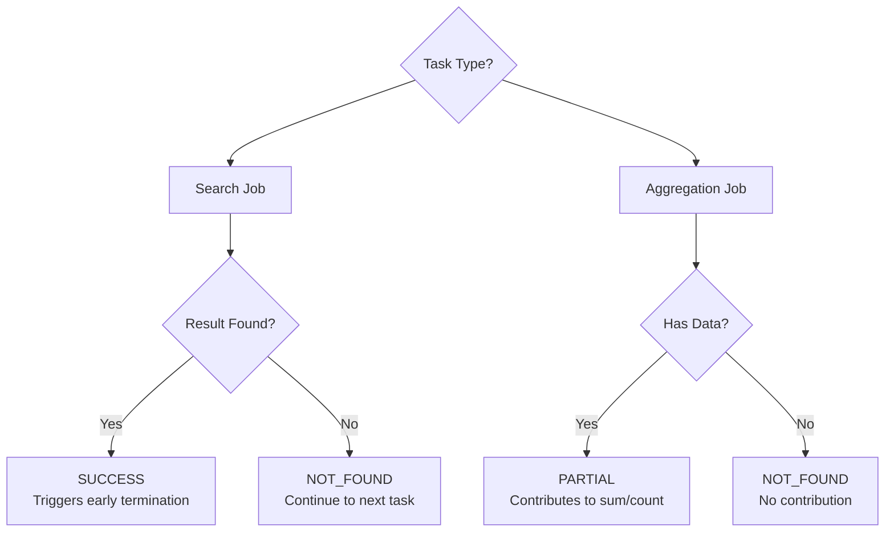
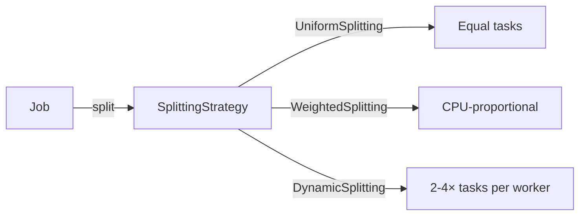

# Core Interfaces

This document describes the fundamental interfaces of the Task Framework: **Job**, **Task**, **JobResult**, and **TaskResult**. These contracts define how distributed work is structured, executed, and aggregated.

---

## Table of Contents

- [Job Interface](#job-interface)
- [Task Interface](#task-interface)
- [JobResult](#jobresult)
- [TaskResult](#taskresult)
- [Design Patterns](#design-patterns)
- [Best Practices](#best-practices)

---

## Job Interface

### Overview

The `Job` interface represents a **complete distributed computational task**. It is the main entry point for users submitting work to the cluster.

```java
package com.hecaton.task;

public interface Job extends Serializable {
    String getJobId();
    void setJobId();
    List<Task> split(int numTasks);
    JobResult aggregateResults(List<TaskResult> results);
    
    // Optional methods with defaults
    String getJobType();
    boolean supportsEarlyTermination();
    long estimateExecutionTime(int workerCount);
    void onStart();
    void onComplete(JobResult result);
}
```

### Core Methods

#### `split(int numTasks)`

**Purpose**: Divide the job into parallelizable tasks.

**Contract**:
- Must return a list of independent, serializable `Task` objects
- The actual number of tasks MAY differ from `numTasks` if the work cannot be divided exactly
- Each task should represent roughly equal work
- Tasks must be completely independent (no shared state)

---

#### `aggregateResults(List<TaskResult> results)`

**Purpose**: Combine task results into a final job result.

**Contract**:
- Called when all tasks complete OR early termination occurs
- Must handle partial result lists (some tasks may be cancelled)
- Must handle mixed statuses (SUCCESS, NOT_FOUND, FAILURE)
- Should compute execution time from task times

---

### Optional Methods

#### `getJobType()`

**Purpose**: Descriptive name for logging and monitoring.

**Default**: Returns `getClass().getSimpleName()`

```java
@Override
public String getJobType() {
    return "PasswordCrackJob";
}
```

---

#### `supportsEarlyTermination()`

**Purpose**: Indicates if the job can stop early when a result is found.

**Default**: `true`

**When to return `true`**:
- Search problems (password cracking, prime finding)
- First-match queries
- Any problem where one result is sufficient

**When to return `false`**:
- Aggregation problems (sum, count, average)
- Map-all operations
- Problems requiring all results

```java
@Override
public boolean supportsEarlyTermination() {
    return true;  // Password cracking stops when password found
}
```

**Impact**:
- `true` → TaskScheduler cancels remaining tasks when first SUCCESS arrives
- `false` → All tasks run to completion before aggregation

---

#### `estimateExecutionTime(int workerCount)`

**Purpose**: Estimate total execution time in milliseconds (for scheduling and timeouts).

**Default**: `-1` (unknown)

**Example**:
```java
@Override
public long estimateExecutionTime(int workerCount) {
    // Assume 1M hashes/second per worker
    long hashesPerSecond = 1_000_000L * workerCount;
    long totalHashes = calculateTotalCombinations();
    return (totalHashes * 1000) / hashesPerSecond;
}
```

**Use Cases**:
- Dynamic timeout adjustment
- Job priority scheduling
- Resource allocation planning

I never really use this method, but it's there if you need it.

---

#### `onStart()` and `onComplete(JobResult result)`

**Purpose**: Lifecycle hooks for initialization and cleanup.

**Default**: No-op

**Example**:
```java
@Override
public void onStart() {
    log.info("Starting password crack job for hash: {}...", 
             targetHash.substring(0, 8));
}

@Override
public void onComplete(JobResult result) {
    if (result.getStatus() == JobResult.Status.SUCCESS) {
        log.info("Password found: {}", result.getData());
    } else {
        log.warn("Password not found in keyspace");
    }
}
```

---

## Task Interface

### Overview

The `Task` interface represents a **unit of work** executed on a single worker node. Tasks are:
- **Independent**: No dependencies on other tasks
- **Serializable**: Transferred via RMI to workers
- **Self-contained**: All data needed for execution is included

```java
package com.hecaton.task;

public interface Task extends Serializable {
    String getTaskId();
    String getJobId();
    TaskResult execute();
    TaskResult execute(ExecutionContext context);
    
    // Optional methods
    void onCancel();
    int getEstimatedComplexity();
    String getTargetWorkerId();
}
```

### Core Methods

#### `execute()`

**Purpose**: Perform the actual computation.

**Contract**:
- Must be **deterministic** (same inputs → same output)
- Must be **thread-safe** (multiple tasks may execute concurrently)
- Must handle **interruption** (check `Thread.interrupted()` for long-running tasks)
- Must return **TaskResult** (never null)
- Must NOT throw exceptions (catch and return `TaskResult.failure()`)

---

#### `execute(ExecutionContext context)`

**Purpose**: Execute with worker hardware information for optimization.

**Default**: Calls `execute()` (ignores context)

**Context Information**:
```java
ExecutionContext {
    String workerId;              // "node-localhost-5002-123"
    String workerAddress;         // "192.168.1.10:5002"
    int availableCpuCores;        // 8
    long availableMemoryMB;       // 16384
    int suggestedParallelism;     // 8
}
```

---

### Optional Methods

#### `onCancel()`

**Purpose**: Cleanup when task is cancelled (early termination or job cancellation).

**Default**: No-op

**Example**:
```java
private volatile InputStream fileStream;

@Override
public void onCancel() {
    // Close open resources
    if (fileStream != null) {
        try {
            fileStream.close();
        } catch (IOException e) {
            log.warn("Error closing file on cancel", e);
        }
    }
}
```

---

#### `getEstimatedComplexity()`

**Purpose**: Relative complexity hint for load balancing (higher = more work).

**Default**: `1` (all tasks equal)

**Use Cases**:
- Weighted assignment strategies
- Dynamic task splitting
- Progress estimation

I never really use this method, but it's there if you need it.
---

#### `getTargetWorkerId()`

**Purpose**: Suggest a specific worker for this task (for data locality).

**Default**: `null` (no preference)

---

## JobResult

### Overview

`JobResult` is the **final aggregated result** returned to the user after all tasks complete.

```java
public final class JobResult implements Serializable {
    
    public enum Status {
        SUCCESS,      // Result found
        NOT_FOUND,    // Search exhausted, no result
        FAILURE,      // Job failed with errors
        CANCELLED     // Job was cancelled
    }
    
    private final String jobId;
    private final Status status;
    private final Object data;                // Flexible result type
    private final String errorMessage;
    private final long executionTimeMs;
    private final int totalTasks;
    private final int completedTasks;
    private final int failedTasks;
}
```

### Factory Methods

```java
// Success with result
JobResult.success(jobId, "cracked_password", 5000L);

// Success with statistics
JobResult.success(jobId, result, 5000L, 10, 8, 2);

// Not found
JobResult.notFound(jobId, 10000L);

// Failure with error
JobResult.failure(jobId, "Worker timeout", 3000L);

// Cancelled
JobResult.cancelled(jobId, "User requested cancellation", 2000L);
```

### Status Semantics

| Status | Meaning | Example |
|--------|---------|---------|
| **SUCCESS** | Result found successfully | Password cracked, sum computed |
| **NOT_FOUND** | Completed but no result | Password not in keyspace |
| **FAILURE** | Job failed with errors | All workers crashed, invalid input |
| **CANCELLED** | User or system cancelled | Timeout, manual stop |

### Data Types

The `data` field is **Object** for flexibility:

**Best Practice**: Use a dedicated result class for complex data.

---

## TaskResult

### Overview

`TaskResult` represents the **outcome of a single task execution**. It is sent from worker to leader as soon as the task completes.

```java
public final class TaskResult implements Serializable {
    
    public enum Status {
        SUCCESS,      // Terminal result found (triggers early termination)
        PARTIAL,      // Partial contribution (aggregation, non-terminal)
        NOT_FOUND,    // Search exhausted, found nothing
        FAILURE,      // Task failed with error
        CANCELLED,    // Task cancelled
        WORKING       // Task dispatched, in progress
    }
    
    private final String jobId;
    private final String taskId;
    private final Status status;
    private final Object data;
    private final String errorMessage;
    private final long executionTimeMs;
}
```

### Factory Methods

```java
// Working (initial state)
TaskResult.working(jobId, taskId);

// Success (terminal, triggers early termination)
TaskResult.success(jobId, taskId, "password123");

// Partial (non-terminal, for aggregation)
TaskResult.partial(jobId, taskId, 500000L);  // Partial sum

// Not found
TaskResult.notFound(jobId, taskId);

// Failure
TaskResult.failure(jobId, taskId, "Division by zero");

// Cancelled
TaskResult.cancelled(jobId, taskId);
```

### Status Decision Tree



**Critical Distinction: SUCCESS vs PARTIAL**

| Aspect | SUCCESS | PARTIAL |
|--------|---------|---------|
| **Meaning** | Terminal result found | Non-terminal contribution |
| **Early Termination** | Triggers (if supported) | Does NOT trigger |
| **Use Case** | Password found, prime found | Sum contribution, count increment |
| **Job Completion** | Can complete immediately | Waits for all tasks |

---

## Design Patterns

### 1. Template Method Pattern

**Job** and **Task** use optional methods with default implementations:

```java
// Users override only what they need
public class MyJob extends AbstractJob {
    // MUST override
    public List<Task> split(int numTasks) { ... }
    public JobResult aggregateResults(...) { ... }
    
    // OPTIONALLY override
    public boolean supportsEarlyTermination() { return false; }
}
```

### 2. Strategy Pattern

Job splitting and task assignment are pluggable strategies:



### 3. Factory Pattern

Result objects use static factory methods for clarity:

```java
// Clear intent
TaskResult.success(jobId, taskId, data);

// vs confusing constructor
new TaskResult(jobId, taskId, Status.SUCCESS, data, null, 0);
```

---