# JobManager

The **JobManager** is the central orchestrator of the Task Framework, managing the complete lifecycle of distributed job execution from submission to result aggregation. It coordinates splitting strategies, assignment strategies, and task scheduling while providing a simple, blocking API to users.

---

## Table of Contents

- [Overview](#overview)
- [Architecture](#architecture)
- [Core Responsibilities](#core-responsibilities)
- [Job Lifecycle](#job-lifecycle)
- [API Reference](#api-reference)
- [Threading Model](#threading-model)
- [State Management](#state-management)
- [Error Handling](#error-handling)
- [Integration with Other Components](#integration-with-other-components)
- [Best Practices](#best-practices)
- [Advanced Topics](#advanced-topics)

---

## Overview

### Purpose

The JobManager serves as the **entry point** for job submission and the **coordinator** for:
1. Job splitting (via SplittingStrategy)
2. Task assignment (via AssignmentStrategy)
3. Task scheduling (via TaskScheduler)
4. Result aggregation (via Job.aggregateResults())

---

## Architecture

### Component Diagram


---

### Class Structure


---

## Core Responsibilities

### 1. Job Orchestration

**Coordinates the complete job execution pipeline:**


---

### 2. State Management

**Maintains three concurrent maps for job tracking:**

```java
// Track pending jobs (blocks submitJob until complete)
Map<String, CountDownLatch> pendingJobs

// Store results for completed jobs (temporary storage)
Map<String, List<TaskResult>> jobResults

// Track active jobs (for early termination queries)
Map<String, Job> activeJobs
```

**Lifecycle:**
```
submitJob() start
    ↓
jobId → activeJobs      (track for early termination)
jobId → pendingJobs     (create latch, count=1)
    ↓
[tasks executing...]
    ↓
onJobFinished() called
    ↓
results → jobResults    (store temporarily)
latch.countDown()       (release blocking thread)
    ↓
submitJob() resumes
    ↓
retrieve results → aggregate → return
    ↓
cleanup(jobId)          (remove from all maps)
```

---

### 3. Timeout Management

**Default timeout: 10 minutes (600,000 ms)**

```java
// Default timeout
public JobResult submitJob(Job job) {
    return submitJob(job, 600_000);  // 10 minutes
}

// Custom timeout
public JobResult submitJob(Job job, long timeoutMs) {
    CountDownLatch latch = new CountDownLatch(1);
    boolean completed = latch.await(timeoutMs, TimeUnit.MILLISECONDS);
    
    if (!completed) {
        return JobResult.failure(jobId, "Timeout after " + timeoutMs + "ms", elapsed);
    }
}
```

---

### 4. Worker Failure Handling

**Delegates to TaskScheduler but provides reassignment logic:**

```java
public Map<String, List<Task>> reassignTasks(List<Task> orphanedTasks) {
    // Get current healthy workers
    List<NodeService> healthyWorkers = membershipService.getActiveNodes();
    
    // Get capabilities
    Map<String, NodeCapabilities> capabilities = getWorkerCapabilities(healthyWorkers);
    
    // Use SAME strategy as initial assignment
    return assignmentStrategy.assign(orphanedTasks, capabilities);
}
```

---

## Job Lifecycle

### Complete Flow


N.B. The OnJobFinished call comes from TaskScheduler when all tasks complete. 
And there are two scenarios:
1. Normal completion: onJobFinished is called when all the task results arrive.
2. Early termination: onJobFinished is called when TaskScheduler detects a worker found the final result and cancels remaining tasks. Notifying JobManager to aggregate partial results early.

---

## API Reference

### `submitJob(Job job)`

**Submits a job with default 10-minute timeout.**

```java
public JobResult submitJob(Job job) throws InterruptedException
```

**Parameters:**
- `job` - The job to execute (must not be null)

**Returns:**
- `JobResult` - Aggregated result when job completes

**Throws:**
- `IllegalArgumentException` - if job is null
- `IllegalStateException` - if no workers available or scheduling fails
- `InterruptedException` - if waiting is interrupted

---

### `submitJob(Job job, long timeoutMs)`

**Submits a job with custom timeout.**

```java
public JobResult submitJob(Job job, long timeoutMs) throws InterruptedException
```

**Parameters:**
- `job` - The job to execute
- `timeoutMs` - Maximum time to wait (milliseconds, must be > 0)

**Returns:**
- `JobResult` - Result or timeout failure
---

### `onJobFinished(String jobId, List<TaskResult> results)`

**Called by TaskScheduler when all tasks complete.**

```java
public void onJobFinished(String jobId, List<TaskResult> results)
```

**Parameters:**
- `jobId` - ID of completed job
- `results` - All task results

**Internal Use Only** - Called by TaskScheduler, not user code.

**Flow:**
```
TaskScheduler detects job complete
    ↓
onJobFinished(jobId, results)
    ↓
Store results in jobResults map
    ↓
Release latch (latch.countDown())
    ↓
Blocked submitJob() thread resumes
```

---

### `reassignTasks(List<Task> orphanedTasks)`

**Reassigns tasks from failed workers to healthy ones.**

```java
public Map<String, List<Task>> reassignTasks(List<Task> orphanedTasks)
```

**Parameters:**
- `orphanedTasks` - Tasks that need reassignment

**Returns:**
- `Map<String, List<Task>>` - New assignments (workerId → tasks)

**Called By**: TaskScheduler during worker failure recovery

**Example Flow:**
```
Worker crashes
    ↓
FailureDetector notifies TaskScheduler
    ↓
TaskScheduler identifies orphaned tasks
    ↓
TaskScheduler calls jobManager.reassignTasks(orphanedTasks)
    ↓
JobManager: Get healthy workers
    ↓
JobManager: Use assignmentStrategy.assign() with same strategy
    ↓
Return new assignments
    ↓
TaskScheduler dispatches to new workers
```

---

### Utility Methods

#### `getPendingJobCount()`

```java
public int getPendingJobCount()
```

Returns number of jobs currently executing.

---

#### `isJobPending(String jobId)`

```java
public boolean isJobPending(String jobId)
```

Checks if specific job is executing.

---

#### `supportsEarlyTermination(String jobId)`

```java
public boolean supportsEarlyTermination(String jobId)
```

Queries if job supports early termination. Called by TaskScheduler.

**Returns:**
- `true` if job supports early termination
- `false` if not supported or job not found

---

## Threading Model

### Concurrent Job Submissions

**Multiple threads can submit jobs simultaneously:**


**Thread Safety Guarantees:**
- ✅ `ConcurrentHashMap` for all state maps
- ✅ Each job has independent `CountDownLatch`
- ✅ No shared mutable state between jobs
- ✅ TaskScheduler is thread-safe

But in the MVP I never tried to submit multiple jobs concurrently in tests.

---

## State Management

### Three State Maps

```java
// 1. Pending Jobs - Synchronization
private final Map<String, CountDownLatch> pendingJobs = new ConcurrentHashMap<>();

// 2. Job Results - Temporary Storage
private final Map<String, List<TaskResult>> jobResults = new ConcurrentHashMap<>();

// 3. Active Jobs - Early Termination Queries
private final Map<String, Job> activeJobs = new ConcurrentHashMap<>();
```

---

### State Map Lifecycle


---

### Cleanup Process

```java
private void cleanup(String jobId) {
    pendingJobs.remove(jobId);   // Remove latch
    jobResults.remove(jobId);    // Remove results (should already be removed)
    activeJobs.remove(jobId);    // Remove job reference
    log.debug("Job {} resources cleaned up", jobId);
}
```

**Called:**
- ✅ After successful completion
- ✅ After timeout
- ✅ After error/exception

**Prevents:**
- ❌ Memory leaks from finished jobs
- ❌ Stale latch references
- ❌ Result accumulation

---

## Error Handling

### Error Scenarios

```mermaid
graph TD
    START[submitJob] --> V1{Job null?}
    V1 -->|Yes| E1[IllegalArgumentException]
    V1 -->|No| V2{Timeout ≤ 0?}
    
    V2 -->|Yes| E2[IllegalArgumentException]
    V2 -->|No| V3{Workers available?}
    
    V3 -->|No| E3[IllegalStateException:<br/>No workers]
    V3 -->|Yes| SPLIT[Split Job]
    
    SPLIT --> V4{Tasks empty?}
    V4 -->|Yes| E4[JobResult.failure:<br/>Zero tasks]
    V4 -->|No| SCHEDULE[Schedule Tasks]
    
    SCHEDULE --> WAIT[Wait for Completion]
    
    WAIT --> V5{Completed in time?}
    V5 -->|No| E5[JobResult.failure:<br/>Timeout]
    V5 -->|Yes| V6{Results available?}
    
    V6 -->|No| E6[JobResult.failure:<br/>No results]
    V6 -->|Yes| AGG[Aggregate]
    
    SPLIT --> V7{Exception thrown?}
    V7 -->|Yes| E7[JobResult.failure:<br/>Exception message]
    
    AGG --> SUCCESS[Return JobResult]
    
    E1 --> END[Throw Exception]
    E2 --> END
    E3 --> END
    E4 --> CLEANUP[Cleanup]
    E5 --> CLEANUP
    E6 --> CLEANUP
    E7 --> CLEANUP
    
    CLEANUP --> END[Return JobResult]
    SUCCESS --> CLEANUP
```



---

## Integration with Other Components

### 1. SplittingStrategy

**JobManager calls:** `splittingStrategy.split(job, workerCapabilities)`

**Provides:**
- The job to split
- Worker capabilities (CPU, RAM, etc.)

**Receives:**
- List of tasks to execute

```java
List<Task> tasks = splittingStrategy.split(job, workerCapabilities);
log.info("Job {} split into {} tasks using {}", 
         jobId, tasks.size(), splittingStrategy.getName());
```

---

### 2. AssignmentStrategy

**JobManager calls:** `assignmentStrategy.assign(tasks, workerCapabilities)`

**Provides:**
- Tasks to assign
- Worker capabilities

**Receives:**
- Map of workerId → tasks

```java
Map<String, List<Task>> assignments = assignmentStrategy.assign(tasks, workerCapabilities);
log.info("Tasks assigned to {} workers using {}", 
         assignments.size(), assignmentStrategy.getName());
```

---

### 3. ClusterMembershipService

**JobManager calls:** `membershipService.getActiveNodes()`

**Uses for:**
- Getting worker list before splitting
- Reassigning tasks after worker failure
- Querying worker capabilities

```java
List<NodeService> workers = membershipService.getActiveNodes();
Map<String, NodeCapabilities> capabilities = getWorkerCapabilities(workers);
```

---

### 4. TaskScheduler

**JobManager creates TaskScheduler internally:**

```java
public JobManager(...) {
    this.taskScheduler = new TaskScheduler(this);  // Passes itself as callback
}
```

**Bidirectional Communication:**

```
JobManager → TaskScheduler:
  - scheduleTasks(jobId, assignments)
  - submitResults(results)  [facade]
  - onWorkerFailed(workerId)  [facade]

TaskScheduler → JobManager:
  - onJobFinished(jobId, results)  [callback]
  - reassignTasks(orphanedTasks)  [strategy query]
  - supportsEarlyTermination(jobId)  [query]
```

---

## Configuration Example

**Complete JobManager setup:**

```java
// Dependencies
ClusterMembershipService membershipService = new ClusterMembershipService(leaderNode);
SplittingStrategy splittingStrategy = new DynamicSplitting(50);
AssignmentStrategy assignmentStrategy = new RoundRobinAssignment();

// Create JobManager
JobManager jobManager = new JobManager(
    splittingStrategy,
    assignmentStrategy,
    membershipService
);

// Submit job
Job job = new PasswordCrackJob(targetHash, charset, 5);

try {
    JobResult result = jobManager.submitJob(job, 600_000);  // 10 min timeout
    
    if (result.getStatus() == JobResult.Status.SUCCESS) {
        System.out.println("Password found: " + result.getData());
    } else {
        System.err.println("Failed: " + result.getErrorMessage());
    }
    
} catch (InterruptedException e) {
    Thread.currentThread().interrupt();
    System.err.println("Job interrupted");
}
```

---

## Typical Usage Pattern

```java
1. Create JobManager (once, at startup)
2. Create Job (per task to execute)
3. Call submitJob(job)
4. Wait (thread blocks)
5. Receive JobResult
6. Process result
7. Repeat from step 2 for next job
```
