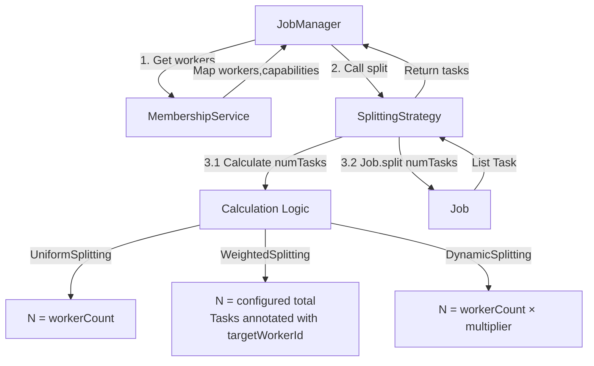
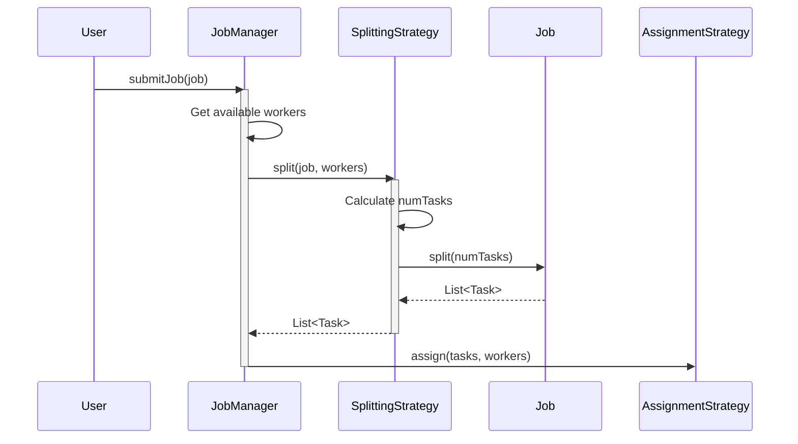
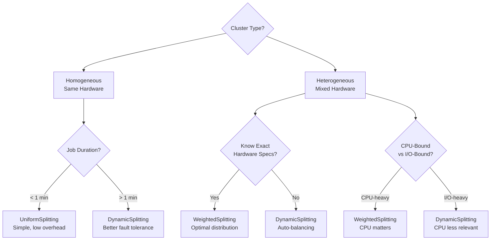

# Splitting Strategies

Splitting strategies determine **how many tasks** to create from a job and **how to divide** the work among them. They are a key component of the Task Framework's flexibility and performance optimization.

---

## Table of Contents

- [Overview](#overview)
- [Strategy Interface](#strategy-interface)
- [UniformSplitting](#uniformsplitting)
- [WeightedSplitting](#weightedsplitting)
- [DynamicSplitting](#dynamicsplitting)
- [Comparison & Selection Guide](#comparison--selection-guide)
- [Creating Custom Strategies](#creating-custom-strategies)
- [Best Practices](#best-practices)

---

## Overview

### Purpose

A **SplittingStrategy** decides:
1. **How many tasks** to create (`numTasks`)
2. Optionally, **which worker** should execute each task (via `task.getTargetWorkerId()`). But I never get so far as that.

The strategy receives:
- The `Job` to split
- `Map<String, NodeCapabilities>` of available workers with their hardware specs

The strategy returns:
- The Job split into a `List<Task>`

---

### Architecture



---

### When Strategies Are Called



---

## Strategy Interface

```java
package com.hecaton.task.splitting;

@FunctionalInterface
public interface SplittingStrategy {
    
    /**
     * Divide the job into tasks.
     * 
     * @param job the job to divide
     * @param workers map of workerId → capabilities (for hardware-based decisions)
     * @return list of created tasks
     * @throws IllegalArgumentException if job is null or workers is empty
     */
    List<Task> split(Job job, Map<String, NodeCapabilities> workers);
    
    /**
     * @return descriptive name of the strategy (for logging)
     */
    default String getName() {
        return getClass().getSimpleName();
    }
    
    /**
     * Checks if this strategy is compatible with the given AssignmentStrategy.
     * 
     * @param assignmentStrategy name of the assignment strategy
     * @return true if compatible
     */
    default boolean isCompatibleWith(String assignmentStrategy) {
        return true;  // Default: compatible with all
    }
}
```

### Key Points

- **Functional interface** - can be implemented as lambda (though concrete classes are recommended)
- **Stateless or serializable** - strategies are part of JobManager configuration
- **Defensive** - must validate inputs (null job, empty workers)

---

## UniformSplitting

### Overview

The simplest strategy: creates **exactly 1 task per worker**.

**Formula**: `numTasks = workerCount`

```java
public class UniformSplitting implements SplittingStrategy {
    @Override
    public List<Task> split(Job job, Map<String, NodeCapabilities> workers) {
        int totalTasks = Math.max(1, workers.size());
        return job.split(totalTasks);
    }
}
```

---

### Characteristics

| Aspect | Value |
|--------|-------|
| **Tasks Created** | N (where N = number of workers) |
| **Task Size** | Large (work / N) |
| **Complexity** | O(1) - trivial calculation |
| **Hardware Awareness** | None |
| **Target Assignment** | No (tasks have no targetWorkerId) |

Advantages: easy.
Disadvantages: not advanced.

---

### Use Cases

**Best For**:
- ✅ **Homogeneous clusters** (identical hardware)
- ✅ **Short-running jobs** (< 1 minute)
- ✅ **Testing & debugging** (simple to reason about)
- ✅ **Predictable workloads** (all tasks take similar time)

**Avoid For**:
- ❌ Heterogeneous clusters (mixed CPUs/RAM)
- ❌ Long-running jobs (hours)
- ❌ Unknown task complexity

---

### Configuration

Does not require any parameters.

---

## WeightedSplitting

### Overview

Creates a **fixed total number of tasks**, distributed proportionally to worker "weight" (CPU power). Tasks are **annotated with target worker IDs**.

**Formula**: 
- `numTasks = configured total` (e.g., 100)
- `tasksForWorkerX = (weightX / totalWeight) × numTasks`

---

### Characteristics

| Aspect | Value |
|--------|-------|
| **Tasks Created** | Fixed (configured, e.g., 100) |
| **Task Size** | Variable per worker |
| **Complexity** | O(W) - where W = worker count |
| **Hardware Awareness** | ✅ High (uses CPU/RAM) |
| **Target Assignment** | ✅ Yes (tasks annotated) |

---

### Advantages ✅

1. **Hardware-aware** - Fast workers get more tasks
2. **Better utilization** - Distributes work according to capacity
3. **Configurable granularity** - Adjust totalTasks for desired precision
4. **Good for heterogeneous clusters** - Handles mixed hardware well

---

### Disadvantages ❌

1. **Requires accurate capabilities** - Garbage in, garbage out
2. **More complex** - Harder to reason about distribution
3. **Requires TargetedAssignment** - Must use compatible assignment strategy
4. **Static distribution** - Doesn't adapt if worker speed changes during execution

---

### Use Cases

**Best For**:
- ✅ **Heterogeneous clusters** (PC + laptop + Raspberry Pi)
- ✅ **CPU-intensive jobs** (where CPU power matters most)
- ✅ **Known worker capabilities** (accurate hardware info)
- ✅ **Medium task count** (50-200 tasks)

**Avoid For**:
- ❌ Homogeneous clusters (use UniformSplitting instead)
- ❌ Unknown/inaccurate hardware specs
- ❌ I/O-bound tasks (CPU weight less relevant)

---

### Configuration

This strategy requires **one parameter**: `totalTasks` - the total number of tasks to create.

---

## DynamicSplitting

### Overview

Creates **multiple tasks per worker** based on a multiplier. 

**Formula**: `numTasks = workerCount × tasksPerWorker`

Default: **50 tasks per worker**

```java
public class DynamicSplitting implements SplittingStrategy {
    private final int tasksPerWorker;
    
    public DynamicSplitting() {
        this(50);  // Default: 50 tasks per worker
    }
    
    public DynamicSplitting(int tasksPerWorker) {
        this.tasksPerWorker = tasksPerWorker;
    }
    
    @Override
    public List<Task> split(Job job, Map<String, NodeCapabilities> workers) {
        int totalTasks = workers.size() * tasksPerWorker;
        totalTasks = Math.max(10, Math.min(10000, totalTasks)); // Bounds
        return job.split(totalTasks);
    }
}
```

---

### Characteristics

| Aspect | Value |
|--------|-------|
| **Tasks Created** | N × M (N = workers, M = multiplier) |
| **Task Size** | Small (work / (N × M)) |
| **Complexity** | O(1) - simple multiplication |
| **Hardware Awareness** | None (implicit via work stealing) |
| **Target Assignment** | No |

---

### Advantages ✅

1. **More parallelism** - Many small tasks could be processed simultaneously from a single worker
2. **No weight calculation needed** - Simpler than WeightedSplitting
3. **Fine-grained progress** - Can report completion as tasks finish
4. **Fault tolerant** - Small tasks = less work lost on failure

---

### Disadvantages ❌

1. **Higher overhead** - Many small tasks to manage
2. **More memory usage** - More Task objects created
3. **Less predictable** - Actual distribution depends on runtime speed

---

### Use Cases

**Best For**:
- ✅ **Heterogeneous clusters** (without accurate weight info)
- ✅ **Long-running jobs** (hours)
- ✅ **Unknown task complexity** (some tasks may take longer)
- ✅ **Fault tolerance priority** (minimize work lost)
- ✅ **Progress tracking** (want fine-grained updates)

**Avoid For**:
- ❌ Very short jobs (overhead dominates)
- ❌ Memory-constrained systems (many Task objects)
- ❌ When determinism is critical (UniformSplitting better)

---

### Configuration
This strategy has **one optional parameter**: `tasksPerWorker` - number of tasks to create per worker (default: 50).

---

## Comparison & Selection Guide

### Quick Comparison Table

| Strategy | Tasks Created | Complexity | Hardware-Aware | Best For |
|----------|---------------|------------|----------------|----------|
| **UniformSplitting** | 1 per worker | O(1) | ❌ No | Homogeneous, short jobs |
| **WeightedSplitting** | Fixed total | O(W) | ✅ Yes (CPU/RAM) | Heterogeneous, known specs |
| **DynamicSplitting** | N × multiplier | O(1) | ⚡ Implicit | Heterogeneous, unknown specs |

---

### Decision Tree



---

### Compatibility with Assignment Strategies

| Splitting Strategy | RoundRobinAssignment | TargetedAssignment |
|--------------------|----------------------|-------------------|
| **UniformSplitting** | ✅ Perfect match | ⚠️ Works but unnecessary |
| **WeightedSplitting** | ⚠️ Wastes targeting | ✅ **Required** |
| **DynamicSplitting** | ✅ Perfect match | ⚠️ Works but unnecessary |

**Rule**: Use **TargetedAssignment** with **WeightedSplitting**, **RoundRobinAssignment** otherwise.

---