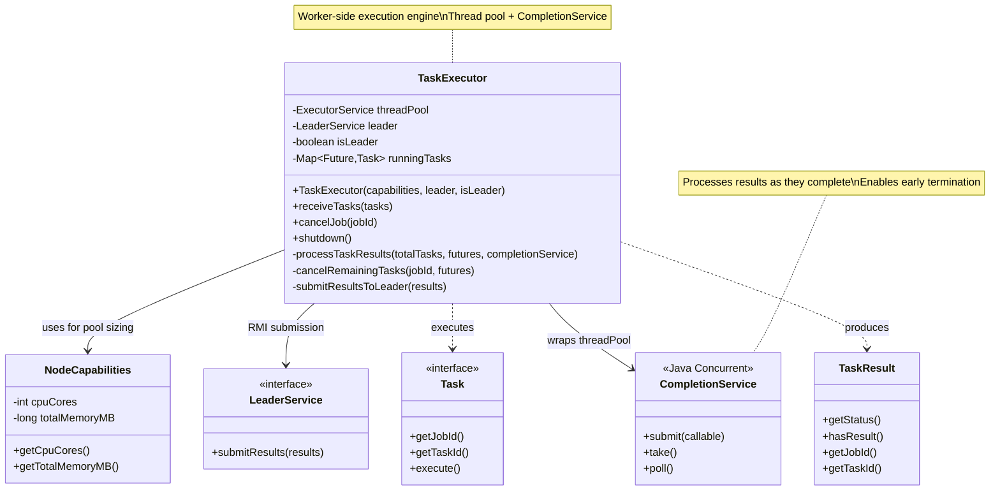
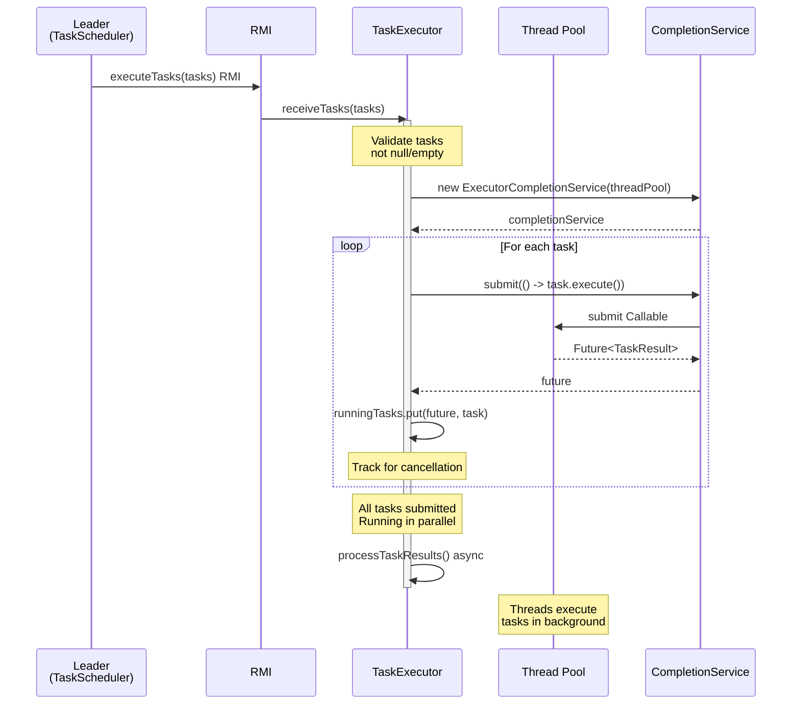
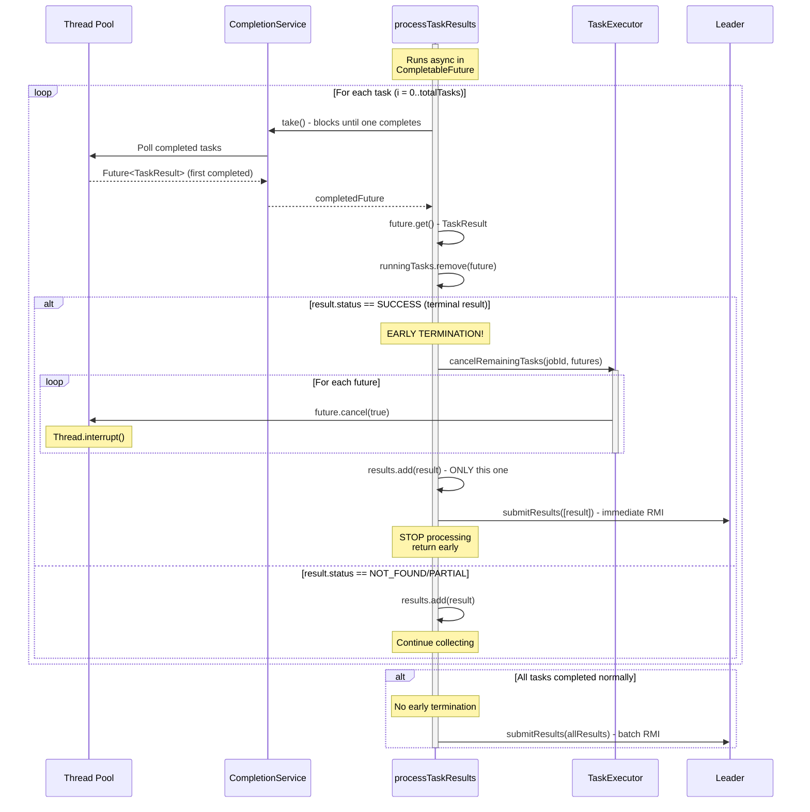
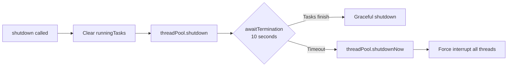
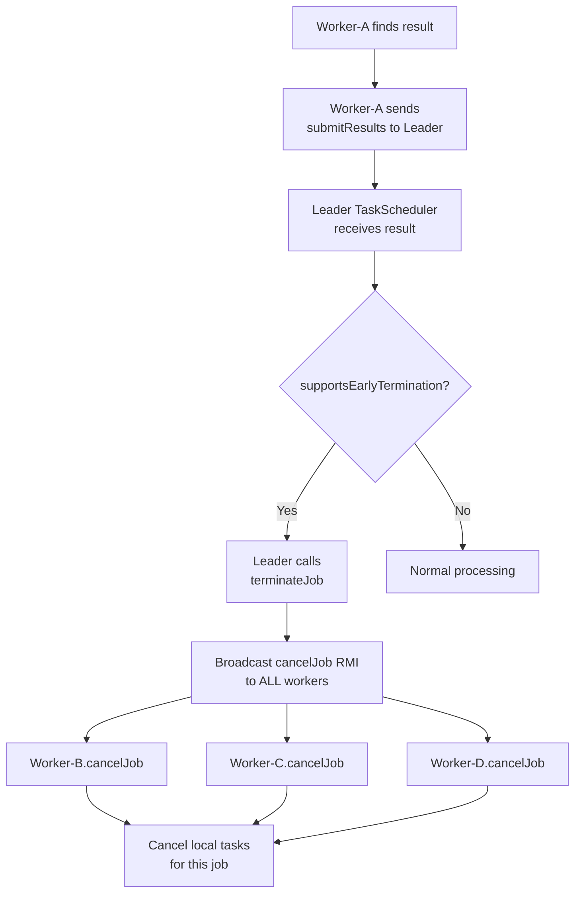
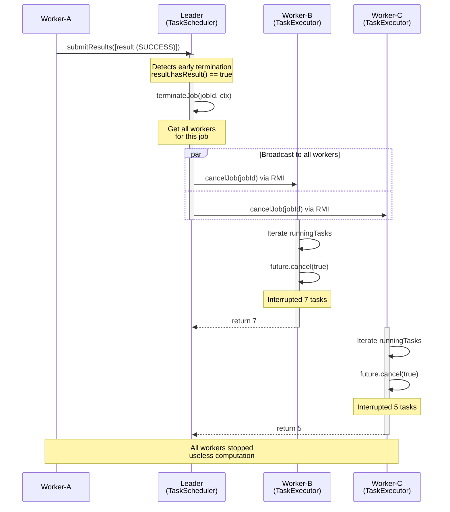
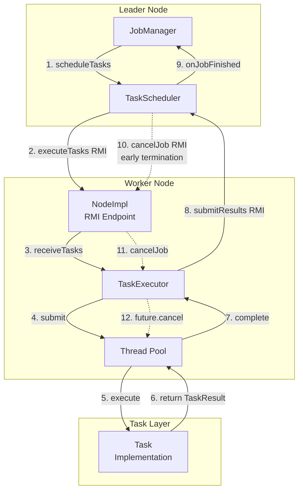

# TaskExecutor - Worker-Side Task Execution

## Table of Contents

- [Overview](#overview)
- [Architecture](#architecture)
- [Class Structure](#class-structure)
- [Thread Pool Management](#thread-pool-management)
- [Complete Lifecycle](#complete-lifecycle)
- [API Reference](#api-reference)
- [Early Termination (Local)](#early-termination-local)
- [Early Termination (Remote)](#early-termination-remote)
- [Integration with Other Components](#integration-with-other-components)
- [Thread Safety](#thread-safety)
- [Best Practices](#best-practices)
- [Advanced Topics](#advanced-topics)

---

## Overview

**TaskExecutor** is the worker-side execution engine of the Hecaton framework. It runs on every worker node and handles:

1. **Receiving Tasks**: Via RMI from Leader (`receiveTasks()`)
2. **Parallel Execution**: Using a fixed thread pool sized to CPU cores
3. **Result Streaming**: Processing results as they complete (not batch)
4. **Early Termination (Local)**: Cancelling remaining tasks when result found
5. **Early Termination (Remote)**: Handling cancellation broadcasts from Leader
6. **Result Submission**: Sending results back to Leader via RMI

**Position in Execution Flow**:

```
JobManager (Leader)
    ↓ scheduleTasks()
TaskScheduler (Leader)
    ↓ executeTasks() RMI
TaskExecutor (Worker)  ← YOU ARE HERE
    ↓ task.execute()
Task Implementation (Worker)
    ↓ returns TaskResult
TaskExecutor (Worker)
    ↓ submitResults() RMI
TaskScheduler (Leader)
    ↓ onJobFinished() callback
JobManager (Leader)
```

**Key Design Decisions**:
- **Fixed Thread Pool**: Size = CPU cores × 1 (avoids over-subscription)
- **CompletionService**: Processes results as they arrive (enables early termination)
- **Async Result Handling**: `CompletableFuture.runAsync()` prevents blocking RMI thread
- **Best-Effort Cancellation**: `future.cancel(true)` interrupts thread (task must check `Thread.interrupted()`)

---

## Architecture
### Data Structures

**1. Thread Pool** (`ExecutorService`):
```java
private final ExecutorService threadPool;

// Initialization:
int poolSize = capabilities.getCpuCores() * CORE_MULTIPLIER;  // CORE_MULTIPLIER = 1
this.threadPool = Executors.newFixedThreadPool(poolSize);
```

**Characteristics**:
- **Fixed Size**: Number of threads = CPU cores (optimal for CPU-bound tasks)
- **Bounded Queue**: Default `LinkedBlockingQueue` (unbounded)
- **Thread Reuse**: Threads stay alive for entire worker lifetime

**2. Running Tasks Tracker** (`Map<Future<?>, Task>`):
```java
private final Map<Future<?>, Task> runningTasks = new ConcurrentHashMap<>();
```

**Purpose**:
- Maps `Future` objects to original `Task` objects
- Enables job-level cancellation (`cancelJob(jobId)`)
- Cleaned up as tasks complete

**Lifecycle**:
```
Task received → submit to thread pool → put(future, task) in runningTasks
Task completes → remove(future) from runningTasks
Job cancelled → iterate runningTasks, cancel matching jobId futures
```

**3. CompletionService** (`ExecutorCompletionService<TaskResult>`):
```java
CompletionService<TaskResult> completionService = new ExecutorCompletionService<>(threadPool);
```

**Purpose**:
- Wraps thread pool to enable result polling **as they complete**
- Returns `Future<TaskResult>` in completion order (not submission order)
- Enables early termination detection without waiting for all tasks

---

## Class Structure



**Relationships**:

1. **TaskExecutor → NodeCapabilities**: Construction-time dependency
   - `poolSize = capabilities.getCpuCores() * CORE_MULTIPLIER`
   - Determines thread pool size

2. **TaskExecutor → LeaderService**: Runtime dependency
   - Worker sends results via `leader.submitResults()`
   - RMI call (or direct if this node is Leader)

3. **TaskExecutor → CompletionService**: Wrapper pattern
   - CompletionService wraps `threadPool`
   - Enables result streaming instead of batch blocking

4. **TaskExecutor → Task**: Execution relationship
   - Receives `List<Task>` from Leader
   - Executes `task.execute()` in thread pool

5. **TaskExecutor → TaskResult**: Production relationship
   - Each task produces `TaskResult`
   - Collected and sent back to Leader

---

## Thread Pool Management

### Sizing Strategy

```java
private static final int CORE_MULTIPLIER = 1;

int poolSize = capabilities.getCpuCores() * CORE_MULTIPLIER;
this.threadPool = Executors.newFixedThreadPool(poolSize);
```

**Philosophy**:
- **CPU-Bound Tasks**: Most Hecaton tasks are CPU-intensive (password cracking, calculations)
- **Optimal Size**: 1 thread per core avoids context switching overhead
- **No Over-Subscription**: More threads than cores → thrashing

---

## Complete Lifecycle

### Phase 1: Task Reception



**Critical Points**:
- **Parallel Submission**: All tasks submitted to thread pool immediately (non-blocking)
- **Exception Handling**: Task execution exceptions caught and converted to `FAILURE` results
- **Async Processing**: `processTaskResults()` runs in separate thread (via `CompletableFuture.runAsync()`)

---

### Phase 2: Result Processing



**Code**:

**Key Behaviors**:

1. **Blocking on CompletionService**: `completionService.take()` blocks until **any** task completes
   - Returns tasks in completion order (fast tasks first)
   - Enables immediate early termination detection

2. **Success vs Partial**:
- `SUCCESS` → terminal result found → trigger early termination, so only send this result to Leader, and cancel remaining tasks
- `NOT_FOUND` / `PARTIAL` → continue collecting results. The results are accumulated and sent in batch after all tasks complete.


3. **Async Execution**: `CompletableFuture.runAsync()` prevents blocking RMI receiver thread
   - RMI call returns immediately after task submission
   - Result processing happens in background

---

### Phase 3: Result Submission

```java
private void submitResultsToLeader(List<TaskResult> results) {
    try {
        if (isLeader) {
            // Leader submits to itself directly (no RMI overhead)
            leader.submitResults(results);
        } else {
            // Worker submits via RMI to Leader
            leader.submitResults(results);
        }
        
        log.info("Successfully submitted {} results to leader", results.size());
        
    } catch (RemoteException e) {
        log.error("Failed to submit results to leader", e);
        // Note: Results are lost if RMI fails
        // TODO: Implement retry logic or persistent queue
    }
}
```

**Submission Modes**:

1. **Batch Submission** (normal completion):
   ```java
   // All tasks complete without early termination
   List<TaskResult> allResults = [result1, result2, ..., resultN];
   submitResultsToLeader(allResults);  // One RMI call with all results
   ```

2. **Immediate Submission** (early termination):
   ```java
   // Task-5 finds result
   List<TaskResult> immediateResult = [result];
   submitResultsToLeader(immediateResult);  // One RMI call with ONLY found result
   // Remaining tasks cancelled, results discarded
   ```

---

## API Reference

### receiveTasks()

```java
public void receiveTasks(List<Task> tasks)
```

**Purpose**: Receives a batch of tasks from Leader and executes them in parallel.

**Parameters**:
- `tasks`: List of tasks to execute (must not be null or empty)

**Behavior**:
1. Validates task list
2. Creates `CompletionService` wrapping thread pool
3. Submits all tasks to thread pool (parallel execution starts)
4. Tracks futures in `runningTasks` for cancellation support
5. Calls `processTaskResults()` asynchronously to handle completion
6. Returns immediately (non-blocking)

**Thread Safety**: Thread-safe (can receive multiple batches concurrently)

---

### cancelJob()

```java
public int cancelJob(String jobId)
```

**Purpose**: Cancels all running tasks for a specific job (called via RMI from Leader).

**Parameters**:
- `jobId`: Job identifier to cancel

**Returns**: Number of tasks successfully cancelled

**Behavior**:
1. Iterates over `runningTasks` map
2. For each task matching `jobId`:
   - Calls `future.cancel(true)` to interrupt thread
   - Removes from `runningTasks` tracking
3. Returns count of cancelled tasks

**Cancellation Mechanism**:

```java
boolean cancelled = future.cancel(true);  // mayInterruptIfRunning = true
```

**What Happens**:
- `true` → `Thread.interrupt()` called on executing thread
- Task must check `Thread.interrupted()` or handle `InterruptedException`
- If task ignores interruption, it continues running (best-effort cancellation)


**Thread Safety**: Thread-safe (ConcurrentHashMap iteration)

**Limitations**:
- **Best-Effort**: Tasks must cooperate by checking `Thread.interrupted()`
- **No Guarantee**: CPU-bound tight loops without interrupt checks won't stop
- **Clean-up Responsibility**: Task implementation must handle interruption gracefully

---

### shutdown()

```java
public void shutdown()
```

**Purpose**: Gracefully shuts down the task executor and waits for running tasks to complete.

**Behavior**:
1. Clears `runningTasks` tracking map
2. Calls `threadPool.shutdown()` (no new tasks accepted)
3. Waits up to 10 seconds for running tasks to finish
4. If timeout exceeded, calls `threadPool.shutdownNow()` (forceful termination)

**Shutdown Sequence**:



**When to Call**:
- Worker node graceful shutdown
- Cluster rebalancing (node leaving)
- Testing cleanup (after test completes)

---

## Early Termination (Local)

**Local early termination** occurs when a worker finds a terminal result and cancels its own remaining tasks **before** notifying the Leader.

### Trigger Condition

```java
if (!earlyTerminationTriggered 
    && result.getStatus() == TaskResult.Status.SUCCESS) {
    // Terminal result found! Trigger local cancellation
}
```

**Success vs Partial**:

| Status | Meaning | Early Termination? | Example |
|--------|---------|-------------------|---------|
| `SUCCESS` | Terminal result found | ✅ YES | Password found: "abc123" |
| `PARTIAL` | Intermediate contribution | ❌ NO | Sum of range [0-100]: 5050 |
| `NOT_FOUND` | No result in range | ❌ NO | Password not in [aaa-azz] |
| `FAILURE` | Execution error | ❌ NO | Exception during execution |

---

## Early Termination (Remote)

**Remote early termination** occurs when the Leader broadcasts `cancelJob()` to all workers because **another worker** found a terminal result.

### Trigger Flow



### RMI Call Sequence



### Difference: Local vs Remote

| Aspect | Local Early Termination | Remote Early Termination |
|--------|------------------------|--------------------------|
| **Trigger** | This worker finds result | Another worker finds result |
| **Detection** | `processTaskResults()` loop | RMI call from Leader |
| **Method Called** | `cancelRemainingTasks()` | `cancelJob()` |
| **Scope** | Only own tasks | All tasks for jobId |
| **Result Handling** | Send found result immediately | Discard all results for this job |
| **Timing** | Before notifying Leader | After Leader notified by other worker |

---

## Integration with Other Components

