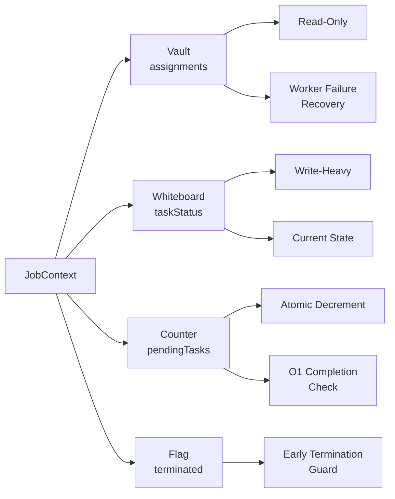
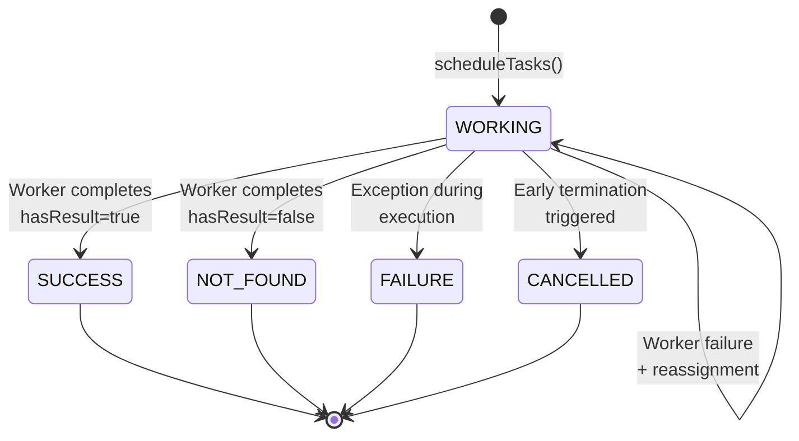
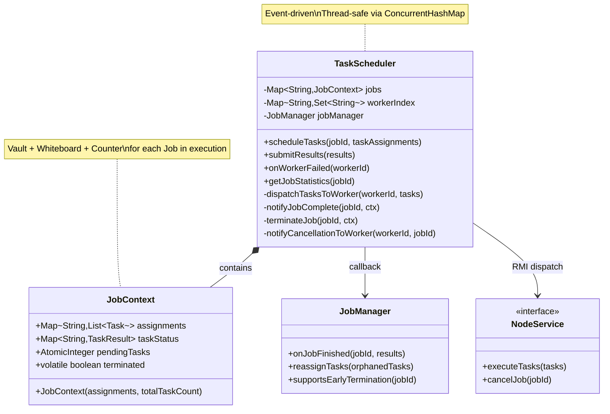
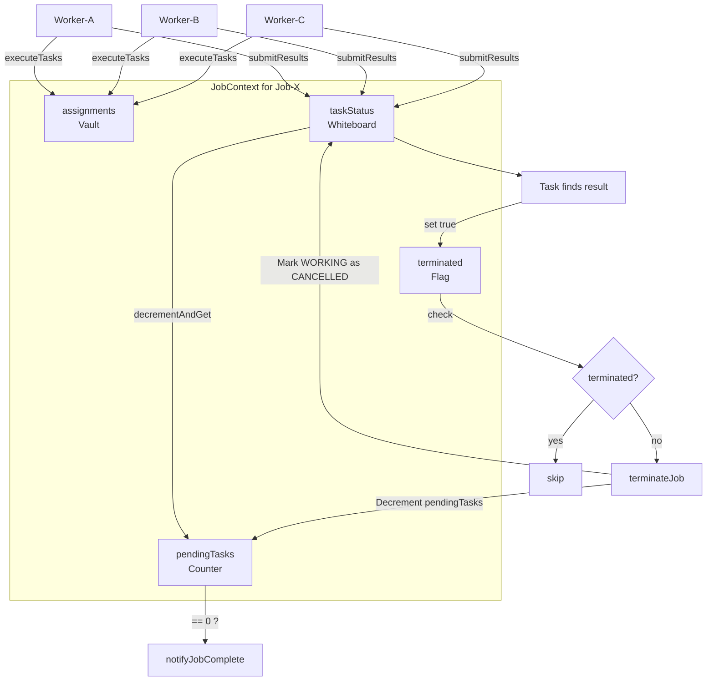
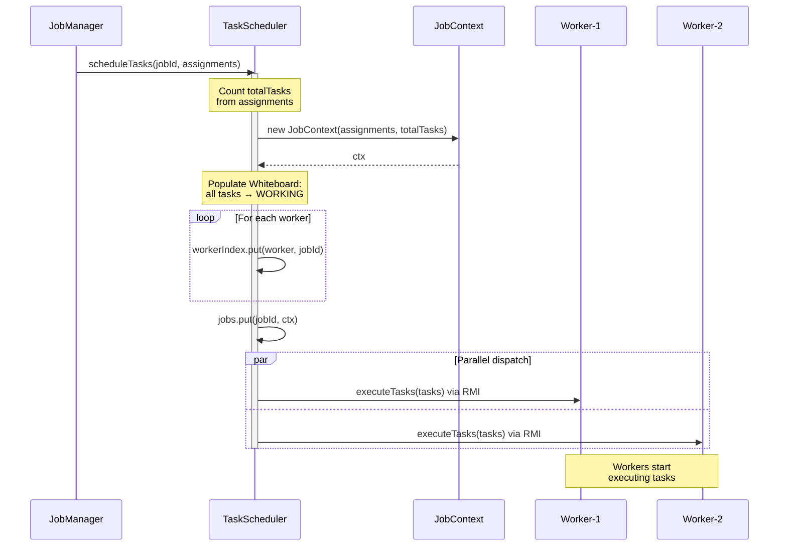
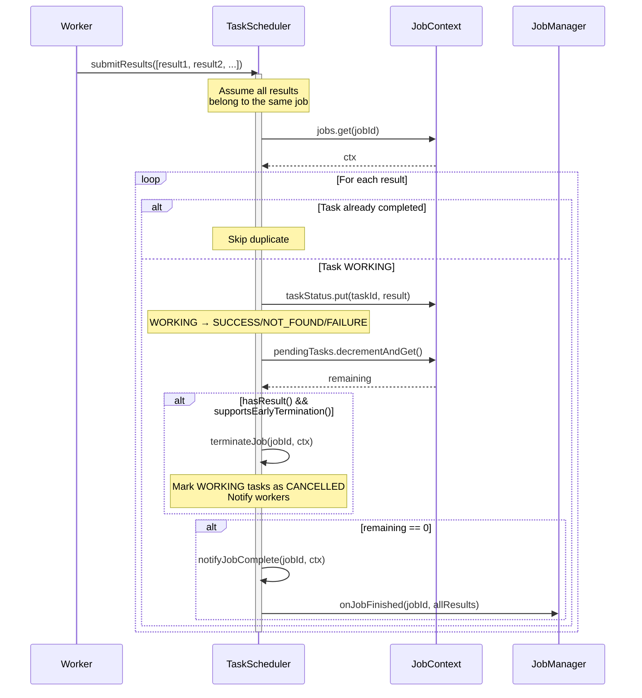
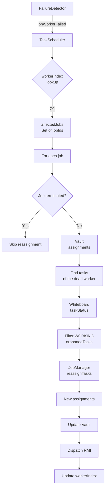
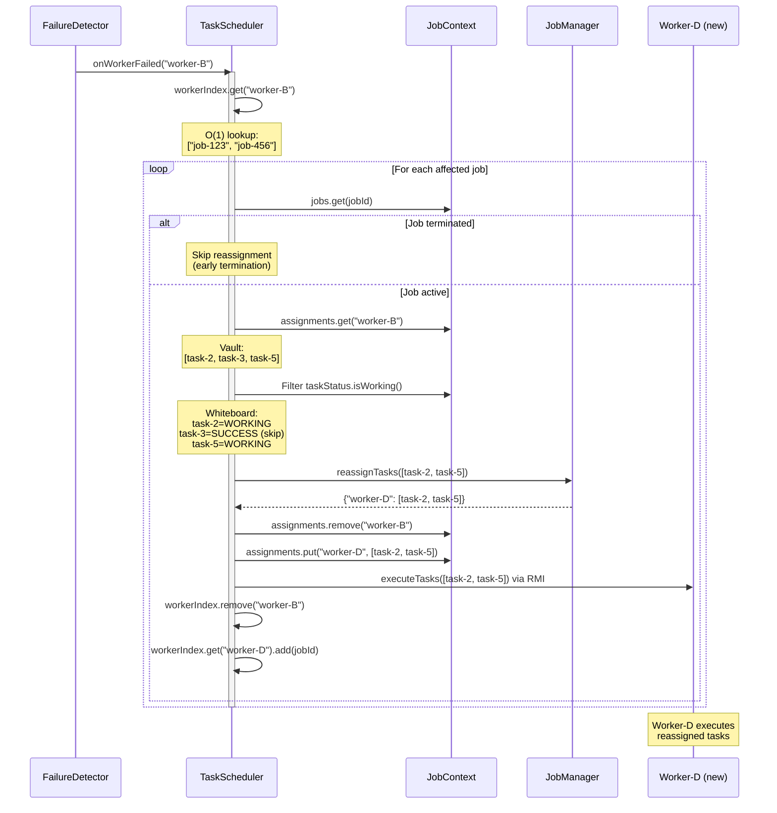
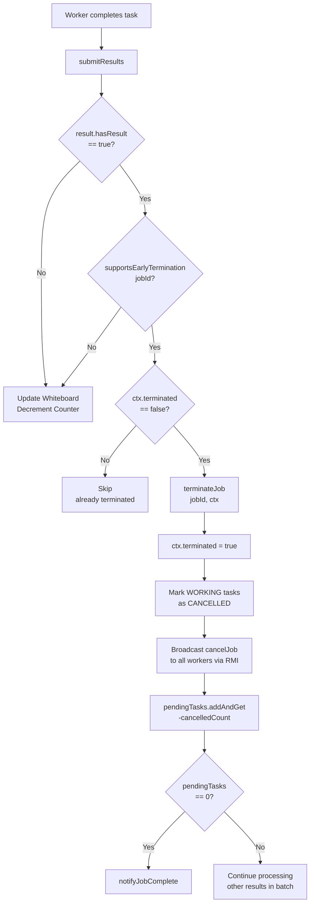
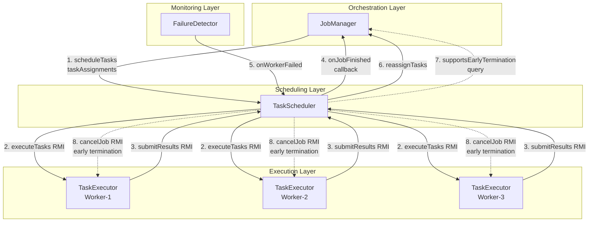

# TaskScheduler - Distributed Task Management

## Index

- [Overview](#overview)
- [Architectural Philosophy: Vault, Whiteboard, Counter](#architectural-philosophy-vault-whiteboard-counter)
- [Class Structure](#class-structure)
- [JobContext: State Aggregation](#jobcontext-state-aggregation)
- [Complete Lifecycle](#complete-lifecycle)
- [API Reference](#api-reference)
- [Worker Failure Recovery](#worker-failure-recovery)
- [Early Termination](#early-termination)
- [Integration with Other Components](#integration-with-other-components)
- [Thread Safety](#thread-safety)
- [Best Practices](#best-practices)
- [Advanced Topics](#advanced-topics)

---

## Overview

**TaskScheduler** is the "distributed execution engine" of the Hecaton framework. It handles:

1. **Dispatching**: Sending tasks to workers via RMI (`executeTasks()`)
2. **Tracking**: Monitoring the state of each task (WORKING/SUCCESS/FAILED/etc)
3. **Aggregation**: Collecting results from workers (`submitResults()`)
4. **Recovery**: Reassigning tasks when a worker fails (`onWorkerFailed()`)
5. **Notification**: Notifying the JobManager upon job completion (O(1)!)

**Position in the Execution Flow**:

```
JobManager (orchestration)
    ↓ scheduleTasks()
TaskScheduler (dispatching + tracking)
    ↓ executeTasks() RMI
TaskExecutor (worker-side execution)
    ↓ submitResults() RMI
TaskScheduler (aggregation)
    ↓ onJobFinished() callback
JobManager (final aggregation)
```

**Difference from JobManager**:
- **JobManager**: Blocking API, manages job lifecycle, integrates with SplittingStrategy/AssignmentStrategy
- **TaskScheduler**: Event-driven, RMI dispatching, task state tracking, recovery from worker failures

---

## Architectural Philosophy: Vault, Whiteboard, Counter

TaskScheduler uses a **3 orthogonal data-structure architecture** per job, held inside `JobContext`:



### 1. The "Vault" (assignments)

```java
final Map<String, List<Task>> assignments;
```

**Characteristics**:
- **Read-Only after creation**: Initialized in `scheduleTasks()`, never modified*  
- **Immutable backup**: Contains the original assignment of each task to each worker  
- **Used ONLY in case of failure**: Worker fails → look in the vault to recover its tasks

**Why a Vault?**
```
Scenario: Worker-B dies while executing tasks T1, T2, T3

Vault:
  Worker-A: [T4, T5]
  Worker-B: [T1, T2, T3]  ← HERE I find WHICH tasks to reassign immediately
  Worker-C: [T6, T7]

Without a vault: you'd need to iterate taskStatus (Whiteboard) and check
which tasks were in WORKING state with owner = Worker-B → O(N) scan!
```

**Trade-off**:
- **Memory**: Duplicates references to Task (taskId is also in Whiteboard)
- **Recovery speed**: O(1) lookup instead of O(N) scan on taskStatus

*Note: In `onWorkerFailed()`, the vault is updated to reflect new assignments after reassignment (remove dead worker, add new worker).

### 2. The "Whiteboard" (taskStatus)

```java
final Map<String, TaskResult> taskStatus;
```

**Characteristics**:
- **Write-Heavy**: Updated by workers when submitting their batch results
- **Current Truth**: Current state of each task (WORKING/SUCCESS/NOT_FOUND/FAILED/CANCELLED)
- **ConcurrentHashMap**: Thread-safe for concurrent access by multiple workers

**Lifecycle of a Task on the Whiteboard**:



### 3. The "Fast Counter" (pendingTasks)

```java
final AtomicInteger pendingTasks;
```

**Characteristics**:
- **Atomic Decrement**: Thread-safe without locks
- **O(1) Completion Check**: `if (pendingTasks.decrementAndGet() == 0)` → job finished!
- **Initialized with totalTaskCount**: Decremented on each task completion

**Problem Solved**:

```java
// ❌ WITHOUT Counter (inefficient):
public boolean isJobComplete(String jobId) {
    int completed = 0;
    for (TaskResult result : taskStatus.values()) {
        if (!result.isWorking()) {
            completed++;
        }
    }
    return completed == taskStatus.size();  // O(N) scan!
}

// ✅ WITH Counter (efficient):
public boolean isJobComplete(String jobId) {
    return ctx.pendingTasks.get() == 0;  // O(1) check!
}
```

**Handling in Case of Early Termination**:

```java
// When a task finds the result:
terminateJob(jobId, ctx);  
  → Marks N WORKING tasks as CANCELLED on the Whiteboard
  → pendingTasks.addAndGet(-N)  // Decrement in batch!
  → if (pendingTasks.get() == 0) → notifyJobComplete()
```

### 4. The Termination Flag (terminated)

```java
volatile boolean terminated = false;
```

**Characteristics**:
- **Volatile**: Immediate visibility across threads
- **Guard against double termination**: Prevents race conditions
- **Blocks reassignment**: If job terminated, do not reassign orphaned tasks

### 5. Effective fields 
```java
    // THE JOB DATABASE
    // Map<JobId, JobContext>
    // It is the "truth" of the system. All state for every job is here
    // Since the TaskScheduler could manage multiple jobs simultaneously,
    // we need to keep track of each job's context separately.
    private final Map<String, JobContext> jobs = new ConcurrentHashMap<>();


    // THE ROUTING INDEX
    // Map<WorkerId, Set<JobId>>
    // Technical lookup table. Answers: "If worker X fails, which jobs to check?"
    private final Map<String, Set<String>> workerIndex = new ConcurrentHashMap<>();
    
    // ==================== Dependencies ====================
    
    private final JobManager jobManager;  // callback for job completion
```
Essentially, the TaskScheduler maintains a global map of all active jobs (`jobs`) and a routing index (`workerIndex`) to quickly find which jobs are affected by a worker failure. It also holds a reference to the `JobManager` for callbacks upon job completion.

---

## Class Structure



**Relationships**:

1. **TaskScheduler → JobContext**: Composition (1-to-many)
   - `jobs`: Map of all active JobContext
   - Each JobContext = a full snapshot of a job's state

2. **TaskScheduler → JobManager**: Unidirectional callback
   - `onJobFinished()`: Completion notification
   - `reassignTasks()`: Request new assignments
   - `supportsEarlyTermination()`: Query cancellation support

3. **TaskScheduler → NodeService**: RMI bidirectional
   - Outbound: `executeTasks()`, `cancelJob()`
   - Inbound: `submitResults()` (worker calls Leader)

---

## JobContext: State Aggregation


---

## Complete Lifecycle

### Phase 1: Scheduling (scheduleTasks)



**Code**:
See the freaking function.

### Phase 2: Execution (submitResults)


---

## API Reference

### scheduleTasks()

```java
public void scheduleTasks(String jobId, Map<String, List<Task>> taskAssignments)
```

**Purpose**: Start distributed execution of a job.

**Parameters**:
- `jobId`: Unique identifier of the job
- `taskAssignments`: Map `workerId → List<Task>` (already computed by AssignmentStrategy)

**Behavior**:
1. Creates `JobContext` with assignments (Vault) + totalTaskCount (Counter)
2. Initializes `taskStatus` (Whiteboard) with all tasks set to `WORKING`
3. Updates `workerIndex` for each involved worker
4. Saves JobContext in `jobs`
5. Dispatches tasks to each worker via RMI `executeTasks()`

**Exceptions**:
- `IllegalArgumentException`: If `jobId` null/empty or `taskAssignments` null

**Thread Safety**: Thread-safe (ConcurrentHashMap)


**Performance**:
- **Time Complexity**: O(N) where N = total number of tasks (for iterating assignments + RMI dispatch)
- **Space Complexity**: O(N) for JobContext (Vault + Whiteboard duplicate task references)

**Integration**:
- **Called by**: `JobManager.submitJob()` after splitting + assignment
- **Calls**: `dispatchTasksToWorker()` for each worker (RMI `executeTasks()`)

---

### dispatchTasksToWorker()

```java
private void dispatchTasksToWorker(String workerId, List<Task> tasks)
```
**Purpose**: Send a batch of tasks to a worker via RMI.

**Parameters**:
- `workerId`: ID of the target worker (format: `"node-host-port-timestamp"`)
- `tasks`: List of tasks to execute

**Behavior**:
1. Parses `workerId` to extract host and port
2. Looks up RMI registry on the worker
3. Calls `executeTasks(tasks)` on the worker's `NodeService` stub

**Exceptions**:
- `RemoteException`: If RMI connection fails

---

### submitResults()

```java
public void submitResults(List<TaskResult> results)
```

**Purpose**: Receive BATCH results from a worker and update job state.

**Parameters**:
- `results`: List of task results (assumes same job!)

**Behavior**:
1. Validates all results belong to the same job (assumption)
2. For each result:
   - Checks if task already completed (skip duplicates)
   - Updates Whiteboard: `WORKING → SUCCESS/NOT_FOUND/FAILURE`
   - Decrements Counter: `pendingTasks.decrementAndGet()`
   - If `hasResult()` → checks early termination support
   - If `pendingTasks == 0` → notifies JobManager (O(1)!)

**Exceptions**:
- `IllegalArgumentException`: If `results` null or empty

**Thread Safety**: Thread-safe (atomic operations on ConcurrentHashMap + AtomicInteger)

**Performance**:
- **Time Complexity**: O(M) where M = number of results in the batch. Tipically is the same number of tasks assigned to the worker.
- **Atomic Operations**: `decrementAndGet()` is lock-free

**Integration**:
- **Called by**: Worker via RMI (executes tasks, calls Leader `submitResults()`)
- **Calls**: 
  - `terminateJob()` if early termination triggered (this marks remaining WORKING tasks as CANCELLED, decrements counter and calls `notifyJobComplete()`)
  - `notifyJobComplete()` if job finished

---

### terminateJob()

```java
private void terminateJob(String jobId, JobContext ctx)
```
**Purpose**: Perform early termination of a job.

**Parameters**:
- `jobId`: Job identifier
- `ctx`: JobContext of the job

**Behavior**:
1. Checks `ctx.terminated` flag (idempotent)
2. Sets `ctx.terminated = true`
3. Broadcasts RMI `cancelJob(jobId)` to all involved workers
4. Marks all `WORKING` tasks as `CANCELLED` on Whiteboard
5. Decrements Counter by number of cancelled tasks
6. If `pendingTasks == 0` → calls `notifyJobComplete()`

Integration:
- **Called by**: `submitResults()` when a task finds the result and early termination is supported
- **Calls**: `notifyCancellationToWorker()` for RMI, `notifyJobComplete()` if job finished

---

### notifyJobComplete()

```java
private void notifyJobComplete(String jobId, JobContext ctx)
```
**Purpose**: Notify JobManager that a job has completed.

**Parameters**: 
- `jobId`: Job identifier
- `ctx`: JobContext of the job

**Behavior**:
1. Gathers all `TaskResult` from Whiteboard
2. Calls `jobManager.onJobFinished(jobId, allResults)`
3. Cleans up: removes JobContext from `jobs`, updates `workerIndex`

Integration:
- **Called by**: 
  - `submitResults()` when `pendingTasks == 0`
  - `terminateJob()` when early termination leads to completion
- **Calls**: `jobManager.onJobFinished()` for final aggregation

---

### notifyCancellationToWorker()

```java
private void notifyCancellationToWorker(String workerId, String jobId)
```
**Purpose**: Send RMI `cancelJob(jobId)` to a worker for early termination.

**Parameters**:
- `workerId`: ID of the target worker (format: `"node-host-port-timestamp"`)
- `jobId`: Job identifier

**Behavior**:
1. Parses `workerId` to extract host and port
2. Looks up RMI registry on the worker
3. Calls `cancelJob(jobId)` on the worker's `NodeService` stub

**Exceptions**:
- `RemoteException`: If RMI connection fails

**Integration**:
- **Called by**: `terminateJob()` during early termination
- **Calls**: RMI `cancelJob()` on the worker
---
### onWorkerFailed()

```java
public void onWorkerFailed(String workerId)
```

**Purpose**: Handle a worker failure by reassigning orphaned tasks.

**Parameters**:
- `workerId`: ID of the failed worker (format: `"node-host-port-timestamp"`)

**Behavior**:
1. O(1) lookup in `workerIndex`: which jobs this worker had?
2. For each affected job:
   - Check if job already terminated (skip reassignment if early termination)
   - Look in Vault (`assignments`): which tasks the dead worker had?
   - Filter Whiteboard (`taskStatus`): which tasks are still `WORKING`?
   - Call `JobManager.reassignTasks()` to obtain new assignments
   - Update Vault: remove dead worker, add new workers
   - Dispatch reassigned tasks via RMI `executeTasks()`
   - Update `workerIndex`: remove dead worker, add new workers

**Thread Safety**: Thread-safe (JobContext modifications isolated, ConcurrentHashMap)

**Performance**:
- **Time Complexity**: O(1) to find affected jobs (workerIndex), O(M) to iterate orphaned tasks
- **Vault Advantage**: Avoids O(N) scan over all tasks to find those of the dead worker

**Integration**:
- **Called by**: `FailureDetector` when it detects a dead worker via heartbeat
- **Calls**: 
  - `JobManager.reassignTasks()` to compute new assignments
  - `dispatchTasksToWorker()` to send tasks to new workers

---

### getJobStatistics()

```java
public Map<TaskResult.Status, Integer> getJobStatistics(String jobId)
```

**Purpose**: Get aggregated statistics of a job.

**Parameters**:
- `jobId`: Job identifier

**Returns**: Map `Status → Count`, or `null` if job not found

**Usage**: Monitoring, debugging, real-time metrics.
I actually never used it anywhere.

---

### getPendingTaskCount()

```java
public int getPendingTaskCount(String jobId)
```

**Purpose**: Get the number of tasks still in execution.

**Parameters**:
- `jobId`: Job identifier

**Returns**: Number of pending tasks, or `-1` if job not found

**Performance**: O(1) (AtomicInteger.get())

---

## Worker Failure Recovery

### Recovery Architecture



### Full Flow


---

## Early Termination

### Trigger Conditions


---

## Integration with Other Components



### 1. JobManager → TaskScheduler

**scheduleTasks()**:

```java
// In JobManager.submitJob():
Map<String, List<Task>> assignments = assignmentStrategy.assignTasks(tasks, workers);
taskScheduler.scheduleTasks(jobId, assignments);
```

**Data Transferred**:
- `jobId`: Generated by JobManager
- `taskAssignments`: Map computed by AssignmentStrategy (RoundRobin/Targeted)

**Responsibility Transfer**:
- JobManager: Splitting + Assignment (business logic)
- TaskScheduler: Dispatching + Tracking (distributed execution)

---

### 2. TaskScheduler → TaskExecutor (Worker)

**executeTasks() RMI**:

```java
// In TaskScheduler.dispatchTasksToWorker():
Registry registry = LocateRegistry.getRegistry(host, port);
NodeService worker = (NodeService) registry.lookup("node");
worker.executeTasks(tasks);  // RMI call
```

**Protocol**:
- **Transport**: Java RMI
- **Direction**: Leader → Worker (one-way, async)
- **Payload**: `List<Task>` serialized

---

### 3. TaskExecutor → TaskScheduler

**submitResults() RMI**:

```java
// In TaskExecutor (on worker):
List<TaskResult> batch = new ArrayList<>();
// ... collect results ...

// RMI call to Leader
Registry leaderRegistry = LocateRegistry.getRegistry(leaderHost, leaderPort);
LeaderService leader = (LeaderService) leaderRegistry.lookup("leader");
leader.submitResults(batch);
```

**Protocol**:
- **Transport**: Java RMI
- **Direction**: Worker → Leader (callback)
- **Payload**: `List<TaskResult>` serialized (batch)

**Leader-Side**:

```java
// In NodeImpl (Leader implements LeaderService):
@Override
public void submitResults(List<TaskResult> results) throws RemoteException {
    taskScheduler.submitResults(results);  // Delegate to TaskScheduler
}
```

---

### 4. TaskScheduler → JobManager

**onJobFinished() Callback**:

```java
// In TaskScheduler.notifyJobComplete():
List<TaskResult> allResults = new ArrayList<>(ctx.taskStatus.values());
jobManager.onJobFinished(jobId, allResults);
```

**Data Transferred**:
- `jobId`: Completed job identifier
- `allResults`: All TaskResult from Whiteboard (SUCCESS/NOT_FOUND/FAILURE/CANCELLED)

**JobManager-Side**:

```java
@Override
public void onJobFinished(String jobId, List<TaskResult> results) {
    // 1. Aggregate results into JobResult
    JobResult jobResult = aggregateResults(jobId, results);
    
    // 2. Save in jobResults map
    jobResults.put(jobId, jobResult);
    
    // 3. Unblock waitForCompletion() (CountDownLatch.countDown())
    CountDownLatch latch = pendingJobs.remove(jobId);
    if (latch != null) {
        latch.countDown();
    }
}
```

---

### 5. FailureDetector → TaskScheduler

**onWorkerFailed()**:

```java
// In FailureDetector (monitors heartbeat):
private void handleWorkerTimeout(String workerId) {
    logger.warn("Worker {} timeout detected", workerId);
    
    // Notify TaskScheduler
    taskScheduler.onWorkerFailed(workerId);
    
    // Remove from cluster membership
    clusterMembershipService.removeNode(workerId);
}
```

**Triggers**:
- Worker does not respond to heartbeat for N seconds
- Connection timeout on RMI call
- Explicit worker disconnection

---

### 6. TaskScheduler → JobManager (Reassignment)

**reassignTasks()**:

```java
// In TaskScheduler.onWorkerFailed():
List<Task> orphanedTasks = ...; // WORKING tasks from dead worker
Map<String, List<Task>> newAssignments = jobManager.reassignTasks(orphanedTasks);
```

**JobManager-Side**:

```java
@Override
public Map<String, List<Task>> reassignTasks(List<Task> orphanedTasks) {
    // 1. Get healthy workers
    List<NodeInfo> healthyWorkers = clusterMembershipService.getHealthyNodes();
    
    // 2. Reassign using the same AssignmentStrategy originally used
    return assignmentStrategy.assignTasks(orphanedTasks, healthyWorkers);
}
```

**Responsibility**:
- TaskScheduler: Identifies orphaned tasks (Vault + Whiteboard)
- JobManager: Computes new assignments (delegates to AssignmentStrategy)

---

### 7. TaskScheduler → JobManager (Query)

**supportsEarlyTermination()**:

```java
// In TaskScheduler.submitResults():
if (result.hasResult() && supportsEarlyTermination(jobId)) {
    terminateJob(jobId, ctx);
}

private boolean supportsEarlyTermination(String jobId) {
    return jobManager.supportsEarlyTermination(jobId);
}
```

**JobManager-Side**:

```java
@Override
public boolean supportsEarlyTermination(String jobId) {
    Job job = activeJobs.get(jobId);
    return job != null && job.supportsEarlyTermination();
}
```

**Why Not in TaskScheduler?**
- TaskScheduler does NOT know job types (encapsulation)
- JobManager holds references to original Job objects

---

### 8. TaskScheduler → TaskExecutor (Cancellation)

**cancelJob() RMI**:

```java
// In TaskScheduler.terminateJob():
for (String workerId : workers) {
    notifyCancellationToWorker(workerId, jobId);
}

private void notifyCancellationToWorker(String workerId, String jobId) {
    Registry registry = LocateRegistry.getRegistry(host, port);
    NodeService worker = (NodeService) registry.lookup("node");
    worker.cancelJob(jobId);  // RMI call
}
```

---