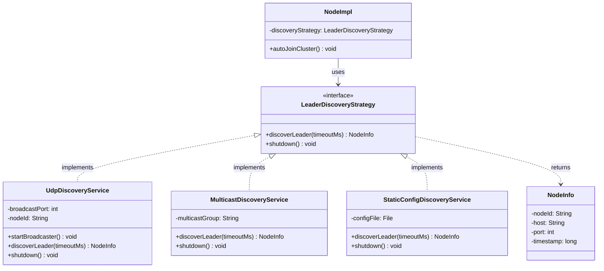

# Leader Discovery - Overview

**Automatic Leader Discovery in Hecaton Distributed Computing**

This document provides a high-level overview of the Leader discovery system, explaining the Strategy Pattern architecture and how different discovery mechanisms can be implemented.

---

## Table of Contents

1. [What is Leader Discovery?](#what-is-leader-discovery)
2. [The Problem](#the-problem)
3. [Strategy Pattern Architecture](#strategy-pattern-architecture)
4. [Available Strategies](#available-strategies)
5. [Choosing the Right Strategy](#choosing-the-right-strategy)
6. [Integration Guide](#integration-guide)
7. [Related Documentation](#related-documentation)

---

## What is Leader Discovery?

**Leader Discovery** is the process by which Worker nodes automatically locate and connect to the Leader node in a Hecaton cluster without requiring manual configuration.

### Key Concepts

- **Leader Node**: The coordinator node that manages cluster membership and task distribution
- **Worker Node**: Compute nodes that join the cluster and execute tasks
- **Discovery Strategy**: The mechanism used to find the Leader (UDP broadcast, multicast, static config, etc.)
- **NodeInfo**: The result of discovery containing Leader's connection details (host, port, nodeId)

### Before Discovery (Manual Join)

```bash
# Worker must know Leader's IP and port
mvn exec:java -Dexec.args="--port 5002 --join 192.168.1.10:5001"
                                        └─────────────────────┘
                                         Manual configuration required
```

**Problems**:
- ❌ Requires network knowledge (IP addresses, ports)
- ❌ Breaks when Leader IP changes (DHCP, cloud migration)
- ❌ No flexibility for dynamic environments
- ❌ User friction (manual config every startup)

### After Discovery (Automatic)

```bash
# Worker discovers Leader automatically
mvn exec:java -Dexec.args="--port 5002 --auto-discover"
                                        └────────────┘
                                         Zero configuration
```

**Benefits**:
- ✅ Zero-configuration setup for Workers
- ✅ Works across network changes (dynamic IPs)
- ✅ Supports multiple discovery mechanisms (LAN, WAN, cloud)
- ✅ Graceful fallback to manual join if discovery fails

---

## The Problem

In distributed systems, nodes need to locate a central coordinator (Leader) to join the cluster. Manual configuration is error-prone and inflexible. An automatic discovery mechanism is needed. It should be:
1. **Automatic**: No user input required (zero-config ideal)
2. **Fast**: Discovery should complete in seconds, not minutes
3. **Reliable**: Must work across different network topologies
4. **Fallback**: Degrade gracefully to manual join if discovery fails
5. **Extensible**: Support multiple discovery mechanisms (LAN, WAN, cloud)

---

## Strategy Pattern Architecture

The discovery system uses the **Strategy Pattern** to allow multiple discovery implementations that can be swapped without modifying core components.

### Core Interface

```java
package com.hecaton.discovery;

public interface LeaderDiscoveryStrategy {
    /**
     * Discovers the Leader node in the cluster.
     * 
     * @param timeoutMs Maximum time to wait for discovery
     * @return NodeInfo containing Leader connection details, or null if not found
     * @throws Exception if discovery fails critically
     */
    NodeInfo discoverLeader(int timeoutMs) throws Exception;
    
    /**
     * Releases resources used by this discovery strategy.
     */
    void shutdown();
}
```

### Architecture Diagram



### Design Benefits

**1. Open/Closed Principle**
- Open for extension: Add new strategies without modifying existing code
- Closed for modification: Core NodeImpl doesn't change when adding discovery methods

**2. Dependency Inversion**
- NodeImpl depends on `LeaderDiscoveryStrategy` interface, not concrete implementations
- Easy to swap strategies via configuration or dependency injection

**3. Testability**
- Mock `LeaderDiscoveryStrategy` in unit tests
- Test each strategy implementation independently

**4. Separation of Concerns**
- Discovery logic isolated from cluster membership management
- Each strategy handles its own network protocol and error handling

---

## Available Strategies

### 1. UDP Broadcast Discovery (Current Implementation)

**Class**: `UdpDiscoveryService`  
**Documentation**: [UDP Implementation Details](udp-implementation.md)

**How it works**:
- Leader broadcasts presence every 5 seconds to `255.255.255.255:6789`
- Workers listen on port 6789 for announcements
- First received announcement triggers connection

**Best for**:
- ✅ Local Area Networks (LAN)
- ✅ Development environments (localhost)
- ✅ Docker Compose setups (same network)

**Limitations**:
- ❌ Does NOT cross routers (subnet-limited)
- ❌ Firewall may block UDP port 6789
- ❌ Not suitable for WAN/Internet deployments

**Configuration**:
```bash
# Leader: Start with UDP broadcaster
mvn exec:java -Dexec.args="--port 5001 --role leader"

# Worker: Auto-discover via UDP
mvn exec:java -Dexec.args="--port 5002 --auto-discover"
```

---

### 2. Multicast Discovery (Future)

**Class**: `MulticastDiscoveryService` (not yet implemented)

**How it works**:
- Leader joins multicast group `224.0.0.1`
- Workers send discovery request to multicast group
- Leader responds with connection details

**Best for**:
- ✅ Cross-subnet networks (with multicast-enabled routers)
- ✅ Enterprise environments
- ✅ Campus networks

**Limitations**:
- ❌ Requires multicast-enabled network infrastructure
- ❌ Firewall configuration needed

---

### 3. Static Configuration Discovery (Future)

**Class**: `StaticConfigDiscoveryService` (not yet implemented)

**How it works**:
- Reads Leader address from `discovery-seeds.properties`
- Connects to known seed nodes
- Suitable for predictable environments

**Best for**:
- ✅ Production deployments with static IPs
- ✅ WAN/Internet environments
- ✅ Cloud deployments with DNS names

**Configuration file** (`discovery-seeds.properties`):
```properties
seed1=192.168.1.10:5001
seed2=leader.example.com:5001
seed3=10.0.0.5:5001
```
---

## Choosing the Right Strategy

| Scenario | Recommended Strategy | Reason |
|----------|---------------------|--------|
| **Local development (same machine)** | UDP Broadcast | Zero config, instant discovery |
| **LAN cluster (office/lab)** | UDP Broadcast | Works across all machines on same subnet |
| **Docker Compose** | UDP Broadcast | Containers on same Docker network |
| **Multi-subnet LAN** | Multicast | Crosses subnets with proper router config |
| **WAN/Internet deployment** | Static Config | UDP/multicast don't work across Internet |
| **Cloud deployment (AWS, Azure)** | Static Config + DNS | Use cloud DNS for leader hostname |
| **Kubernetes** | Cloud-Native (k8s DNS) | Built-in service discovery |
| **High-security environment** | Static Config | Explicit whitelist, no broadcast |

---

## Integration Guide

**Step 1: Implement the interface**
```java
package com.hecaton.discovery;

public class MyCustomDiscoveryService implements LeaderDiscoveryStrategy {
    
    @Override
    public NodeInfo discoverLeader(int timeoutMs) throws Exception {
        // Your custom discovery logic here
        // Example: Query database, call REST API, read config file, etc.
        
        String leaderHost = queryYourDiscoveryMechanism();
        int leaderPort = getLeaderPort();
        String leaderNodeId = getLeaderNodeId();
        
        return new NodeInfo(leaderNodeId, leaderHost, leaderPort);
    }
    
    @Override
    public void shutdown() {
        // Cleanup resources (close connections, stop threads, etc.)
    }
}
```

**Step 2: Use in NodeImpl**
```java
// In NodeImpl.autoJoinCluster()
LeaderDiscoveryStrategy strategy = new MyCustomDiscoveryService();
NodeInfo leader = strategy.discoverLeader(5000);

if (leader != null) {
    joinCluster(leader.getHost(), leader.getPort());
} else {
    throw new Exception("Leader not found");
}
```

**Step 3: Document your strategy**
- Create `docs/discovery/my-custom-implementation.md`
- Include usage examples, limitations, configuration

---

## Related Documentation

### Discovery Implementations
- **[UDP Broadcast Implementation](udp-implementation.md)** - Current default strategy
- **[Java Networking Concepts](java-networking-concepts.md)** - Technical deep dive (threads, sockets, serialization)

### Related Components
- **[Cluster Membership Service](../components/cluster-membership.md)** - Manages active nodes after discovery
- **[Node Architecture](../components/node.md)** - How discovery integrates with NodeImpl
- **[Testing Guide](../testing/README.md)** - Testing discovery strategies

### Architecture
- **[System Overview](../architecture/overview.md)** - How discovery fits in overall architecture
- **[Structural Diagrams](../DIAGRAMS_STRUCTURAL.md)** - Class diagrams with discovery layer
