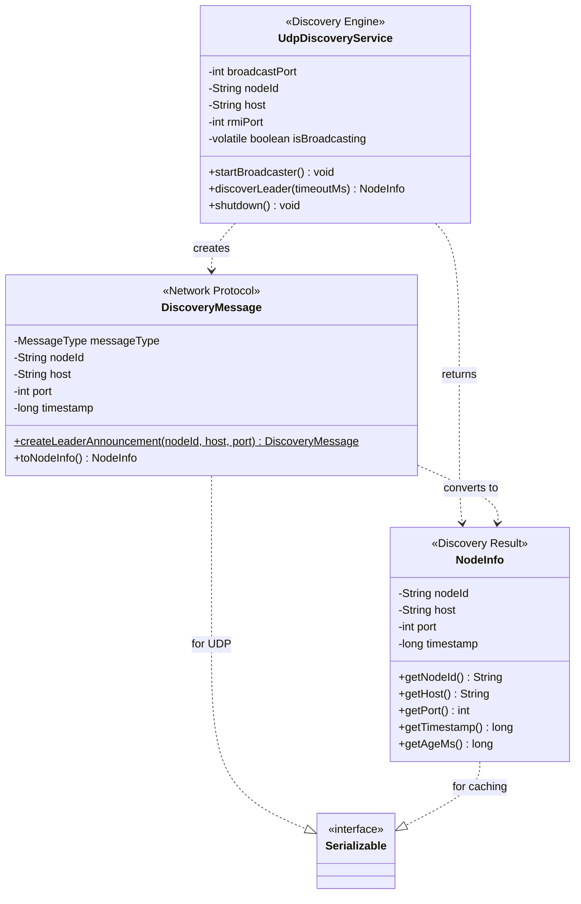
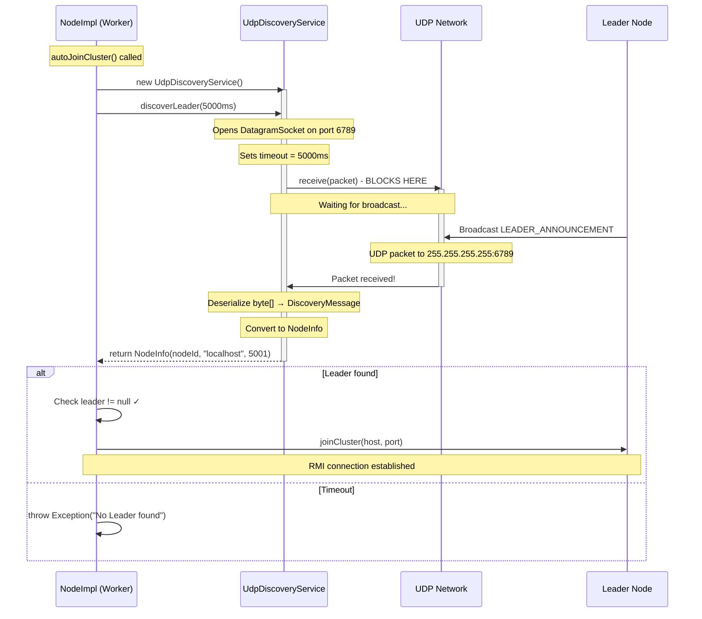
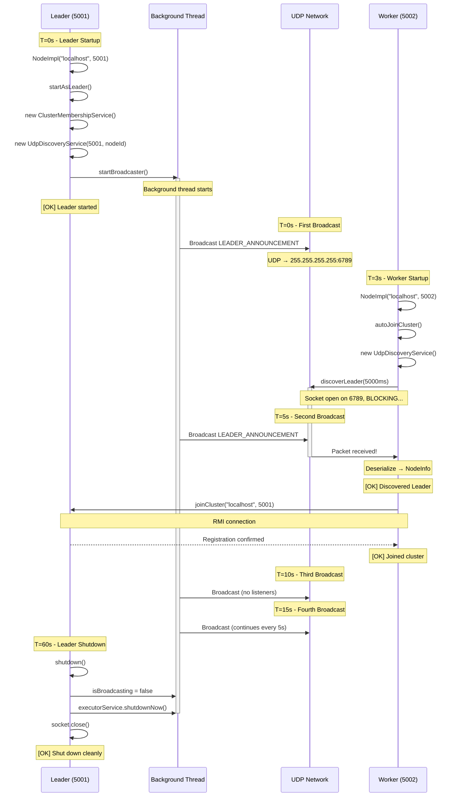

# UDP Discovery Architecture

**Automatic Leader Discovery System for Hecaton Distributed Computing**

This document provides a comprehensive architectural overview of the UDP-based automatic discovery system, detailing the three core classes (`NodeInfo`, `DiscoveryMessage`, `UdpDiscoveryService`) and their interactions.

---

## Table of Contents

1. [Architecture Overview](#architecture-overview)
2. [NodeInfo - Discovery Result](#nodeinfo---discovery-result)
3. [DiscoveryMessage - Network Protocol](#discoverymessage---network-protocol)
4. [UdpDiscoveryService - Discovery Engine](#udpdiscoveryservice---discovery-engine)
5. [Component Interactions](#component-interactions)
6. [Discovery Workflow](#discovery-workflow)
7. [Error Handling & Fallback](#error-handling--fallback)
8. [Testing Strategy](#testing-strategy)

---

## Architecture Overview

### Strategy Pattern Implementation

`UdpDiscoveryService` implements the `LeaderDiscoveryStrategy` interface, making it one of potentially many discovery strategies available in Hecaton.

```java
public interface LeaderDiscoveryStrategy {
    NodeInfo discoverLeader(int timeoutMs) throws Exception;
    void shutdown();
}

public class UdpDiscoveryService implements LeaderDiscoveryStrategy {
    // UDP-specific implementation
}
```

**Why Strategy Pattern?**
- ✅ **Extensibility**: Add new discovery mechanisms (multicast, static config) without modifying NodeImpl
- ✅ **Open/Closed Principle**: Open for extension, closed for modification
- ✅ **Testability**: Mock the interface in unit tests
- ✅ **Flexibility**: Switch strategies via configuration

**See also**: [Discovery Overview](overview.md) for complete Strategy Pattern explanation and comparison of all discovery strategies.

---

### Design Philosophy

The UDP discovery system follows a **push-pull hybrid model**:
- **Leader (Push)**: Periodically broadcasts its presence via UDP
- **Worker (Pull)**: Listens for announcements when needed

This eliminates the need for manual IP:port configuration while maintaining backward compatibility with the `--join host:port` approach.

### Component Separation (Single Responsibility Principle)

```
┌─────────────────────────────────────────────────────────┐
│ Three-Layer Architecture                                │
└─────────────────────────────────────────────────────────┘

Layer 1: Data Transfer Object (DTO)
   ┌────────────────┐
   │   NodeInfo     │  Pure data (no logic)
   │                │  Result of discovery
   └────────────────┘

Layer 2: Network Protocol
   ┌────────────────┐
   │ Discovery      │  Message format
   │ Message        │  Serializable payload
   └────────────────┘

Layer 3: Discovery Engine
   ┌────────────────┐
   │ UdpDiscovery   │  Networking logic
   │ Service        │  Thread management
   └────────────────┘
```

**Why three classes instead of one?**
- ✅ **Testability**: Each class can be unit-tested independently
- ✅ **Maintainability**: Clear boundaries between concerns
- ✅ **Extensibility**: Easy to add new discovery mechanisms (multicast, static config) without changing NodeInfo/DiscoveryMessage
- ✅ **Protocol Evolution**: Can change message format without affecting discovery logic

### Package Structure

```
com.hecaton.discovery/
├── ClusterMembershipService.java  (renamed from DiscoveryService)
├── NodeInfo.java                  (NEW - discovery result)
├── DiscoveryMessage.java          (NEW - UDP protocol)
└── UdpDiscoveryService.java       (NEW - discovery engine)
```

---

## NodeInfo - Discovery Result

### Purpose

`NodeInfo` is an **immutable data transfer object (DTO)** that encapsulates metadata about a discovered node. It serves as the return type of discovery operations.

**Location**: `src/main/java/com/hecaton/discovery/NodeInfo.java`

### Class Definition

```java
public class NodeInfo implements Serializable {
    private static final long serialVersionUID = 1L;
    
    private final String nodeId;   // Unique identifier
    private final String host;     // Hostname/IP
    private final int port;        // RMI registry port
    private final long timestamp;  // Discovery timestamp
    
    public NodeInfo(String nodeId, String host, int port) {
        this.nodeId = nodeId;
        this.host = host;
        this.port = port;
        this.timestamp = System.currentTimeMillis();
    }
    
    // Getters only (immutable)
    public String getNodeId() { return nodeId; }
    public String getHost() { return host; }
    public int getPort() { return port; }
    public long getTimestamp() { return timestamp; }
    
    public long getAgeMs() {
        return System.currentTimeMillis() - timestamp;
    }
}
```

### Design Principles

**1. Immutability**
- All fields are `final` → cannot be modified after construction
- No setters → ensures thread safety
- Safe to share across threads without synchronization

**2. Serializable**
- Implements `Serializable` for future extension (e.g., caching, persistence)
- `serialVersionUID = 1L` → version control for serialization format

**3. Self-Contained Metadata**
- `timestamp`: Captures when the discovery occurred
- `getAgeMs()`: Utility method to check freshness of discovery info

### Usage Patterns

**Pattern 1: Discovery Result**
```java
// Worker discovers Leader
UdpDiscoveryService discovery = new UdpDiscoveryService();
NodeInfo leaderInfo = discovery.discoverLeader(5000);

if (leaderInfo != null) {
    // Use discovered info to connect
    String host = leaderInfo.getHost();
    int port = leaderInfo.getPort();
    joinCluster(host, port);
}
```

**Pattern 2: Freshness Check**
```java
NodeInfo cachedLeader = getFromCache();

if (cachedLeader.getAgeMs() > 30000) {  // Older than 30s
    // Re-discover
    NodeInfo freshLeader = discovery.discoverLeader(5000);
}
```

**Pattern 3: Conversion from DiscoveryMessage**
```java
DiscoveryMessage msg = receiveFromNetwork();
NodeInfo nodeInfo = msg.toNodeInfo();  // Convenient conversion
```

Thanks to all this I can avoid passing multiple parameters around.
---

## DiscoveryMessage - Network Protocol

### Purpose

`DiscoveryMessage` defines the **wire format** for UDP discovery communication. It represents the actual data transmitted over the network.

**Location**: `src/main/java/com/hecaton/discovery/DiscoveryMessage.java`

### Class Definition

```java
public class DiscoveryMessage implements Serializable {
    private static final long serialVersionUID = 1L;
    
    public enum MessageType {
        LEADER_ANNOUNCEMENT,  // Leader broadcasts presence
        LEADER_REQUEST,       // Worker asks for Leader (future)
        LEADER_RESPONSE       // Leader responds to request (future)
    }
    
    private final MessageType messageType;
    private final String nodeId;
    private final String host;
    private final int port;
    private final long timestamp;
    
    public DiscoveryMessage(MessageType type, String nodeId, String host, int port) {
        this.messageType = type;
        this.nodeId = nodeId;
        this.host = host;
        this.port = port;
        this.timestamp = System.currentTimeMillis();
    }
    
    // Factory method for common use case
    public static DiscoveryMessage createLeaderAnnouncement(
            String nodeId, String host, int port) {
        return new DiscoveryMessage(LEADER_ANNOUNCEMENT, nodeId, host, port);
    }
    
    // Conversion to NodeInfo
    public NodeInfo toNodeInfo() {
        return new NodeInfo(nodeId, host, port);
    }
}
```

### Message Types

#### 1. LEADER_ANNOUNCEMENT (Currently Used)

**Direction**: Leader → All Workers (broadcast)  
**Frequency**: Every 5 seconds  
**Purpose**: Passive announcement of Leader presence

#### 2. LEADER_REQUEST (Future Extension)

**Direction**: Worker → Multicast group  
**Use case**: On-demand discovery instead of passive listening

#### 3. LEADER_RESPONSE (Future Extension)

**Direction**: Leader → Specific Worker (unicast)  
**Use case**: Direct response to LEADER_REQUEST


### Factory Method Pattern

**Why `createLeaderAnnouncement()` instead of direct constructor?**

```java
// ❌ Verbose, easy to mess up parameter order
new DiscoveryMessage(
    DiscoveryMessage.MessageType.LEADER_ANNOUNCEMENT,
    nodeId,
    host,
    port
);

// ✅ Explicit intent, cannot use wrong MessageType
DiscoveryMessage.createLeaderAnnouncement(nodeId, host, port);
```

**Benefits**:
- Self-documenting (method name explains purpose)
- Type safety (cannot accidentally use LEADER_REQUEST)
- Future-proof (can add validation in factory method)

---

## UdpDiscoveryService - Discovery Engine

### Purpose

`UdpDiscoveryService` is the **core networking component** that handles UDP broadcasting (Leader mode) and listening (Worker mode).

**Location**: `src/main/java/com/hecaton/discovery/UdpDiscoveryService.java`

**See [Thread](java-networking-concepts.md#1-thread---esecuzione-parallela), [Socket UDP](java-networking-concepts.md#2-socket-udp---comunicazione-di-rete), [ExecutorService](java-networking-concepts.md#3-executorservice---gestione-thread) in Java Networking Concepts**

### Two Operating Modes

```
┌─────────────────────────────────────────────────────┐
│ Mode 1: Leader (Broadcaster)                        │
│                                                     │
│  new UdpDiscoveryService(5001, "node-...")          │
│      ↓                                              │
│  startBroadcaster()                                 │
│      ↓                                              │
│  [Background thread sends UDP every 5s]             │
│      ↓                                              │
│  shutdown()  (cleanup)                              │
└─────────────────────────────────────────────────────┘

┌─────────────────────────────────────────────────────┐
│ Mode 2: Worker (Listener)                           │
│                                                     │
│  new UdpDiscoveryService()  (no params)             │
│      ↓                                              │
│  NodeInfo leader = discoverLeader(5000)             │
│      ↓ [BLOCKS until received or timeout]           │
│  Use leader info to connect                         │
└─────────────────────────────────────────────────────┘
```

### Configuration Constants

```java
private static final int DEFAULT_BROADCAST_PORT = 6789;
private static final int BROADCAST_INTERVAL_MS = 5000;  // 5 seconds
private static final String BROADCAST_ADDRESS = "255.255.255.255";
```

**Why these values?**
- **Port 6789**: High port (>1024) to avoid requiring root/admin privileges
- **5 second interval**: Balance between network overhead and discovery latency
- **255.255.255.255**: Standard IPv4 broadcast address (all devices on LAN)

### Leader Mode (Broadcaster)

**Initialization:**
```java
// Constructor for Leader mode
public UdpDiscoveryService(int rmiPort, String nodeId) {
    this.broadcastPort = DEFAULT_BROADCAST_PORT;
    this.nodeId = nodeId;
    this.host = "localhost";  // Or actual hostname
    this.rmiPort = rmiPort;
}
```

**Starting the broadcaster:**
```java
public void startBroadcaster() throws IOException {
    // Validation
    if (nodeId == null || host == null || rmiPort == 0) {
        throw new IllegalStateException("Node info required for broadcaster mode");
    }
    
    // Create UDP socket
    broadcasterSocket = new DatagramSocket();
    broadcasterSocket.setBroadcast(true);  // Enable broadcast
    
    // Thread management (see ExecutorService in concepts doc)
    broadcasterExecutor = Executors.newSingleThreadExecutor(r -> {
        Thread t = new Thread(r, "UDP-Broadcaster-" + nodeId);
        t.setDaemon(true);  // Don't block JVM shutdown
        return t;
    });
    
    // Submit broadcaster task
    isBroadcasting = true;
    broadcasterExecutor.submit(() -> {
        while (isBroadcasting) {
            try {
                broadcastLeaderAnnouncement(); // see below (next section)
                Thread.sleep(BROADCAST_INTERVAL_MS);
            } catch (InterruptedException e) {
                Thread.currentThread().interrupt();
                break;
            } catch (Exception e) {
                log.error("Broadcast error: {}", e.getMessage());
            }
        }
    });
}
```

**Broadcasting logic:**
```java
private void broadcastLeaderAnnouncement() throws IOException {
    // 1. Create message
    DiscoveryMessage message = DiscoveryMessage.createLeaderAnnouncement(
        nodeId, host, rmiPort
    );
    
    // 2. Serialize (Java Object → byte[])
    ByteArrayOutputStream baos = new ByteArrayOutputStream();
    try (ObjectOutputStream oos = new ObjectOutputStream(baos)) {
        oos.writeObject(message);
    }
    byte[] data = baos.toByteArray();
    
    // 3. Create UDP packet
    InetAddress broadcastAddr = InetAddress.getByName(BROADCAST_ADDRESS);
    DatagramPacket packet = new DatagramPacket(
        data,              // Payload
        data.length,       // Size
        broadcastAddr,     // Destination (broadcast)
        broadcastPort      // Port (6789)
    );
    
    // 4. Send on network
    broadcasterSocket.send(packet);
    
    log.debug("Broadcasted LEADER_ANNOUNCEMENT: {} bytes", data.length);
}
```

### Worker Mode (Listener)

**Initialization:**
```java
// Constructor for Worker mode (no parameters needed)
public UdpDiscoveryService() {
    this.broadcastPort = DEFAULT_BROADCAST_PORT;
    this.nodeId = null;  // Not needed for listening
    this.host = null;
    this.rmiPort = 0;
}
```

**Discovery blocking call:**
```java
public NodeInfo discoverLeader(int timeoutMs) throws Exception {
    log.info("Listening for Leader announcements (timeout: {}ms)...", timeoutMs);
    
    DatagramSocket listenerSocket = null;
    try {
        // 1. Create listener socket on broadcast port
        listenerSocket = new DatagramSocket(broadcastPort);  // Port 6789
        listenerSocket.setSoTimeout(timeoutMs);  // e.g., 5000ms
        
        // 2. Prepare receive buffer
        byte[] buffer = new byte[4096];  // 4KB buffer
        DatagramPacket packet = new DatagramPacket(buffer, buffer.length);
        
        // 3. BLOCK HERE until packet received or timeout
        listenerSocket.receive(packet);
        
        // 4. Deserialize received data
        ByteArrayInputStream bais = new ByteArrayInputStream(
            packet.getData(), 0, packet.getLength()
        );
        try (ObjectInputStream ois = new ObjectInputStream(bais)) {
            DiscoveryMessage message = (DiscoveryMessage) ois.readObject();
            
            // 5. Validate message type
            if (message.getMessageType() == MessageType.LEADER_ANNOUNCEMENT) {
                NodeInfo leaderInfo = message.toNodeInfo();
                log.info("[OK] Discovered Leader: {} at {}:{} (age: {}ms)",
                         leaderInfo.getNodeId(),
                         leaderInfo.getHost(),
                         leaderInfo.getPort(),
                         message.getAgeMs());
                return leaderInfo;
            } else {
                log.warn("Unexpected message type: {}", message.getMessageType());
                return null;
            }
        }
        
    } catch (SocketTimeoutException e) {
        log.warn("No Leader found within {}ms timeout", timeoutMs);
        return null;
    } catch (SocketException e) {
        log.error("Failed to create UDP listener on port {}: {}",
                  broadcastPort, e.getMessage());
        log.error("  Possible causes: Port in use, firewall blocking UDP");
        throw e;
    } finally {
        if (listenerSocket != null && !listenerSocket.isClosed()) {
            listenerSocket.close();
        }
    }
}
```

**Blocking behavior** (see [Socket UDP receive](java-networking-concepts.md#2-socket-udp---comunicazione-di-rete)):

```
Worker calls discoverLeader(5000):
    │
    ├─ Opens socket on port 6789
    ├─ Sets timeout to 5000ms
    │
    ├─ receive(packet) ← BLOCKS THREAD HERE
    │   │
    │   │ Waiting... (1s)
    │   │ Waiting... (2s)
    │   │ [Leader sends broadcast]
    │   │ Packet received! ✅
    │   │
    │   └─ Deserialize packet → DiscoveryMessage
    │
    ├─ Validate MessageType
    ├─ Convert to NodeInfo
    ├─ Close socket
    └─ Return NodeInfo
```

### Graceful Shutdown

```java
public void shutdown() {
    if (isBroadcasting) {
        log.info("Shutting down UDP broadcaster...");
        
        // 1. Signal thread to stop (volatile write)
        isBroadcasting = false;
        
        // 2. Interrupt thread
        if (broadcasterExecutor != null) {
            broadcasterExecutor.shutdownNow();
            
            // 3. Wait for termination (max 2 seconds)
            try {
                if (!broadcasterExecutor.awaitTermination(2, TimeUnit.SECONDS)) {
                    log.warn("Broadcaster thread did not terminate within 2s");
                }
            } catch (InterruptedException e) {
                Thread.currentThread().interrupt();
            }
        }
        
        // 4. Close socket (releases port)
        if (broadcasterSocket != null && !broadcasterSocket.isClosed()) {
            broadcasterSocket.close();
        }
        
        log.info("[OK] UDP broadcaster shut down cleanly");
    }
}
```

**Why this sequence matters:**
1. **Volatile flag first**: Thread sees change immediately (see [volatile](java-networking-concepts.md#4-volatile---sincronizzazione-variabili))
2. **Interrupt second**: Wakes thread from `sleep()` if waiting
3. **AwaitTermination**: Gives thread time to exit loop gracefully
4. **Socket close last**: Releases system resources

---

## Component Interactions

### Class Relationship Diagram



### Data Flow Diagrams

#### Leader Startup Sequence

```
NodeImpl.startAsLeader()
    │
    ├─ 1. Initialize membership service
    │      this.membershipService = new ClusterMembershipService()
    │
    ├─ 2. Initialize UDP discovery
    │      this.udpDiscovery = new UdpDiscoveryService(5001, nodeId)
    │
    └─ 3. Start broadcaster
           udpDiscovery.startBroadcaster()
               │
               ├─ Creates DatagramSocket (broadcast enabled)
               ├─ Creates ExecutorService (daemon thread)
               │
               └─ Background thread loop:
                      │
                      ├─ Create DiscoveryMessage
                      │     └─ createLeaderAnnouncement(nodeId, "localhost", 5001)
                      │
                      ├─ Serialize to byte[]
                      │     └─ ObjectOutputStream.writeObject(message)
                      │
                      ├─ Send UDP packet
                      │     └─ socket.send(packet → 255.255.255.255:6789)
                      │
                      ├─ Sleep 5s
                      └─ Repeat...
```

#### Worker Discovery Sequence


---

## Discovery Workflow

### Complete Lifecycle: Leader + Worker


---

## Error Handling & Fallback

### Failure Scenarios

#### 1. UDP Port Already in Use

**Problem**: Another process using port 6789

```java
// Leader side
try {
    udpDiscovery.startBroadcaster();
} catch (BindException e) {
    log.warn("UDP port 6789 already in use - discovery disabled");
    log.warn("  Workers must use manual --join localhost:5001");
    // Leader continues without UDP, manual join still works
}
```

**Mitigation**: Make broadcast port configurable via CLI argument `--discovery-port`

#### 2. Firewall Blocking UDP

**Problem**: Corporate firewall blocks UDP broadcast

```java
// Worker side
NodeInfo leader = udpDiscovery.discoverLeader(5000);
if (leader == null) {
    log.error("Discovery timeout - possible firewall blocking UDP");
    log.error("  Fallback: Use --join <leader-host>:<leader-port>");
    throw new Exception("Manual join required");
}
```

**Mitigation**: Hybrid strategy - UDP for LAN, static config for WAN (Phase 1.5 enhancement)

#### 3. Network Segmentation

**Problem**: Leader and Worker on different subnets (broadcast doesn't cross routers)

```
Network A (192.168.1.0/24)    Network B (192.168.2.0/24)
    │                              │
    ├─ Leader (192.168.1.10)       ├─ Worker (192.168.2.20)
    │                              │
    └─ Broadcast to 255.255.255.255
       └─ Does NOT reach Network B! ❌
```

**Mitigation**: Static seeds configuration file (future Phase 1.5)

```properties
# discovery-seeds.properties
seed1=192.168.1.10:5001
seed2=192.168.2.15:5001
```

#### 4. Leader Not Started Yet

**Problem**: Worker starts before Leader

```java
NodeInfo leader = udpDiscovery.discoverLeader(5000);
if (leader == null) {
    log.warn("No Leader found - retrying in 5s...");
    Thread.sleep(5000);
    leader = udpDiscovery.discoverLeader(5000);  // Retry
}
```

**Mitigation**: Exponential backoff retry (future enhancement)

### Backward Compatibility

**Manual join still works** (always available as fallback):

```bash
# Old way (still supported)
mvn exec:java -Dexec.args="--port 5002 --join localhost:5001"

# New way (auto-discovery)
mvn exec:java -Dexec.args="--port 5002 --auto-discover"

# Hybrid (auto-discover with fallback)
mvn exec:java -Dexec.args="--port 5002 --discover-or-join localhost:5001"
```

---
### Java Concepts Applied

This implementation demonstrates mastery of:
- **[Thread management](java-networking-concepts.md#1-thread---esecuzione-parallela)**: Background broadcaster thread
- **[UDP networking](java-networking-concepts.md#2-socket-udp---comunicazione-di-rete)**: Broadcast and unicast patterns
- **[ExecutorService](java-networking-concepts.md#3-executorservice---gestione-thread)**: Managed thread lifecycle
- **[Volatile variables](java-networking-concepts.md#4-volatile---sincronizzazione-variabili)**: Thread-safe shutdown flag
- **[Daemon threads](java-networking-concepts.md#5-daemon-thread---thread-non-bloccanti)**: Non-blocking JVM termination

---

## Related Documentation

- [Java Networking & Concurrency Concepts](java-networking-concepts.md) - Deep dive into underlying technologies
- [Cluster Membership Service](components/discovery.md) - Membership management (formerly DiscoveryService)
- [Node Architecture](components/node.md) - NodeImpl integration with discovery
- [Testing Guide](testing/README.md) - Comprehensive testing strategy

---

